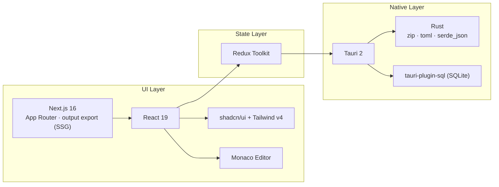

# 00 — Overview

## Goal

**ForgeModpack V2** is a desktop app to **manage the dependencies and configurations of an
existing Minecraft modpack**. The user points to a directory (`workpath`); the app:

1. reads mods (`.jar`), datapacks, configs and keybinds from disk;
2. retrieves online — **only when needed** — the version metadata for Minecraft and the modloaders;
3. lets you edit the pack metadata, the mod/datapack list, keybinds, JVM arguments and
   configuration files;
4. saves everything in a single project file `<name>.json` in the `workpath`.

It does **not** download the mods and does **not** launch Minecraft: it is a manager/editor, not a launcher.

## Technology stack



| Area | Technology | Notes |
|------|------------|-------|
| Desktop shell | **Tauri 2** | plugins fs, dialog, http, sql, opener, process |
| UI | **Next.js 16 App Router** | `output: "export"` (pure SSG, no server/route handler) |
| Components | **shadcn/ui** + **Tailwind v4** | `dark` theme forced; do not edit `ui/` by hand |
| State | **Redux Toolkit** | slices `project`, MC/ML manifest, `documents`, `keybindActions` |
| Editor | **@monaco-editor/react** | loaded **offline** from `public/monaco/vs` |
| Backend | **Rust** | jar/datapack scanning, file tree reading |
| Cache | **SQLite** | key-value table `manifest_cache` |
| Language | **TypeScript strict** | import alias `@/*` → root |

## Commands

```bash
pnpm dev          # Next dev server (web, http://localhost:3000)
pnpm tauri:dev    # Desktop app in dev (also starts pnpm dev)
pnpm tauri:build  # Build the executable (BLOCKED without a version bump)
pnpm build        # Static Next export -> ./out (consumed by Tauri)
pnpm bump         # Interactive version bump (patch/minor/major) + commit + tag
pnpm lint
```

> ⚠️ Use **pnpm** (not npm/yarn). The `@tauri-apps/plugin-*` APIs (fs, dialog, http, sql)
> **do not work** in `pnpm dev` alone: to test the real features you need `pnpm tauri:dev`.

## Glossary

| Term | Meaning |
|---------|-------------|
| **workpath** | Modpack directory chosen by the user; contains `project.json`, `mods/`, `config/`, `datapacks/` |
| **project** | The `<name>.json` object/file that represents all the saveable state of the modpack |
| **modloader** | Forge / NeoForge / Fabric / Quilt / Datapack (+ hybrid mode) |
| **provides** | All the `modId`s made available by a jar (multi-mods + `provides` + JarJar dependencies) |
| **JarJar** | Forge/NeoForge mechanism for bundling jars inside jars (`META-INF/jarjar/*.jar`) |
| **keybind** | Physical key → action mapping, with an optional `actionKey` (translation key) for export |
| **actionKey** | Minecraft translation key (e.g. `key.jei.toggleOverlay`), used to write the config files |
| **manifest** | Version list downloaded from the MC/modloader APIs, cached in SQLite with a 24h TTL |
