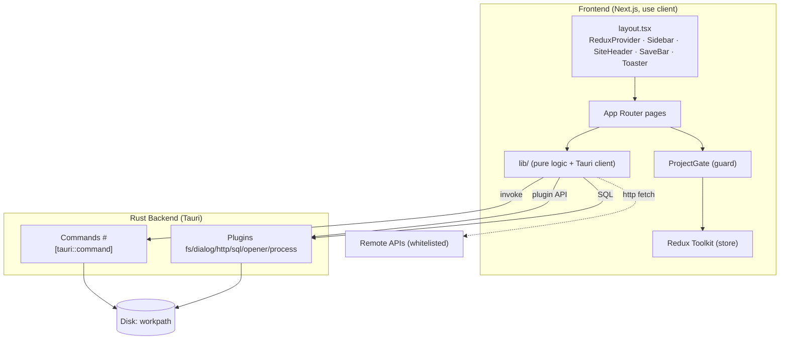
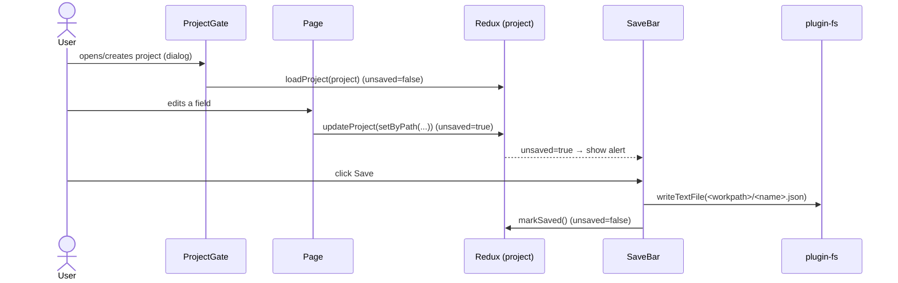
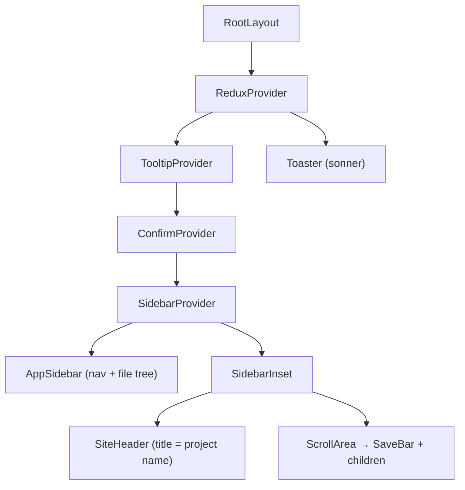
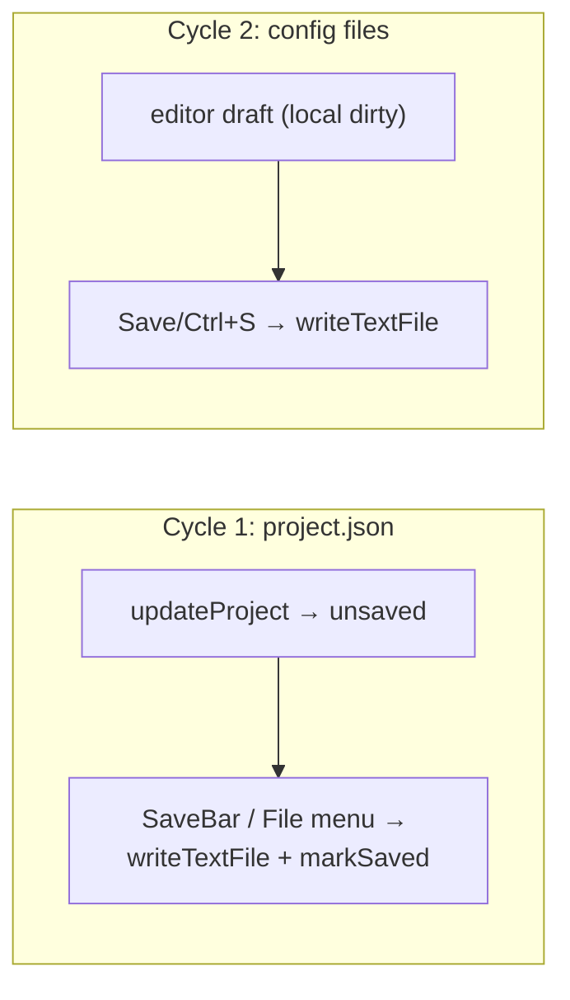
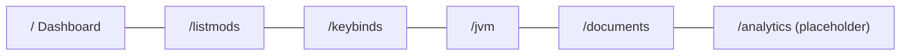

# 01 — Architecture

## Layers

## Rust ↔ JavaScript boundary

Two paths toward the native side, with distinct responsibilities:

| Path | Use | Examples |
|----------|-----|--------|
| **Custom commands** (`invoke`) | Heavy disk reads (opening jar/zip, trees) | `scan_mods`, `scan_datapacks`, `resolve_keybind_labels`, `read_dir_tree` |
| **Tauri plugins** (JS APIs) | Text I/O, dialogs, network, DB | `readTextFile`/`writeTextFile`, `open`/`save`, `fetch`, `Database` |

> The allowed network hosts are **whitelisted** in
> [`capabilities/default.json`](../../../src-tauri/capabilities/default.json): every new host must be
> added there, otherwise the fetch fails. SQL writes require `sql:allow-execute`.

## Main data flow

The central editing pattern is **immutable**: you use `setByPath`/`addByPath`/`removeByPath`
([`json-data.ts`](../../../src/lib/json-data.ts)) to produce a new `project`, then
`dispatch(updateProject(next))`. The pages **no longer** manage save/unsaved locally: it is enough
to dispatch `updateProject` and the global `<SaveBar />` appears everywhere. See [13 — Helpers](./13-helper-lib.md).

## Cross-cutting layout components

`layout.tsx` mounts the shared infrastructure exactly once:

- **`ReduxProvider`**: global store.
- **`ConfirmProvider`**: reusable confirmation dialog (`useConfirm()`), e.g. to discard changes.
- **`AppSidebar`**: File menu (New/Open/Save/Save As/Close/Exit + Ctrl/Cmd shortcuts), nav items
  (`NavMain`) and config file tree (`NavFiles`).
- **`SaveBar`**: global save alert, the single source for writing `project.json`.
- **`Toaster`**: required so that sonner's `toast(...)` calls are visible (mounted only once).

## Persistence — two separate cycles

The project (`project.json`) and the **config files** (Documents section) have **independent**
save cycles: the config files do **not** live in the project and have their own "dirty" state
in the editor, decoupled from the `SaveBar`.

## App routes

Every route (except the placeholder) is wrapped in `<ProjectGate>`: without a project it shows the
create/open block. Details in [03 — Frontend](./03-frontend-pagine.md).
