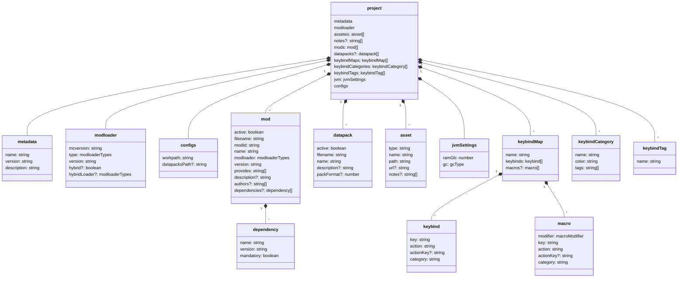
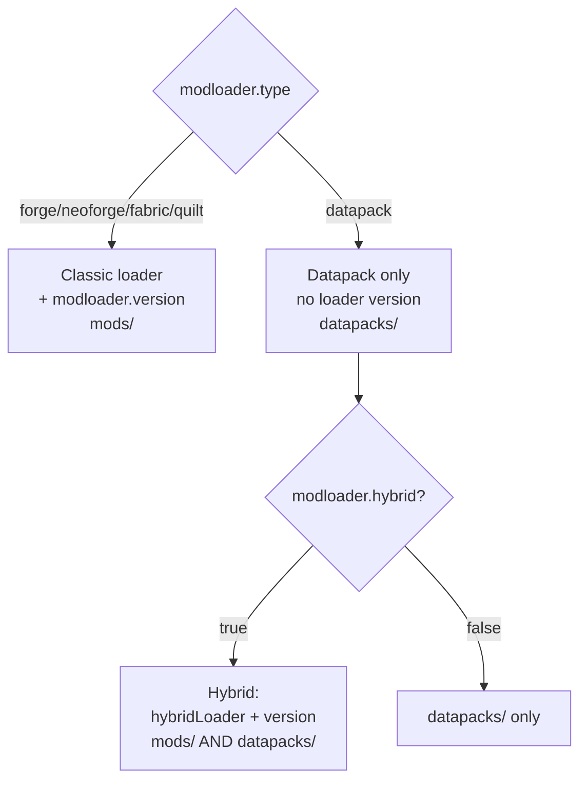

# 02 — Data model

All the saveable state of a modpack lives in a single `project` object
([`src/model/models.ts`](../../../src/model/models.ts)), serialized to the file
`<workpath>/<name>.json`. The types for the remote manifests live instead in
[`src/model/manifest-mc-ml.ts`](../../../src/model/manifest-mc-ml.ts).

## Entity diagram

## `project` — main fields

| Field | Type | Notes |
|-------|------|-------|
| `metadata` | `{ name, version, description }` | Pack metadata |
| `modloader` | see below | Loader + versions + hybrid mode |
| `assetes` | `asset[]` | Resources (resource/shader pack…) — historical name with a typo |
| `notes?` | `string[]` | Free-form project notes (optional, backward compatible) |
| `mods` | `mod[]` | Mod list, derived from the scan |
| `datapacks?` | `datapack[]` | Datapacks (optional, backward compatible) |
| `keybindMaps` | `keybindMap[]` | Keybind maps (multi-map) |
| `keybindCategories` | `keybindCategory[]` | Primary categories = mods (+ "Vanilla") |
| `keybindTags` | `keybindTag[]` | Secondary filter tags |
| `jvm` | `jvmSettings` | RAM + garbage collector |
| `configs` | `{ workpath, datapacksPath? }` | Project paths |

### `modloader` and the hybrid mode

`modloaderTypes` (enum): `forge`, `neoforge`, `fabric`, `quilt`, `datapack`, `unknown`.

- With a classic `type`: the modpack has only mods; `version` = the loader version.
- With `type === "datapack"`: no loader version, it depends only on `mcversion`.
  - If `hybrid === true`: `hybridLoader` is the additional classic loader and `version` becomes
    its version → modpack with **mods AND datapacks**.

### `mod`

Populated by scanning the jars (see [06 — Scanning](./06-scansione.md)). The key field is
`provides`: **all** the modIds made available by the jar (multi-`[[mods]]`, the `provides` field
and dependencies bundled via JarJar). It is used by List Mods' dependency check to avoid false
"missing dependency" reports. `active` is preserved by `filename` across scans.

> ⚠️ The `keybinds` read from the scan are **not** copied into `project.json`: they stay only in
> the SQLite cache, so the project file remains lightweight.

### `keybind` / `macro` / `keybindCategory` / `keybindTag`

- **`keybind`**: `key` (id of the physical key, see [`keyboard-layout.ts`](../../../src/lib/keyboard-layout.ts)),
  `action` (human-readable label), `actionKey?` (translation key for export, backward compatible),
  `category` (mod name or "Vanilla").
- **`macro`**: like `keybind` but with a `modifier` (`ctrl` | `shift` | `alt`) — combinations like
  Ctrl+A; they live in the map separately from normal keybinds.
- **`keybindCategory`**: primary category = a mod (`name` = mod name), with a HEX `color` and `tags[]`.
- **`keybindTag`**: second filter axis (only `name`).

Details in [08 — Keybinds](./08-keybinds.md).

### `jvmSettings`

`{ ramGb: number, gc: gcType }` with `gcType = "g1" | "zgc" | "shen"`. Default via
`defaultJvmSettings()` → `{ ramGb: 4, gc: "g1" }`. See [10 — JVM](./10-jvm.md).

## Remote manifest types

[`manifest-mc-ml.ts`](../../../src/model/manifest-mc-ml.ts) defines the shapes of the API responses:

- **`MinecraftManifest`**: `{ latest: {release, snapshot}, versions: VersionEntry[] }`.
- **`ForgeMavenMetadata`**: map `{ [mcVersion]: string[] }`.
- **`NeoForgeVersions`**: `{ isSnapshot: boolean, versions: string[] }`.
- **Fabric / Quilt**: separate responses for loader and game version, recomposed into `ModLoaderManifest`
  by [`get-manifest.ts`](../../../src/lib/get-manifest.ts).

See [07 — Cache and manifests](./07-cache-manifest.md).

## `toastStyles`

`models.ts` also exports `toastStyles` (info/success/warning/destructive): objects of custom CSS
properties to color sonner's toasts consistently with the theme.
