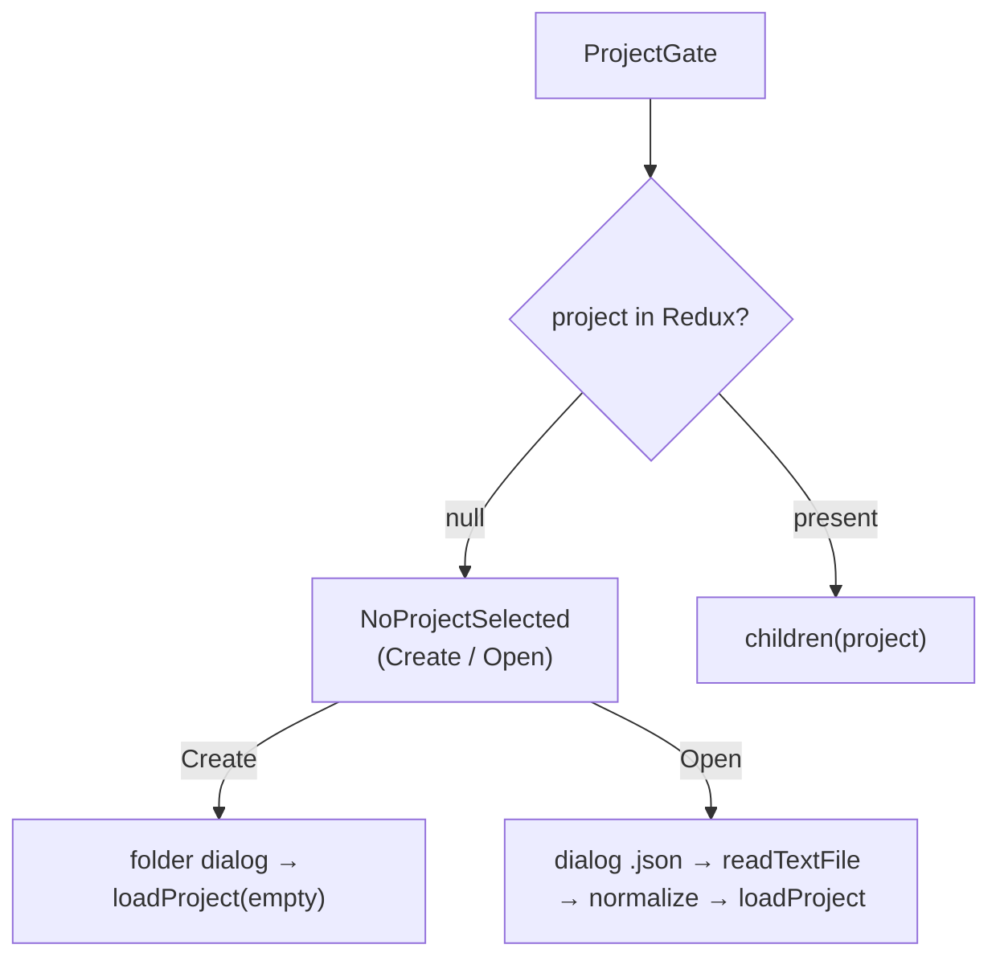
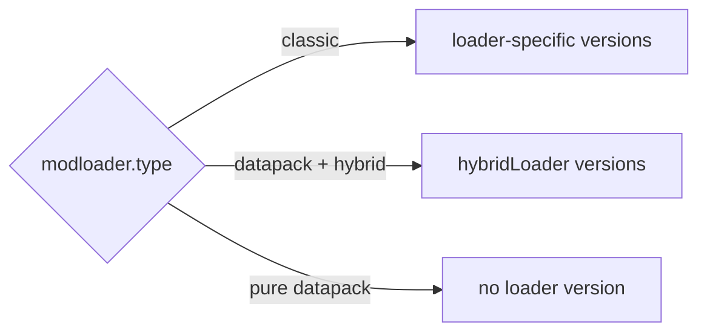
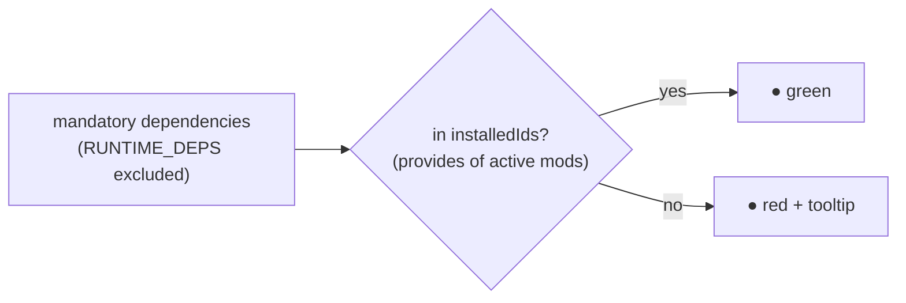
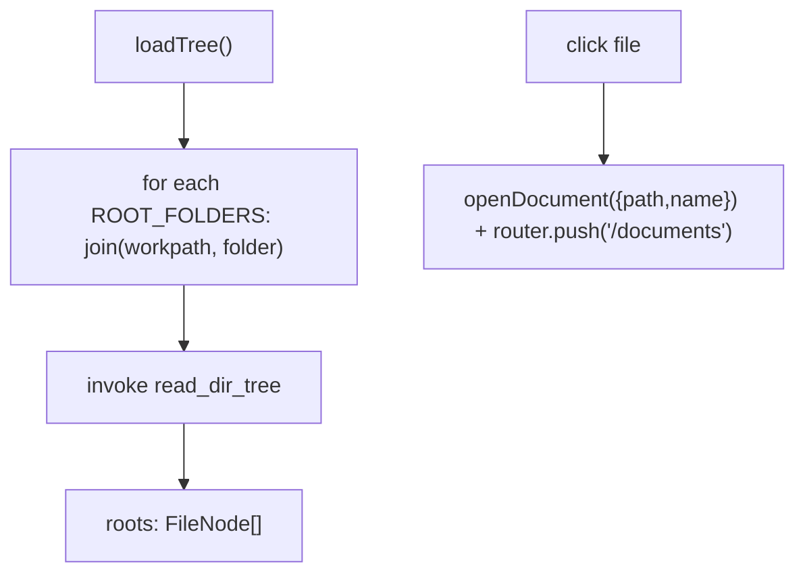
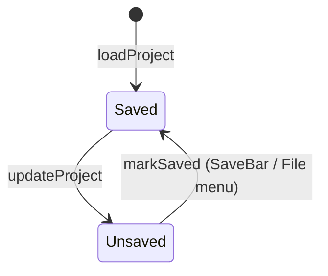

# 03 — Frontend: pages and navigation

All pages are `"use client"` (pure SSG, `output: "export"`). Each one that requires a project
is wrapped in `<ProjectGate>` and receives the non-null `project` via render prop.

## Guard: `ProjectGate`

[`project-gate.tsx`](../../../src/components/project-gate.tsx) is the single source of the
"No project selected" block.

- **Create**: `open({directory:true})` picks the workpath, then `loadProject` with an empty project
  (`modloader.type = FORGE`, empty arrays, `jvm = defaultJvmSettings()`, `configs.workpath`).
- **Open**: `open({filters json})` → `readTextFile` → `JSON.parse` → **normalizes** the optional fields
  (`assetes`, `notes`, `mods`, `datapacks`, `keybindMaps`, `keybindCategories`, `keybindTags`, `jvm`)
  for backward compatibility → `loadProject`.

## The pages

### `/` — Home / Dashboard ([`page.tsx`](../../../src/app/page.tsx))

Editor for metadata, modloader/versions and assets.

- **Reads**: `state.project`, `state.minecraftManifest`, `state.modLoaderManifest`.
- **Writes**: `updateProject`, `updateMinecraftManifest`, `loadManifest`.
- **Bootstrap** (once, anti-StrictMode ref): `getMinecraftManifestCached()` +
  `getModLoaderManifestCached()` in parallel → dispatch.
- **`handleUpdateField(path, value)`**: `setByPath` on the project; clears `modloader.version` when
  `mcversion`/`type` changes; leaving DATAPACK clears `hybrid`/`hybridLoader`.
- **Filtered versions** (useMemo): `minecraftVersions` (only `release`), `forgeVersions`,
  `neoforgeVersions` (min minor 20), `fabricVersions`, `quiltVersions` → `modloaderVersions` chosen
  based on `effectiveLoader` (the type itself, or `hybridLoader` in datapack+hybrid mode).
- **Assets**: Add/Edit dialog (`ASSET_TYPES` = Resource/Shader/Data Pack, Config, Icon, Splash, Other),
  upsert into `project.assetes`; notes per project and per single asset; `openUrl` for links.
- **`updateManifest()`**: forced refresh (`force=true`) of the two manifests + toast.

### `/listmods` — List Mods ([`listmods/page.tsx`](../../../src/app/listmods/page.tsx))

Scans `mods/` (and `datapacks/`), lists them with an active toggle, fuzzy search, dependency check.

- **Prop** `project`; writes `updateProject` on `mods` and `datapacks`.
- **Visibility**: `showMods = type !== DATAPACK || hybrid`; `showDatapacks = type === DATAPACK`.
- **`scan(force)`**: `getModsScanCached(workpath, force)` → maps into `mod[]` preserving `active` by
  `filename` (Map); does **not** copy keybinds. Auto-scan only the first time per workpath and only if
  the list is empty (`initialized` ref).
- **`scanDatapacks(force)`**: dir = `configs.datapacksPath` or `<workpath>/datapacks`.
- **`missingDependencies`**: `mandatory` dependencies not in `RUNTIME_DEPS` nor in `installedIds`
  (union of the `provides` — or `modId` fallback — of the **active** mods).
- **`fuzzyMatch`/`modScore`**: subsequence search with scoring; sorts `visibleMods`.
- **UI**: `SummaryCard` (total/active/inactive), mod table (On/Mod/Version/Loader/Authors/
  Dependencies with a green/red dot + tooltip for missing ones) and datapack table.

### `/keybinds` — Keybinds ([`keybinds/page.tsx`](../../../src/app/keybinds/page.tsx))

Visual keyboard editor. Full detail in [08 — Keybinds](./08-keybinds.md).

### `/jvm` — JVM ([`jvm/page.tsx`](../../../src/app/jvm/page.tsx))

RAM slider (2–32 GB) + GC choice → generated flags (`buildFlags`), colored and copyable. Writes
`jvm.ramGb`/`jvm.gc`. Detail in [10 — JVM](./10-jvm.md).

### `/documents` — Documents ([`documents/page.tsx`](../../../src/app/documents/page.tsx))

Monaco editor for the file selected in the tree (sidebar). Save cycle **independent** of the
project. Detail in [11 — Documents](./11-documents-editor.md).

### `/analytics` — placeholder

`<ProjectGate>{() => Analytics}</ProjectGate>`. Not linked in the sidebar.

## Navigation and sidebar

### `AppSidebar` ([`app-sidebar.tsx`](../../../src/components/app-sidebar.tsx))

**File** menu (dropdown) + `NavMain` + `NavFiles` + footer.

- **`NAV_MAIN_ITEMS`**: Dashboard `/`, List Mods `/listmods`, keybinds `/keybinds`, JVM `/jvm`
  (Analytics excluded).
- **File actions**: `newProject`, `openProject`, `closeProject`, `saveProject`, `saveAsProject`
  (new workpath via `dirname`/`basename`), `changeWorkspace`, `exitApp` (`exit(0)`).
- **Unsaved changes confirmation** (`confirmDiscardUnsavedChanges`): cancel/continue/save dialog
  before destructive actions.
- **Shortcuts** (ignored if focus is in input/textarea/contentEditable):

| Combination | Action |
|--------------|--------|
| Ctrl/Cmd + N | New |
| Ctrl/Cmd + O | Open |
| Ctrl/Cmd + W | Close |
| Ctrl/Cmd + S | Save |
| Ctrl/Cmd + Shift + S | Save As |
| Ctrl/Cmd + Q | Exit |

### `NavMain` ([`nav-main.tsx`](../../../src/components/nav-main.tsx))

Items with `next/link`; highlights the active one via `usePathname`.

### `NavFiles` ([`nav-files.tsx`](../../../src/components/nav-files.tsx))

File tree of `config/` and `kubejs/` (`ROOT_FOLDERS`), read with `read_dir_tree`.

Optimistic updates (`handleFileCreated/Renamed/Deleted`) through immutable helpers
(`insertFileNode`, `replaceFileNode`, `removeFileNodeByPath`); the Refresh button calls `loadTree`.

### `SiteHeader` ([`site-header.tsx`](../../../src/components/site-header.tsx))

`SidebarTrigger` + title = the project's `metadata.name` (fallback "No project").

## Global saving: `SaveBar`

[`save-bar.tsx`](../../../src/components/save-bar.tsx) shows the alert only if there is a project and
`state.project.unsaved`. `handleSave()`: validates `metadata.name`, `join(workpath, "<name>.json")`,
`create` + writes `JSON.stringify(project, null, 2)`, `close`, `markSaved()`, toast.

