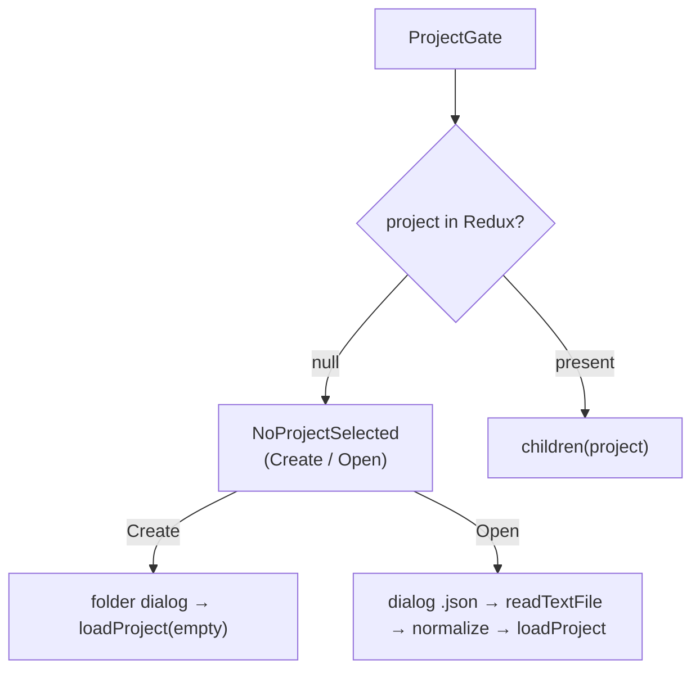
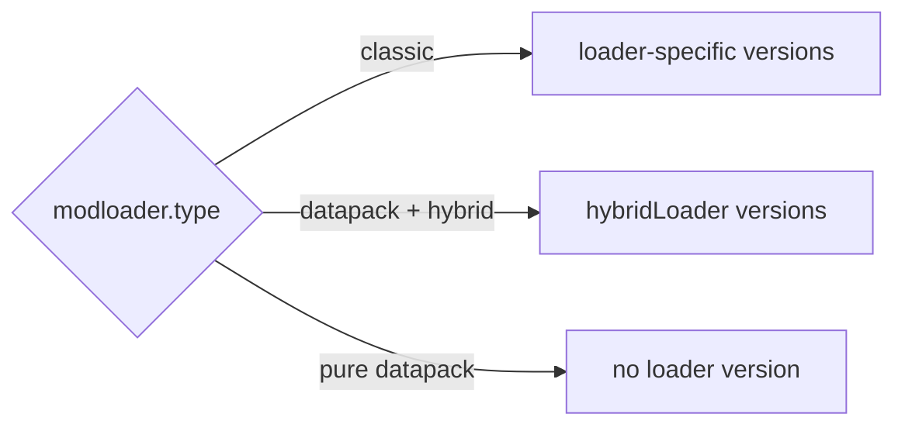
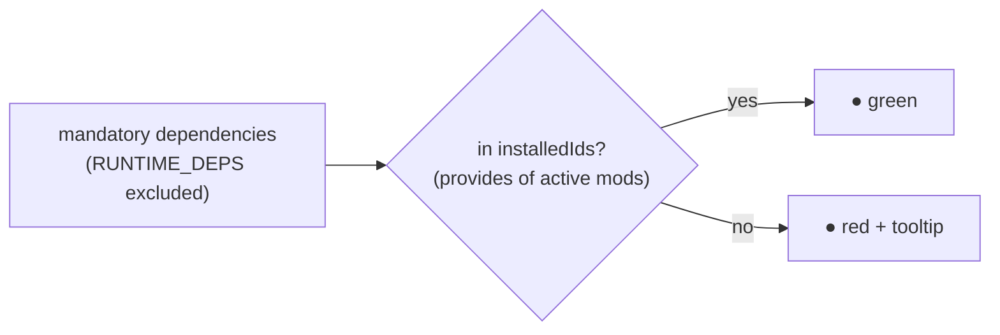
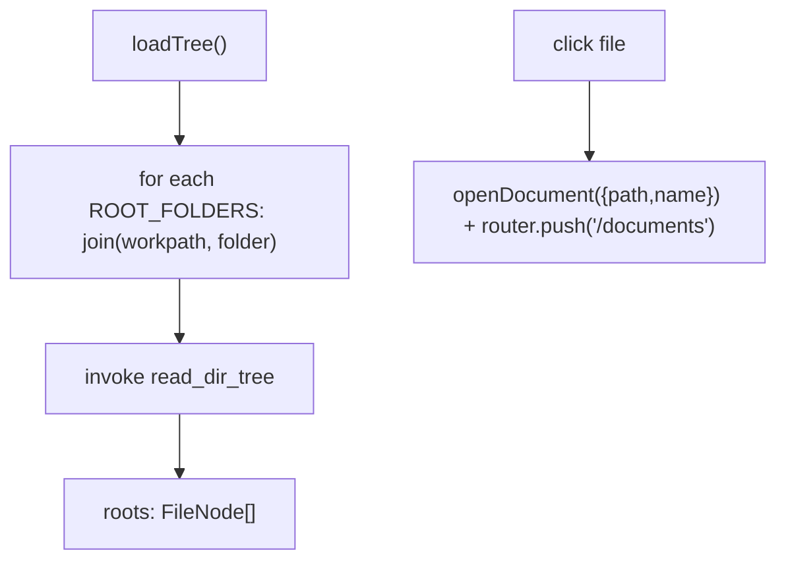
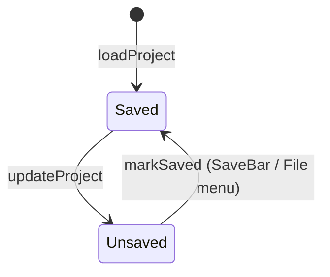

# 03 — Frontend: pages and navigation

All pages are `"use client"` (pure SSG, `output: "export"`). Each one that requires a project
is wrapped in `<ProjectGate>` and receives the non-null `project` via render prop.

## Guard: `ProjectGate`

[`project-gate.tsx`](../../../src/components/project-gate.tsx) is the single source of the
"No project selected" block.



- **Create**: `open({directory:true})` picks the workpath, then `loadProject` with an empty project
  (`modloader.type = FORGE`, empty arrays, `jvm = defaultJvmSettings()`, `configs.workpath`).
- **Open**: `open({filters json})` → `readTextFile` → `JSON.parse` → **normalizes** the optional fields
  (`assetes`, `notes`, `mods`, `datapacks`, `keybindMaps`, `keybindCategories`, `keybindTags`, `jvm`)
  for backward compatibility → `loadProject`.

> ⚠️ **Project-switch gotcha**: `ProjectGate` always renders the **same** child component, so
> switching from one project to another makes React **reuse the instance** and the page's local state
> survives — lists, filters, data scanned in the previous session. Pages holding project-derived state
> therefore pass a `key` tied to the project identity (`${loadId}::${workpath}`) to force a remount:
> see [`listmods/page.tsx`](../../../src/app/listmods/page.tsx) and
> [`keybinds/page.tsx`](../../../src/app/keybinds/page.tsx).

## The pages

### `/` — Home / Dashboard ([`page.tsx`](../../../src/app/page.tsx))

Editor for metadata, modloader/versions and assets.

- **Reads**: `state.project`, `state.minecraftManifest`, `state.modLoaderManifest`.
- **Writes**: `updateProject`, `updateMinecraftManifest`, `loadManifest`.
- **Bootstrap** (once, anti-StrictMode ref): `getMinecraftManifestCached()` +
  `getModLoaderManifestCached()` in parallel → dispatch.
- **`handleUpdateField(path, value)`**: `setByPath` on the project; clears `modloader.version` when
  `mcversion`/`type` changes; leaving DATAPACK clears `hybrid`/`hybridLoader`; dropping below MC 1.13
  while `type = DATAPACK` sets the loader back to FORGE and clears hybrid mode (with a toast), because
  data packs don't exist before 1.13.
- **Loaders unavailable per version**: `isBelowMcMinor(mc, minMinor)` (pure helper) feeds
  `neoforgeDisabled` (`NEOFORGE_MIN_MINOR = 20`) and `datapackDisabled` (`DATAPACK_MIN_MINOR = 13`) →
  `disabled` on the respective `ToggleGroupItem`. The helper reasons **only** about the "1.x" scheme
  (where minor is the game generation); with `major != "1"` (newer schemes such as "26.1") the feature
  always exists, and with no version picked the toggle stays disabled. A line below the toggles explains
  which version data packs start from (a disabled toggle with no reason looks like a bug).
- **Filtered versions** (useMemo): `minecraftVersions` (only `release`), `forgeVersions`,
  `neoforgeVersions` (min minor 20), `fabricVersions`, `quiltVersions` → `modloaderVersions` chosen
  based on `effectiveLoader` (the type itself, or `hybridLoader` in datapack+hybrid mode).
- **Assets**: Add/Edit dialog (`ASSET_TYPES` = Resource/Shader/Data Pack, Config, Icon, Splash, Other),
  upsert into `project.assetes`; notes per project and per single asset; `openUrl` for links.
- **`updateManifest()`**: forced refresh (`force=true`) of the two manifests + toast.



### `/listmods` — List Mods ([`listmods/page.tsx`](../../../src/app/listmods/page.tsx))

Scans `mods/` (and `datapacks/`), lists them with an active toggle, fuzzy search, dependency check.

- **Prop** `project`; writes `updateProject` on `mods` and `datapacks`.
- **Visibility**: `showMods = type !== DATAPACK || hybrid`; `showDatapacks = type === DATAPACK`.
- **`scan(force)`**: `getModsScanCached(workpath, force)` → maps into `mod[]` preserving `active` by
  `filename` (Map); does **not** copy keybinds. Auto-scan only the first time per workpath and only if
  the list is empty (`initialized` ref).
- **`scanDatapacks(force)`**: dir = `configs.datapacksPath` or `<workpath>/datapacks`.
- **`missingDependencies`**: `mandatory` dependencies not in `RUNTIME_DEPS` nor in `installedIds`
  (union of the `provides` — or `modId` fallback — of the **active** mods).
- **`fuzzyMatch`/`modScore`**: subsequence search with scoring; sorts `visibleMods`.
- **`visibleMods`** (useMemo): three-step pipeline **chips → search → sorting**.
  `installedIds`/`missing`/`withWarnings` are memoized: recreating them on every render would make
  memoizing the pipeline pointless.
- **Default sorting**: `effectiveSort = sort ?? (query ? null : DEFAULT_SORT)` with
  `DEFAULT_SORT = {key: "name", dir: "asc"}`. The table therefore starts **alphabetical by name** (the
  scan order is alphabetical by *filename*, which doesn't match the displayed name); while searching,
  with no explicit choice, **fuzzy relevance** wins (sorting search results by name would bury the best
  match). A clicked sort always **beats** relevance. `effectiveSort` is what feeds both the pipeline
  and the header arrows.
- **Sorting**: `sortState = {key, dir} | null`, cycling `asc → desc → null` on header click
  (`SortableHead`, with `aria-sort`; the cycle starts from `effectiveSort`, not from internal state, so
  the first click on "Mod" **reverses** the already visible order instead of reapplying it — and the
  third click goes back to the default). `sortValue` maps the column to the value to compare (`active` →
  0/1, `deps` → number of missing ones, `format` → the **displayed** label); `compareMods` uses an
  `Intl.Collator({numeric: true})` — **natural** comparison, so "1.10.0" comes after "1.9.0" — with the
  name as a stable tie-break. Semver is not used: mod versions often aren't
  (`1.20.1-forge-47.2.0`). A **copy** is sorted (the array comes from Redux).
- **Chip filters** (multiple `ToggleGroup`): `matchesFilters` with OR **within** a group and AND
  **across** groups — status group (`active`/`inactive`) and issues group (`missing`/`warnings`). The
  chip counts match the `SummaryCard` ones; since `missing` only considers active mods,
  "inactive + missing" is empty by construction.
- **UI**: `SummaryCard` (total/active/inactive/missing/warnings), search bar + chips + "Clear filters",
  mod table with sortable headers (On/Mod/Version/Loader/Format/Authors/Dependencies with a green/red
  dot + tooltip for missing ones) and datapack table (no sort/chips: search only).



### `/keybinds` — Keybinds ([`keybinds/page.tsx`](../../../src/app/keybinds/page.tsx))

Visual keyboard editor. Full detail in [08 — Keybinds](./08-keybinds.md).

### `/jvm` — JVM ([`jvm/page.tsx`](../../../src/app/jvm/page.tsx))

RAM slider (2–32 GB) + GC choice → generated flags (`buildFlags`), colored and copyable. Writes
`jvm.ramGb`/`jvm.gc`. Detail in [10 — JVM](./10-jvm.md).

### `/documents` — Documents ([`documents/page.tsx`](../../../src/app/documents/page.tsx))

Monaco editor for the file selected in the tree (sidebar). Save cycle **independent** of the
project. Detail in [11 — Documents](./11-documents-editor.md).

### `/analytics` — placeholder

`<ProjectGate>{() => <span>Analytics</span>}</ProjectGate>`. Not linked in the sidebar.

## Navigation and sidebar

### `AppSidebar` ([`app-sidebar.tsx`](../../../src/components/app-sidebar.tsx))

**File** menu (dropdown) + `NavMain` + `NavFiles` + footer.

- **`NAV_MAIN_ITEMS`**: Dashboard `/`, List Mods `/listmods`, keybinds `/keybinds`, JVM `/jvm`
  (Analytics excluded).
- **File actions**: `newProject`, `openProject`, `closeProject`, `saveProject`, `saveAsProject`
  (new workpath via `dirname`/`basename`), `changeWorkspace`, `exitApp` (`exit(0)`).
- **Unsaved changes confirmation** (`confirmDiscardUnsavedChanges`): cancel/continue/save dialog
  before destructive actions.
- **Shortcuts** (ignored if focus is in input/textarea/contentEditable):

| Combination | Action |
|--------------|--------|
| Ctrl/Cmd + N | New |
| Ctrl/Cmd + O | Open |
| Ctrl/Cmd + W | Close |
| Ctrl/Cmd + S | Save |
| Ctrl/Cmd + Shift + S | Save As |
| Ctrl/Cmd + Q | Exit |

### `NavMain` ([`nav-main.tsx`](../../../src/components/nav-main.tsx))

Items with `next/link`; highlights the active one via `usePathname`.

### `NavFiles` ([`nav-files.tsx`](../../../src/components/nav-files.tsx))

File tree of `config/` and `kubejs/` (`ROOT_FOLDERS`), read with `read_dir_tree`.



Optimistic updates (`handleFileCreated/Renamed/Deleted`) through immutable helpers
(`insertFileNode`, `replaceFileNode`, `removeFileNodeByPath`); the Refresh button calls `loadTree`.

### `SiteHeader` ([`site-header.tsx`](../../../src/components/site-header.tsx))

`SidebarTrigger` + title = the project's `metadata.name` (fallback "No project").

## Global saving: `SaveBar`

[`save-bar.tsx`](../../../src/components/save-bar.tsx) shows the alert only if there is a project and
`state.project.unsaved`. `handleSave()`: validates `metadata.name`, `join(workpath, "<name>.json")`,
`create` + writes `JSON.stringify(project, null, 2)`, `close`, `markSaved()`, toast.



## Global loading overlay: `BusyOverlay`

Operations that open every jar (mod/keybind scan, import), write several files (HTML/PNG export) or hit
the network (manifest refresh) **effectively block interaction**: while they run the user must not be
able to switch project or page, or the result would be applied to a state that no longer exists.

[`busy-overlay.tsx`](../../../src/components/busy-overlay.tsx) is mounted once in the layout (outside
`SidebarProvider`, `z-[100]` to sit above shadcn dialogs) and reads the runtime
[`busy`](./04-state-redux.md) slice. It is never dispatched by hand: use the
[`useBusy`](../../../src/lib/use-busy.ts) hook, which opens the task and closes it in `finally`.

```ts
const busy = useBusy()
const mods = await busy(t("busy.scanningMods"), () => getModsScanForLoad(workpath, loadId, hint),
  { detail: workpath })
// staged operations: the callback receives setMessage(message, detail)
```

| Detail | Behaviour |
|---|---|
| Appearance | delayed by **250 ms**: within the same project opening scans answer from cache in a few ms, and without the threshold the overlay would flicker on every navigation |
| Concurrent tasks | allowed (e.g. mods + datapacks): shows the first and counts the others; the overlay stays until the last one ends |
| Dismissal | always in `finally`, so also on error or cancellation |
| System dialogs | the wrap starts **after** the file/folder choice, so the overlay never covers the dialog |

Covered spots: sync on project opening (`ModsSync`), mod and datapack scan in List Mods (manual refresh
included), keybind scan, keybind import and export, manifest refresh on the dashboard, file tree reading
in the sidebar. The existing local spinners (refresh icon, disabled buttons) stay: they tell *which*
command is running.
