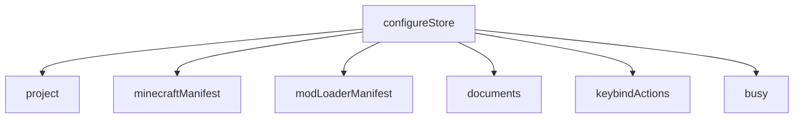
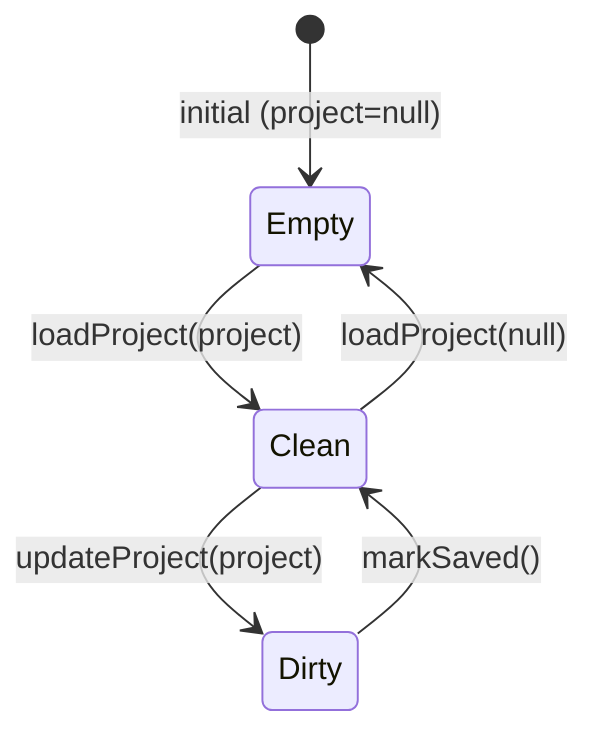

# 04 — Global state (Redux)

The store ([`store.ts`](../../../src/redux/store.ts)) combines six reducers. Access always happens
through the typed hooks `useAppSelector`/`useAppDispatch` ([`hooks.ts`](../../../src/redux/hooks.ts)),
never raw `useSelector`. The `ReduxProvider` is mounted in `layout.tsx`.

| Slice | File | Persisted in project.json? | Role |
|-------|------|------------------------------|-------|
| `project` | [project-slice.ts](../../../src/redux/project-slice.ts) | is **the** project | Savable state + `unsaved` flag |
| `minecraftManifest` | [metadata-mc-slice.ts](../../../src/redux/metadata-mc-slice.ts) | no (SQLite cache) | MC versions |
| `modLoaderManifest` | [metadata-ml-slice.ts](../../../src/redux/metadata-ml-slice.ts) | no (SQLite cache) | Modloader versions |
| `documents` | [documents-slice.ts](../../../src/redux/documents-slice.ts) | no | File open in the editor |
| `keybindActions` | [keybind-actions-slice.ts](../../../src/redux/keybind-actions-slice.ts) | no (runtime) | Keybind actions per mod |
| `busy` | [busy-slice.ts](../../../src/redux/busy-slice.ts) | no (runtime) | Heavy operations in progress → blocking overlay |

## `project`

**State**: `{ project: project | null; unsaved: boolean; loadId: number }`. Initial `{ null, false, 0 }`.

| Action | Effect |
|--------|---------|
| `loadProject(project \| null)` | Sets `project`, `unsaved=false` (create/open/close: clean state), **`loadId += 1`** |
| `updateProject(project)` | Sets `project`, `unsaved=true` (any change → activates SaveBar) |
| `markSaved()` | `unsaved=false` (after writing to file) |

Selector: `selectProject`. **Golden rule**: pages edit the project only with `updateProject`;
writing to disk + `markSaved` is centralized in SaveBar / File menu.

`loadId` counts project **opens** (not persisted): whatever derives data from disk (mod/datapack
scanning) watches it to re-read the files on every open instead of trusting the cache. See
[06 — Scanning](./06-scansione.md#syncing-with-disk).

## `documents`

**State**: `{ openFile: openDocument | null }` with `openDocument = { path, name }`.

| Action | Effect |
|--------|---------|
| `openDocument({path, name})` | Sets the open file |
| `closeDocument()` | `openFile = null` |

Selector: `selectOpenDocument`. Separated from the project on purpose: config files do **not** live
in project.json. Decouples the sidebar (which opens) and the editor (which renders).

## `keybindActions` (runtime)

**State**: `{ workpath: string | null; byModId: Record<string, scannedKeybindAction[]>; loading: boolean; error: string | null }`.
Types: `scannedKeybindAction { key, label }`, `modKeybinds { filename, modId, keybinds[] }`.

| Action | Effect |
|--------|---------|
| `setKeybindActionsLoading(bool)` | `loading`; if true clears `error` |
| `setKeybindActionsError(string \| null)` | `error`, `loading=false` |
| `setKeybindActions({ workpath, mods })` | `workpath` + rebuilds `byModId` (only mods with `modId`), `loading=false`, `error=null` |

Selector: `selectKeybindActions`. Populated by the unified jar scan; **not** saved in
project.json. Source of the selectable actions in the keybind dialog and for the import.

## `minecraftManifest`

**State**: type `MinecraftManifest` (`latest.release/snapshot`, `versions[]`).

| Action | Effect |
|--------|---------|
| `updateMinecraftManifest(MinecraftManifest)` | Sets `latest` and `versions` |

Selector: `selectMinecraftManifest`.

## `modLoaderManifest`

**State**: type `ModLoaderManifest` (`forge`, `neoforge`, `fabric.{loader,game}`, `quilt.{loader,game}`).

| Action | Effect |
|--------|---------|
| `loadManifest(ModLoaderManifest)` | Sets all subfields at once |
| `updateForgeManifest` / `updateNeoManifest` | Updates the single loader |
| `updateFabricManifest` / `updateFabricGameManifest` | Fabric loader / game |
| `updateQuiltManifest` / `updateQuiltGameManifest` | Quilt loader / game |

Selector: `selectModLoaderManifest`. In practice the Home uses `loadManifest` with the result of
`getModLoaderManifestCached`. See [07 — Cache and manifest](./07-cache-manifest.md).
