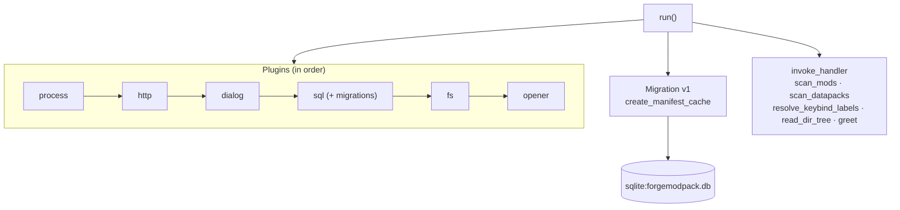
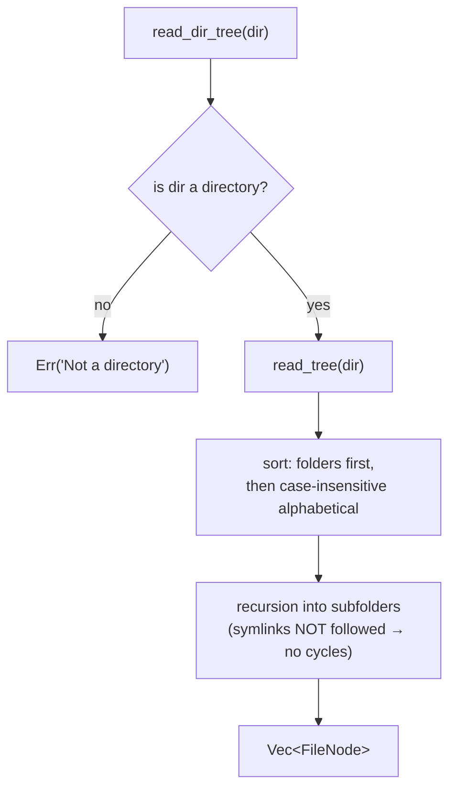

# 05 — Rust Backend

The Tauri backend lives in [`src-tauri/src/`](../../../src-tauri/src) and has a precise
responsibility: **read the disk efficiently** (open jar/zip files, scan folders) and cache the
results. Everything related to network, dialogs and simple text I/O goes instead through the **Tauri
plugins** used directly from the frontend.

> The application commands (`#[tauri::command]` defined here) do **not** require permissions in the
> capabilities, unlike the plugin commands. The scan uses `std::fs`, not `plugin-fs`.

## Files

| File | Role |
|------|-------|
| [`main.rs`](../../../src-tauri/src/main.rs) | Entry point: delegates to `forgemodpack_lib::run()`; hides the console on Windows release |
| [`lib.rs`](../../../src-tauri/src/lib.rs) | App setup, plugin registration, SQLite migration, `invoke_handler` |
| [`mods.rs`](../../../src-tauri/src/mods.rs) | Mod, datapack, keybind scanning (opening jar/zip files) |
| [`files.rs`](../../../src-tauri/src/files.rs) | Recursive file tree for the Documents section |

## Exposed Tauri commands

| Command | File | Signature | Return |
|---------|------|-------|---------|
| `scan_mods` | mods.rs | `(dir: String)` | `Result<Vec<ScannedMod>, String>` |
| `scan_datapacks` | mods.rs | `(dir: String)` | `Result<Vec<ScannedDatapack>, String>` |
| `resolve_keybind_labels` | mods.rs | `(dir: String, keys: Vec<String>)` | `Result<Vec<ResolvedKeybind>, String>` |
| `read_dir_tree` | files.rs | `(dir: String)` | `Result<Vec<FileNode>, String>` |
| `greet` | lib.rs | `(name: &str)` | `String` (example command, unused) |

## `lib.rs` — setup



**SQLite migration** (version 1, `create_manifest_cache`):

```sql
CREATE TABLE IF NOT EXISTS manifest_cache (
  key        TEXT PRIMARY KEY NOT NULL,
  data       TEXT NOT NULL,          -- serialized JSON
  updated_at INTEGER NOT NULL        -- epoch ms
);
```

The `sqlite:forgemodpack.db` DB is registered with `.add_migrations(...)`. It is used as a generic
key-value cache (see [07 — Cache](./07-cache-manifest.md)).

## `files.rs` — file tree



**`FileNode`** (`#[serde(rename_all = "camelCase")]`): `name`, `path` (absolute), `isDir`,
`children` (`None` for files). The **content** of files is read/written on the frontend side with
`@tauri-apps/plugin-fs`, not from here. If `dir` does not exist the command returns `Err` and the
frontend uses it to skip absent folders.

## `mods.rs` — exposed structs

All with `#[derive(Serialize)]`; those marked camelCase rename `mod_id`→`modId`, etc.

| Struct | Fields (serialized) |
|--------|----------------------|
| `ScannedMod` | `filename`, `modId`, `name`, `modloader`, `version`, `description?`, `authors[]`, `dependencies[]`, `provides[]`, `keybinds[]` |
| `ModDependency` | `name`, `version`, `mandatory` |
| `KeybindAction` | `key` (translation key), `label` |
| `ScannedDatapack` | `filename`, `name`, `description?`, `packFormat?` |
| `ResolvedKeybind` | `key`, `label`, `modId` |

The detail of parsing, JarJar and keybind recognition is in
[06 — Mod, datapack and keybind scanning](./06-scansione.md).
