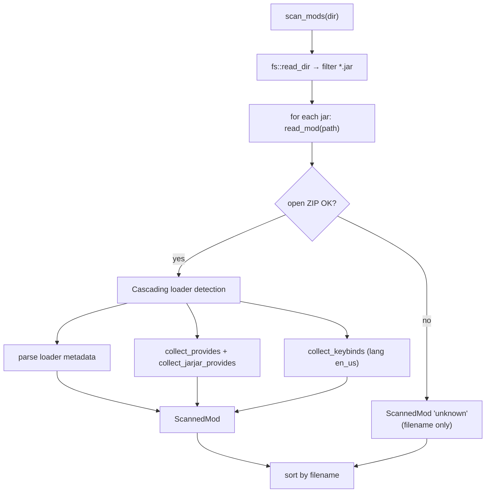
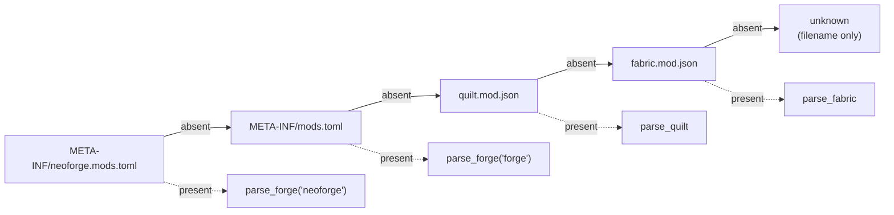
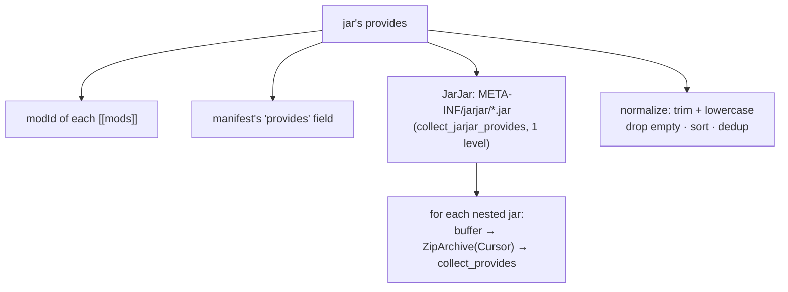
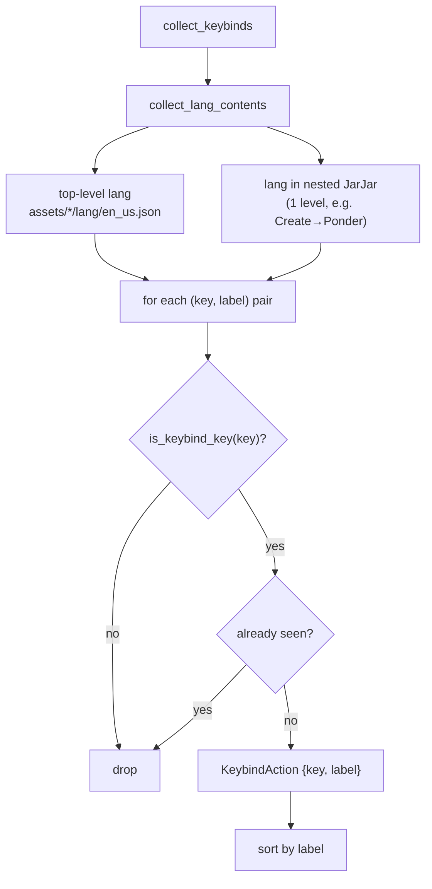

# 06 — Mod, datapack and keybind scanning

The "read from disk" heart of the app. The Rust command [`scan_mods`](../../../src-tauri/src/mods.rs) opens
each `.jar` exactly once as a ZIP archive and extracts, **in a single pass**: metadata,
the `provides` list and keybinds. It is the data source for List Mods and for Keybinds/Import.

## Unified scan of a jar

### Loader detection (cascade)

The order is always the same, both for metadata and for `provides`:

| Format | File | Parser | Notes |
|---------|------|--------|------|
| NeoForge | `META-INF/neoforge.mods.toml` | `parse_forge(..., "neoforge")` | same TOML schema as Forge |
| Forge | `META-INF/mods.toml` | `parse_forge(..., "forge")` | also reads `MANIFEST.MF` |
| Quilt | `quilt.mod.json` | `parse_quilt` | data under `quilt_loader` |
| Fabric | `fabric.mod.json` | `parse_fabric` | |

### Metadata parsing — per-loader details

**Forge/NeoForge** (`parse_forge`):
- Reads the first `[[mods]]`: `modId`, `displayName` (fallback `modId`), `version`, `description`.
- If `version` is empty or contains `${file.jarVersion}`, it substitutes it with the
  `Implementation-Version` read from `MANIFEST.MF` (`manifest_version`).
- `authors`: from a `"a, b"` string or an array (`authors_from_toml`).
- `dependencies`: from `dependencies.<mod_id>`; mandatory if `type == "required"` (new) or
  `mandatory` (classic, default `true`) — `forge_dep_mandatory`.

**Fabric** (`parse_fabric`): `id`, `name`, `version`, `description`; `authors` from an array of strings
or `{name}`; `dependencies` from `depends` (all `mandatory: true`).

**Quilt** (`parse_quilt`): everything under `quilt_loader` (`id`, `version`, `metadata.name/description`,
`contributors`); `depends` as strings (`version:"*"`, mandatory) or objects `{id, versions, optional}`
(`mandatory = !optional`).

## `provides` and JarJar

`provides` = **all** the modIds a jar makes available. It serves to avoid false
"missing dependency" reports: on Forge many dependencies are bundled inside the jar.

`collect_provides` applies the same detection cascade and collects the modIds. `collect_jarjar_provides`
opens each jar inside `META-INF/jarjar/` (reading it into a buffer and re-opening it with `Cursor`) and
calls `collect_provides` — **only one level** deep.

> ⚠️ Projects saved **before** the introduction of `provides` must be re-scanned (refresh)
> to benefit from JarJar; the verification fallback uses `modId` alone.

## Keybind recognition

Within the same opening of the jar, `collect_keybinds` reads the keybind keys from the
`assets/*/lang/en_us.json` files.

### `is_keybind_key` — heuristic

A key is considered a keybind if:
1. it does **not** contain `.categories.` nor start with `key.categories.` (excludes category titles);
2. **and** it has at least one marker segment among: `key`, `keys`, `keybind`, `keybinds`, `keyinfo`,
   `keymapping`.

This covers the heterogeneous prefixes used by mods: `key.jei.x`, `cos.key.x`, `create.keyinfo.x`,
`iris.keybind.x`, `keybind.simplyjetpacks.x`, `mod.chiselsandbits.keys.x`.

> **Known limitation**: mods that name their KeyMappings **without** any marker (e.g. `config.jsg.*`,
> `placebo.toggleTrails`) are indistinguishable from other translations → not covered by the generic
> scan. For those, targeted resolution is used (below).

## Targeted keybind resolution

`resolve_keybind_labels(dir, keys)` receives the **exact** translation keys (e.g. the `actionKey`s
of an imported `keybindprofiles.json`) and searches for an **exact match** across the lang files of each jar for the `label`
and the owning `modId`. No heuristic → it also resolves keybinds with non-standard names without
false positives. The first jar that defines a key wins; keys not found are omitted.

It is used by import ([09 — Keybind I/O](./09-keybind-io.md)) as the first step, more reliable than the
generic scan.

## Datapack

`scan_datapacks(dir)` reads a folder and, for each `.zip` or folder with a `pack.mcmeta`, extracts a
`ScannedDatapack`:

- `read_datapack`: if a directory it reads `pack.mcmeta` from disk; if a `.zip` it reads it from the
  archive; it drops items without a `pack.mcmeta`.
- `parse_pack_mcmeta`: extracts `pack_format` and the `description` **flattened** from the Minecraft
  text component (`text_component_to_string` handles string/array/objects with `text`+`extra`).

## Frontend side — scan cache

Scans are cached in SQLite (no TTL, invalidated only by manual refresh):

| Helper | File | Cache key | Command |
|--------|------|--------------|---------|
| `getModsScanCached` / `peekModsScanCache` | [`mods-scan.ts`](../../../src/lib/mods-scan.ts) | `mods:v2:<workpath>` | `scan_mods` |
| `getKeybindActionsCached` / `peekKeybindActionsCache` | [`keybind-cache.ts`](../../../src/lib/keybind-cache.ts) | (derives from `mods:v2`) | — |
| `resolveKeybindLabels` | [`keybind-cache.ts`](../../../src/lib/keybind-cache.ts) | (none) | `resolve_keybind_labels` |
| `getDatapacksScanCached` / `peekDatapacksScanCache` | [`datapacks-scan.ts`](../../../src/lib/datapacks-scan.ts) | `datapacks:v1:<dir>` | `scan_datapacks` |

`getModsScanCached` is the **single** data source: List Mods derives the metadata from it (without copying the
`keybinds` into `project.json`), Keybinds/Import derive the per-mod actions from it (`toModKeybinds` filters
the mods with at least one keybind). The `v2` prefix in the key invalidates caches written before
the inclusion of keybinds + nested JarJar.
