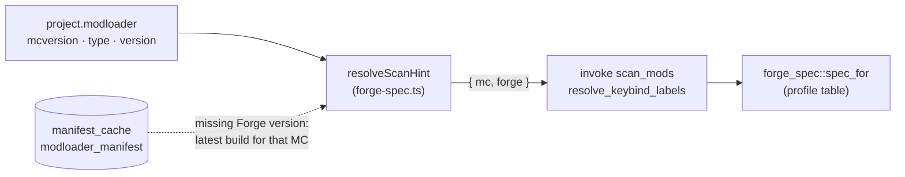
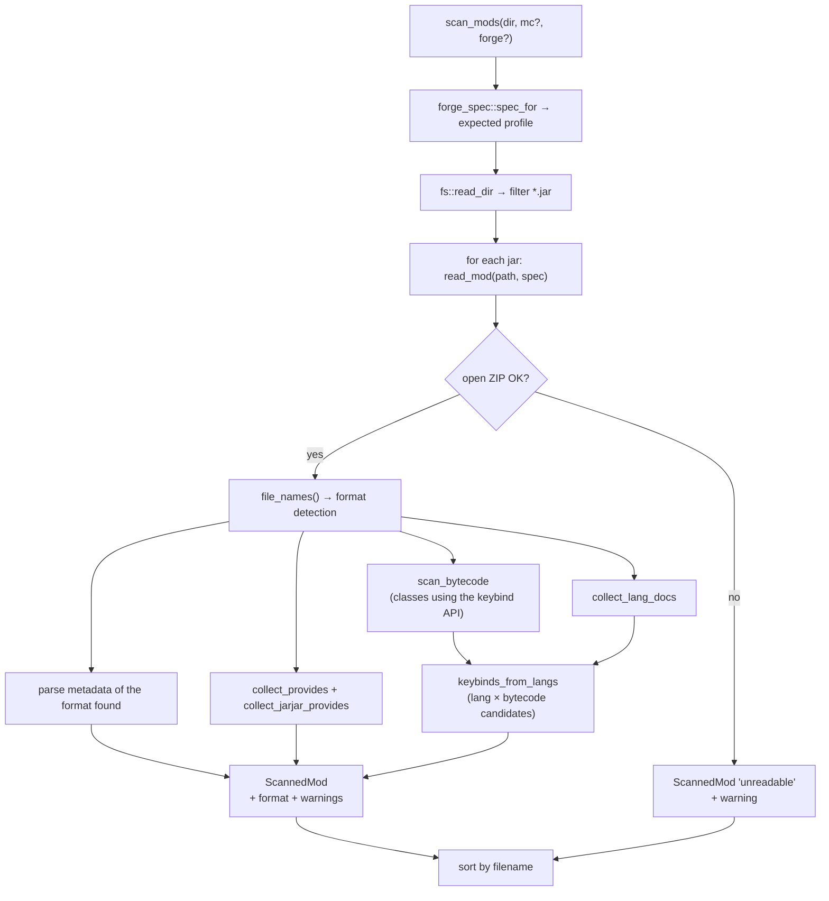
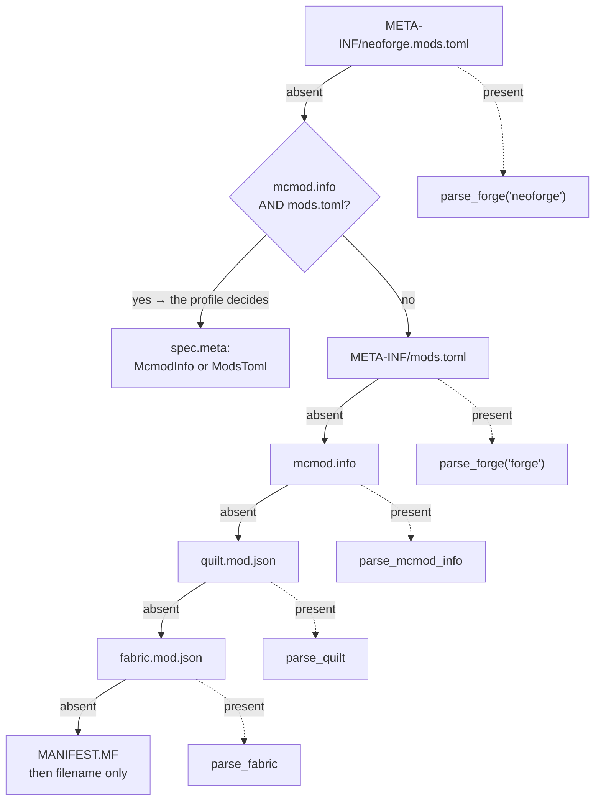
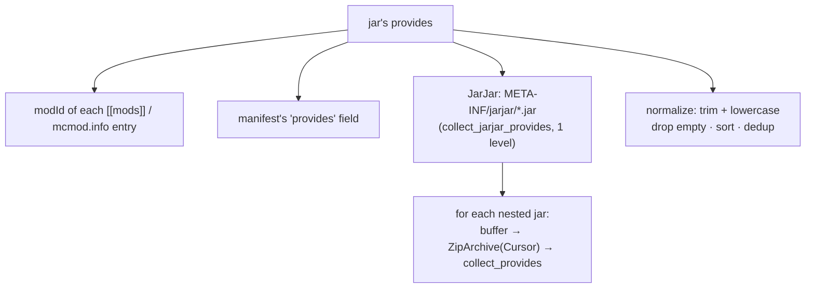
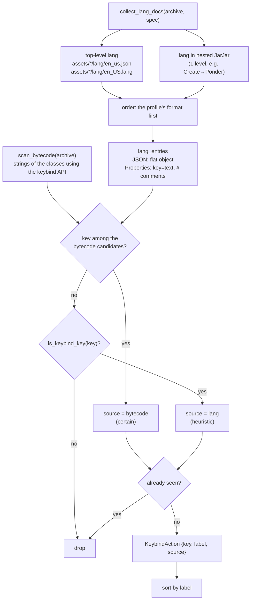
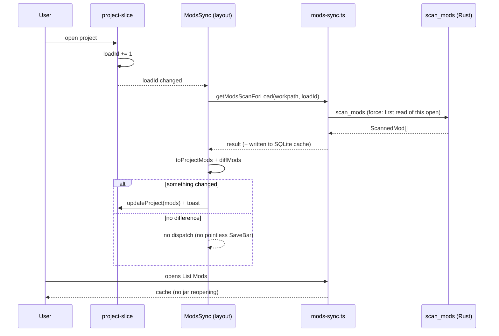

# 06 — Mod, datapack and keybind scanning

The "read from disk" heart of the app. The Rust command [`scan_mods`](../../../src-tauri/src/mods.rs) opens
each `.jar` exactly once as a ZIP archive and extracts, **in a single pass**: metadata,
the `provides` list, keybinds and diagnostics (`format` + `warnings`). It is the data source for
List Mods and for Keybinds/Import.

## Format profiles per Minecraft version

Forge mods changed format over time, both for metadata and for language files. The profile table
lives in [`forge_spec.rs`](../../../src-tauri/src/forge_spec.rs):

| Profile | MC versions | Metadata | Dependencies | Lang |
|---------|-------------|----------|--------------|------|
| `forge-legacy` | ≤ 1.12.2 | `mcmod.info` (JSON) | `requiredMods` / `dependencies` (strings) | `assets/<modid>/lang/en_US.lang` (properties) |
| `forge-fml` | 1.13 – 1.20.4 | `META-INF/mods.toml` | `mandatory = true` / `false` | `assets/<modid>/lang/en_us.json` |
| `forge-fml-modern` | ≥ 1.20.5 | `META-INF/mods.toml` (NeoForge: `neoforge.mods.toml`) | `type = "required"…` + `provides` | `en_us.json` |
| `detect-only` | — (no hint) | prefers `mods.toml` | — | prefers JSON |

> **Primary detection is still the jar's content**: the `mods` folder may contain jars built for
> versions other than the project's. The profile is used to (1) break ties on jars that contain
> *both* metadata formats, (2) order the reading of lang files, (3) produce `warnings` when the
> format found does not match the version declared in the project.

### Where the version hint comes from

[`forge-spec.ts`](../../../src/lib/forge-spec.ts) builds the `{ mc, forge }` hint:

- `mc` = `project.modloader.mcversion` (usually enough to pick the profile);
- `forge` = the **Forge** loader version, used by the backend only when `mc` cannot be parsed
  (e.g. the `24w14a` snapshot). It is **not** passed for NeoForge: that uses a different numbering
  (20.4, 21.1…) which would skew the comparison against Forge numbering (14 / 47 / 50+).
- If the project is on Forge with no loader version picked yet, it is derived from the **latest
  build** for that MC version by reading the manifest already cached in SQLite (host already
  whitelisted, 24h TTL, offline fallback: with no network only `mc` is used).

`spec_for(mc, forge)` is a pure function, covered by unit tests.

## Unified scan of a jar

### Format detection (cascade)

| Format (`ScannedMod.format`) | File | Parser | Notes |
|---|---|---|---|
| `neoforge:mods.toml` | `META-INF/neoforge.mods.toml` | `parse_forge(…, "neoforge")` | same TOML schema as Forge |
| `forge:mods.toml` | `META-INF/mods.toml` | `parse_forge(…, "forge")` | also reads `MANIFEST.MF` |
| `forge:mcmod.info` | `mcmod.info` | `parse_mcmod_info` | Forge ≤ 1.12.2 |
| `quilt:quilt.mod.json` | `quilt.mod.json` | `parse_quilt` | data under `quilt_loader` |
| `fabric:fabric.mod.json` | `fabric.mod.json` | `parse_fabric` | |
| `unknown:manifest` | `META-INF/MANIFEST.MF` | `unknown_mod` | name/version from `Implementation-*` |
| `unknown` / `unreadable` | — | `unknown_mod` / `read_mod` | filename only / jar cannot be opened |

### Metadata parsing — per-format details

**Forge/NeoForge ≥ 1.13** (`parse_forge`):
- reads the first `[[mods]]` (`modId`, `displayName` → fallback `modId` → fallback filename,
  `version`, `description`); if the jar declares several mods it is reported in `warnings`;
- empty `version` or one with a placeholder (`${file.jarVersion}`) → `Implementation-Version` from
  `MANIFEST.MF`; if still unresolved, a warning;
- `authors`: from a `"a, b"` string or an array (`authors_from_toml`);
- **dependencies** (`forge_dependencies`): from `[[dependencies.<modId>]]` with a
  **case-insensitive** lookup over **all** the mod ids declared in the jar; accepts both
  `[[dependencies.x]]` (array) and `[dependencies.x]` (single table); if no key matches but the
  table is not empty the entries are used anyway, with a warning. Mandatory if `type == "required"`
  or `mandatory` (default `true`); `optional`/`incompatible`/`discouraged` are not;
- if the TOML **cannot be parsed**, instead of losing everything it falls back to a lenient
  line-by-line read (`lenient_toml_value` on `modId`/`displayName`/`version`) + a warning.

**Forge ≤ 1.12.2** (`parse_mcmod_info`): `mcmod.info` is either a root array or
`{ modListVersion, modList: [...] }`. Fields: `modid`, `name`, `version` (`${version}` placeholder →
`MANIFEST.MF`), `description`, `authorList` (or `authors`). Dependencies:

| Field | Mandatory by default | Entry format |
|---|---|---|
| `requiredMods` | yes | `jei`, `jei@[4.15,)` |
| `dependencies` | no (load order only) | `after:jei`, `required-after:jei@[4.15,)` |

`parse_legacy_dep` recognises the FML ordering prefixes (`required-after:`, `after:`, `before:`):
a prefix containing `required` makes the dependency mandatory; the rest is split on `@` into name +
`versionRange`.

**Fabric** (`parse_fabric`): `id`, `name`, `version`, `description`; `authors` from an array of strings
or `{name}`; `dependencies` from `depends` (all `mandatory: true`).

**Quilt** (`parse_quilt`): everything under `quilt_loader` (`id`, `version`, `metadata.name/description`,
`contributors`); `depends` as strings (`version:"*"`, mandatory) or objects `{id, versions, optional}`
(`mandatory = !optional`).

## `provides` and JarJar

`provides` = **all** the modIds a jar makes available. It serves to avoid false
"missing dependency" reports: on Forge many dependencies are bundled inside the jar.

`collect_provides` applies the same detection cascade (including `mcmod.info`) and collects the
modIds; on broken TOML it at least recovers the `modId` leniently. `collect_jarjar_provides` opens
each jar inside `META-INF/jarjar/` (reading it into a buffer and re-opening it with `Cursor`) and
calls `collect_provides` — **only one level** deep.

> ⚠️ Projects saved **before** the introduction of `provides` must be re-scanned (refresh)
> to benefit from JarJar; the verification fallback uses `modId` alone.

## Keybind recognition

Two sources, cross-checked within the same opening of the jar:

1. **the bytecode** ([`keybind_scan.rs`](../../../src-tauri/src/keybind_scan.rs)) — how Forge *actually*
   declares a keybind: CERTAIN keybinds;
2. **the language files** (`collect_lang_docs` + `is_keybind_key`) — heuristic on the key name:
   PROBABLE keybinds.

Every `KeybindAction` therefore carries a `source` field (`"bytecode"` | `"lang"`).

Lang path recognition is **case-insensitive** (legacy `en_US.lang` vs `en_us.json`); the ordering puts
the profile's expected format first, so on jars containing both the one matching the MC version wins.
Contents are decoded as UTF-8 and, when the bytes are not valid, as **ISO-8859-1** (common in legacy
`.lang`/`mcmod.info` files): otherwise a single stray byte would discard the whole file and lose every
keybind of that mod. The UTF-8 BOM is stripped (it used to break JSON parsing).

### From the bytecode: `scan_bytecode`

On Forge/NeoForge a keybind is a `KeyBinding`/`KeyMapping` object built in code, and its translation
key is a **constant string** in the class file. So:

1. for each `.class` in the jar (and in nested JarJars) only **header + constant pool** are read
   ([`class_scan.rs`](../../../src-tauri/src/class_scan.rs)): decompression stops there;
2. if the class references one of the SDK classes (`forge_spec::KEYBIND_MARKERS`), its constant
   strings become **candidates**;
3. a candidate that is also a lang key is a certain keybind — even when its name has no marker at all.

This works because SRG reobfuscation of Forge mods renames **only methods and fields**: Minecraft
class names stay readable in published jars. On **Fabric/Quilt** the MC classes are in *intermediary*
(`class_304`), so the bytecode scan does not apply and only the heuristic remains.

### Keybind API per version (SDK table)

In [`forge_spec.rs`](../../../src-tauri/src/forge_spec.rs), next to the format profiles:

| MC versions | Keybind class | Registration |
|---|---|---|
| ≤ 1.7.10 | `net.minecraft.client.settings.KeyBinding` | `cpw.mods.fml.client.registry.ClientRegistry` |
| 1.8 – 1.16.5 | `net.minecraft.client.settings.KeyBinding` | `net.minecraftforge.fml.client.registry.ClientRegistry` |
| 1.17 – 1.19.2 | `net.minecraft.client.KeyMapping` | `ClientRegistry` (in `FMLClientSetupEvent`) |
| ≥ 1.19.3 | `net.minecraft.client.KeyMapping` | `RegisterKeyMappingsEvent` (NeoForge: `net.neoforged.neoforge.client.event` package) |
| ≥ 1.21.9 / NeoForge 21.9 | `KeyMapping.Category` | `RegisterKeyMappingsEvent#registerCategory` |

**All** classes are looked for, not just the profile's: the `mods` folder may contain jars from other
versions. The expected API (`keybind_api_for`) is only used for diagnostics: when the era of the class
found (`KeyBinding` ≤1.16 vs `KeyMapping` ≥1.17) is not the one of the project's MC version, a warning
is emitted — the typical sign of a jar for the wrong version.

### `is_keybind_key` — heuristic (fallback)

A key is considered a keybind if:
1. it is **not** a category title (`is_category_key`): a `categories` segment, or `category` preceded
   by `key` — the latter covers the `key.category.<namespace>.<path>` format introduced with
   `KeyMapping.Category` in **1.21.9**;
2. **and** it has at least one marker segment among: `key`, `keys`, `keybind`, `keybinds`, `keyinfo`,
   `keymapping`.

This covers the heterogeneous prefixes used by mods: `key.jei.x`, `cos.key.x`, `create.keyinfo.x`,
`iris.keybind.x`, `keybind.simplyjetpacks.x`, `mod.chiselsandbits.keys.x`.

> **Remaining limitation**: keybinds whose key is **built at runtime** (`"key." + MODID + ".x"`) or
> declared in a class that does not reference the SDK do not show up among the bytecode candidates; if
> the name has no markers they stay out of the generic scan. For those there is targeted resolution
> (below). Conversely, a key with a marker that is **not** a keybind (e.g. `gui.mod.press.key`) stays
> in the list but marked `source = "lang"`: the Keybinds page lists the certain ones first.

> ⚠️ Cost: the bytecode scan adds decompression (≈17 ms per 1000 classes in release). That is why
> `scan_mods` reads jars on **multiple threads** (`std::thread::scope`, up to 8) and the result stays
> cached in SQLite with no TTL; the final order is always alphabetical, so it does not depend on
> scheduling.

## Targeted keybind resolution

`resolve_keybind_labels(dir, keys, mc?, forge?)` receives the **exact** translation keys (e.g. the
`actionKey`s of an imported `keybindprofiles.json`) and searches for an **exact match** across the
lang files of each jar for the `label` and the owning `modId` — in both lang formats, so it works on
legacy mods too. No heuristic → it also resolves keybinds with non-standard names without false
positives. The first jar that defines a key wins; keys not found are omitted.

It is used by import ([09 — Keybind I/O](./09-keybind-io.md)) as the first step, more reliable than the
generic scan.

## Diagnostics (`format` + `warnings`)

Every `ScannedMod` carries the detected format and the list of problems (in English, like the
exporter warnings). List Mods shows them in the **Format** column: a badge with the metadata file
name and, when there are warnings, an icon with a tooltip; a summary card counts the mods **with
warnings**. Typical cases:

| Warning | Meaning |
|---|---|
| `Metadata format … expected …` | jar built for an MC version other than the project's |
| `… is not valid TOML …` | malformed `mods.toml`: metadata read leniently |
| `Dependencies are declared under a different mod id …` | `[[dependencies.x]]` key not aligned with `modId` |
| `Dependencies declared with … while … is expected` | `mandatory =` / `type =` style not aligned with the MC version |
| `No English language file … found` | the jar declares keybinds but has no English lang files → not detectable (not emitted for mods without keybinds) |
| `Keybinds use KeyBinding … expects KeyMapping …` | the keybind class era found in the bytecode is not the one of the project's MC version |
| `Bytecode scan stopped after … classes` | jar beyond the inspected-class limit: some keybinds may be missing |
| `Version placeholder could not be resolved` | `${…}` not resolvable without `Implementation-Version` |
| `No known mod metadata … was found` | no recognised format (data from MANIFEST or filename only) |

These fields do **not** end up in `project.json`: List Mods reads them from the scan cache (peek on
mount), so the project file stays lightweight.

## Syncing with disk

The lists derived from disk (mods and datapacks) **must not stay frozen** at the moment the project
was saved: if a mod is removed, added or updated outside the app, the project has to follow. The
rule:

- **on every project open** (create/open → `loadId` incremented in the project slice) the first read
  re-reads the files from disk, even when `project.mods` is already populated;
- **within the same open** later reads use the SQLite cache, so navigating between pages does not
  reopen every jar;
- **manual refresh** always forces a re-read.

| Piece | Role |
|---|---|
| `loadId` ([project-slice.ts](../../../src/redux/project-slice.ts)) | Counter of project opens, not persisted: the "re-read from disk" signal |
| `getModsScanForLoad` / `getDatapacksScanForLoad` ([mods-sync.ts](../../../src/lib/mods-sync.ts)) | Re-read on the first request of an open, then cache; **dedup** of concurrent requests (one shared scan) |
| `refreshModsScan` / `refreshDatapacksScan` | Manual refresh: always forces |
| `toProjectMods` / `toProjectDatapacks` | Scan → project lists, preserving `active` per `filename`; entries no longer on disk disappear |
| `diffMods` / `diffDatapacks` | Counts added/removed/updated (`active` excluded: it belongs to the user) |
| `<ModsSync />` ([mods-sync.tsx](../../../src/components/mods-sync.tsx)) | Headless in the layout: syncs on every open **whatever page is open**, also updates `keybindActions`, shows the diff toast |

> **`updateProject` only when the diff is non-empty**: opening a project or a page must not raise the
> SaveBar when nothing changed on disk.

> ⚠️ **React gotcha**: "already synced" guards must be checked **and set after the `await`**. Set
> before, in dev (React StrictMode invokes effects twice) the first invocation is cancelled and the
> second skips the work: the result is no sync at all.

## Datapack

`scan_datapacks(dir)` reads a folder and, for each `.zip` or folder with a `pack.mcmeta`, extracts a
`ScannedDatapack`:

- `read_datapack`: if a directory it reads `pack.mcmeta` from disk; if a `.zip` it reads it from the
  archive; it drops items without a `pack.mcmeta`.
- `parse_pack_mcmeta`: extracts `pack_format` and the `description` **flattened** from the Minecraft
  text component (`text_component_to_string` handles string/array/objects with `text`+`extra`).

## Frontend side — scan cache

Scans are cached in SQLite (no TTL, invalidated only by manual refresh):

| Helper | File | Cache key | Command |
|--------|------|--------------|---------|
| `getModsScanCached` / `peekModsScanCache` | [`mods-scan.ts`](../../../src/lib/mods-scan.ts) | `mods:v4:<mc>:<forge>:<workpath>` | `scan_mods` |
| `getKeybindActionsCached` / `peekKeybindActionsCache` | [`keybind-cache.ts`](../../../src/lib/keybind-cache.ts) | (derives from `mods:v4`) | — |
| `resolveKeybindLabels` | [`keybind-cache.ts`](../../../src/lib/keybind-cache.ts) | (none) | `resolve_keybind_labels` |
| `getDatapacksScanCached` / `peekDatapacksScanCache` | [`datapacks-scan.ts`](../../../src/lib/datapacks-scan.ts) | `datapacks:v1:<dir>` | `scan_datapacks` |

`getModsScanCached` is the **single** data source: List Mods derives the metadata from it (without copying the
`keybinds` into `project.json`), Keybinds/Import derive the per-mod actions from it (`toModKeybinds` filters
the mods with at least one keybind). The **version hint is part of the key**: changing the Minecraft
version changes the expected format, so the scan is redone. The `v3` prefix invalidates caches
written before legacy format support and the `format`/`warnings` fields.

## Tests

`cargo test --lib` covers the pure parts and an end-to-end case as well: the
`scansione_end_to_end_legacy_e_moderno` test builds two real `.jar` files (one with `mcmod.info` +
`en_US.lang`, one with `mods.toml` + `en_us.json`) in a temporary folder and checks metadata,
dependencies, keybinds, `format`, `warnings` and `resolve_keybind_labels`.
