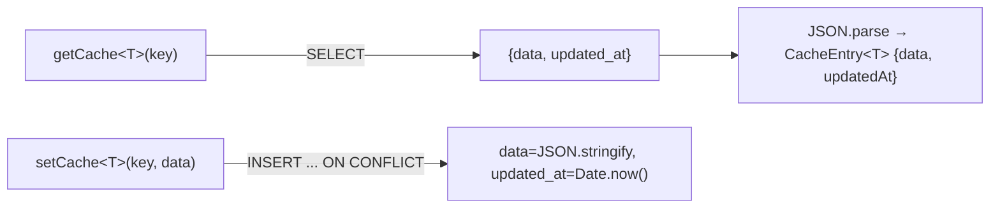
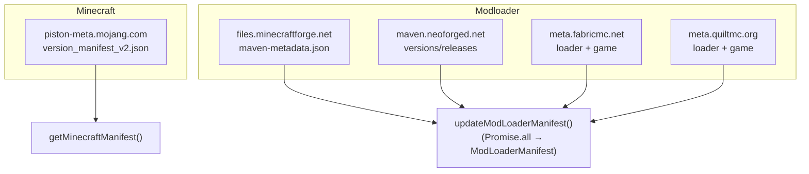
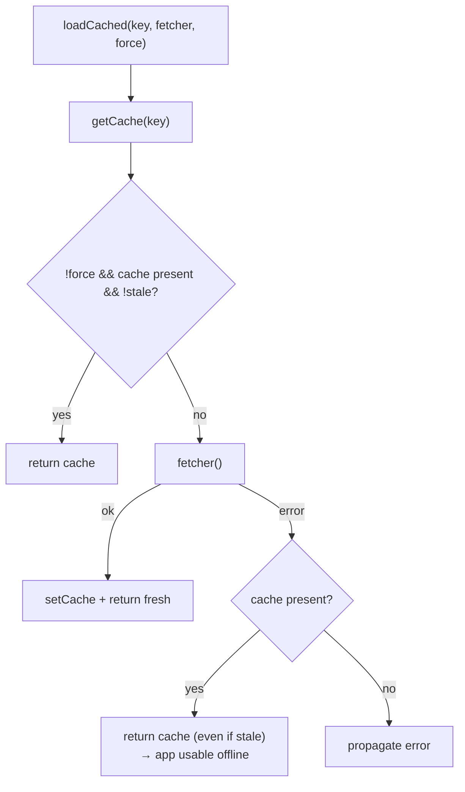
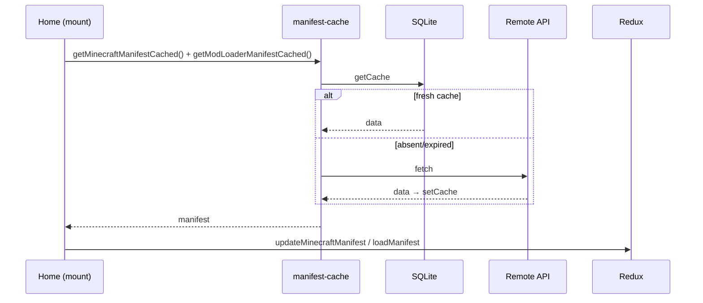

# 07 — SQLite cache and remote manifests

To avoid querying the APIs on every launch, the app caches the manifests (and the scans) in a local
SQLite DB. The network is used **only** for version metadata: never to download mods.

## Key-value cache (SQLite)

[`cache-db.ts`](../../../src/lib/cache-db.ts) exposes generic access to the `manifest_cache` table
(schema in [05 — Rust Backend](./05-backend-rust.md)):

- Singleton connection (`Database.load("sqlite:forgemodpack.db")`) → the migrations run
  only once.
- `getCache<T>(key)`: returns `{ data, updatedAt }` or `null`.
- `setCache<T>(key, data)`: upsert with the current timestamp.

### Keys used

| Key | Content | TTL |
|--------|-----------|-----|
| `minecraft_manifest` | MC versions manifest | 24h |
| `modloader_manifest` | Forge/NeoForge/Fabric/Quilt manifest | 24h |
| `mods:v2:<workpath>` | Mod scan (metadata + keybind) | none (manual refresh) |
| `datapacks:v1:<dir>` | Datapack scan | none (manual refresh) |

## Remote manifests

[`get-manifest.ts`](../../../src/lib/get-manifest.ts) uses `@tauri-apps/plugin-http` to download the data.
The hosts are **whitelisted** in [`capabilities/default.json`](../../../src-tauri/capabilities/default.json).

`updateModLoaderManifest()` runs the six fetches in parallel (Forge, NeoForge, Fabric loader+game,
Quilt loader+game) and recomposes them into a single `ModLoaderManifest`.

## Cache strategy (TTL + offline fallback)

[`manifest-cache.ts`](../../../src/lib/manifest-cache.ts) orchestrates TTL, fetch and fallback:

- **TTL** = 24h (`TTL_MS`); `isStale(updatedAt)` = `Date.now() - updatedAt > TTL_MS`.
- Public APIs:
  - `getMinecraftManifestCached(force = false)`
  - `getModLoaderManifestCached(force = false)`
- `force = true` (manual refresh from the Home) bypasses the cache and re-downloads.
- If the fetch fails (offline) but a cache exists, it uses it **even if expired**.

## Bootstrap in Home

A ref (`bootstrapped`) avoids the double fetch caused by React StrictMode.

## Scan cache

The mod/datapack scans use the same SQLite store but **without TTL** (the folder changes
rarely; it is invalidated only by manual refresh). Details in
[06 — Scanning](./06-scansione.md). The versioning in the key (`v2`, `v1`) allows invalidating
old caches in bulk when the shape of the data changes.
