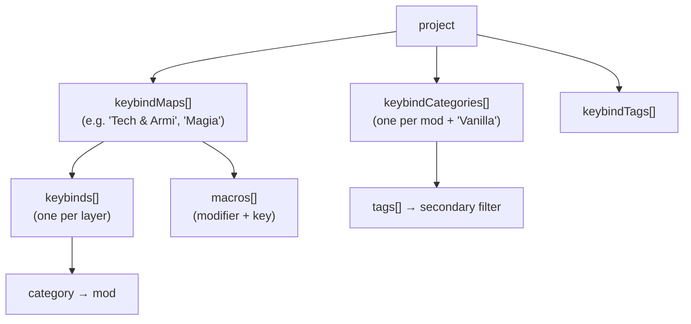
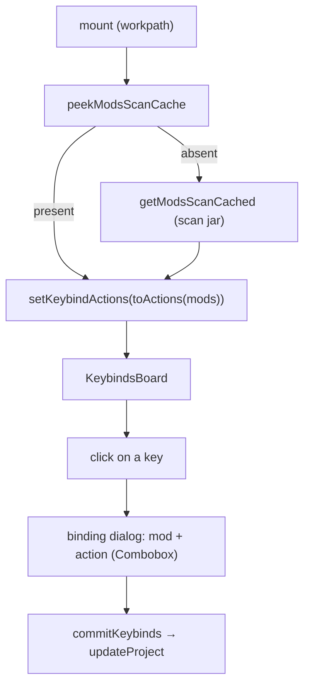
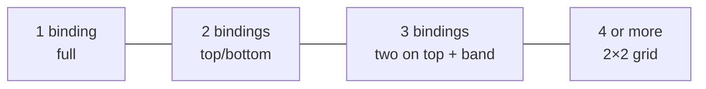

# 08 — Keybinds

The richest section of the app: a **graphical representation of the keyboard** (ISO/IT layout +
numpad + mouse) on which to assign mod actions, organized into multiple **maps/profiles** with
two classification axes (Mod and Tag).

## Concepts

- **Map** (`keybindMap`): a profile with its own set of `keybinds` and `macros`. The project has
  more than one; a selector at the top with add/remove.
- **Category** (`keybindCategory`): primary axis = a **mod** (`name` = mod name), with `color` and
  `tags[]`. The default non-mod category is **"Vanilla"**.
- **Tag** (`keybindTag`): secondary filter axis, associated with the mods.
- The binding stores only `category` (the mod); the tags derive from the mod.

## Keyboard layout

[`keyboard-layout.ts`](../../../src/lib/keyboard-layout.ts) is **data-driven** (rem units). Each key has a
**stable** `id`: it is the key the bindings are tied to, so it must not be changed once in use.

- `KeyDef { id, label, w?, tall? }` and `Spacer { spacer }` (with the `isSpacer` type guard).
- `MAIN_ROWS`: 6 rows (function, numbers, qwerty, home, shift, bottom) with navigation cluster and
  arrows; `NUMPAD_ROWS`/`NUMPAD_SIDE` for the numeric keypad; `MOUSE_KEYS` for the mouse buttons.
- The IT key ids include the accented ones (`igrave`, `egrave`, `agrave`, `ograve`, `ugrave`).
- **Scale**: in [`keybinds/page.tsx`](../../../src/app/keybinds/page.tsx) `KEY_SCALE` (1.35) is the
  **single** source the grid measures derive from — `UNIT_REM` (2.5 → 3.375rem, i.e. 54px for a 1u key),
  `GAP_REM`, `KEY_GAP_STYLE` (the markup gaps too: they were `gap-1` by coincidence) and `scaledPx()`
  for the folded corner. Scaling only part of it would throw off `keyWidth()`, which sums units **and**
  gaps: wide keys would no longer line up with the grid. The **text sizes** stay fixed
  (`text-[9px]`/`text-[7.5px]`/`text-[10px]`): the bigger key is there to give the action room (more
  characters per line, two full lines), not to write it larger. The three blocks (keyboard,
  numpad, mouse) **wrap** (`flex-wrap`) because at this scale they don't fit in a row on normal
  screens, and `overflow-x-auto` stays for the keyboard alone.

## Template for a new map

[`keybind-template.ts`](../../../src/lib/keybind-template.ts) — separate from the layout — defines what
a new map is born from:

- **`defaultKeybinds()`**: the **vanilla** Minecraft keybinds with the default keys (movement,
  inventory, UI, multiplayer, hotbar 1-9 → `digit1..9`), all with a valid `actionKey` → exportable.
  It also includes **hardcoded** functions without an `actionKey` (`esc`→Menu, `f1`→Toggle HUD, `f3`→Debug) as a
  reference (they occupy fixed keys, not exportable).
- **`defaultCategories()`**: the sole non-mod category **"Vanilla"** (color `#6b7280`).
- **`defaultTags()`**: a predefined list of thematic tags (Movement, Inventory, Technology, Magic…,
  names in canonical English since they are persisted data). They are put into the project **on
  creation** ([`new-project.ts`](../../../src/lib/new-project.ts)), not on the first map: they are used
  to label mods via **Add Mod**, which works before any map exists.
- **`vanillaActions()`**: the complete list of vanilla keybinds (`{actionKey, label}`), used as a
  fallback in the dialog when the category is not a scanned mod.

When a map is created, the template is merged into the project's categories/tags **without
duplicates**. For tags that merge is now just a safety net for projects created before `emptyProject`
included them (empty `keybindTags`); categories really do start there, because "Vanilla" only makes
sense together with a map.

## Page flow

- **Bootstrap**: at mount it reads the unified cache; if absent it runs the scan (so the page is
  usable even without having opened List Mods first). `scanKeybinds(force)` for the manual refresh.
- **`actionsForCategory(name)`**: if the category is non-mod (Vanilla) → `vanillaActions()`; otherwise
  it resolves the mod and returns the scanned keybinds, or `null` (→ free input) if the mod has none.
- **`commit(next)`** = `dispatch(updateProject(next))`; `commitKeybinds`/`commitMacros` update
  only the active map.

## Map layers

A key can serve several actions, but drawing them all at once turns the keyboard into a mosaic of
colors. **Layers** are transparencies stacked INSIDE the same map: you look at one level at a time and
every key shows a single binding, in a solid color.

| Data | Where | Meaning |
|---|---|---|
| `keybind.layer?` | [`models.ts`](../../../src/model/models.ts) | the binding's layer, `>= 1` with no maximum; **absent = 1** (projects saved before layers) |
| `keybindMap.layerCount?` | same | how many layers the map has; explicit, so a freshly created empty layer doesn't vanish |

- **`layerOf(binding)`** normalizes the layer (out of range → 1); **`layerCountOf(map)`** never drops
  below the highest layer actually used by the bindings (an import or a hand edit could exceed
  `layerCount`).
- **`effectiveLayer`** falls back to 1 when the selected layer doesn't exist in the current map:
  switching maps would otherwise leave the keyboard empty with no explanation.
- **Flattening**: `flattened = effectiveLayer === "all" || filtersActive`. With a filter on (mod, tag
  or search) the subset is already small — there you want "that mod's map", not layer 2 — and the
  isolated view shows a single color per key anyway, so there is nothing to split. The `KeyCap` goes
  back to splitting into tiles (`colorRects`) only on **"All layers"** with no filter.
- **Key tooltip**: `KeyCap` uses the shadcn/Radix `Tooltip`, **not** the native `title` attribute (which
  showed up late, with the system font and lines separated by `\n`): inside the key the action is clamped
  to two 9px lines, so that is exactly where you need to read it in full. Every binding in the tooltip
  carries **its mod's color dot**, so it also explains the key's tiles. A key that is empty and has no
  hidden bindings gets no tooltip: it would repeat the label already written on it (and that would be
  ~100 useless tooltips). `delayDuration={250}` instead of the global provider's 0: moving the mouse
  across the keyboard, instant tooltips would be a constant flicker.
- **Hidden-bindings mark**: the key shows a **folded corner** in its top-right (like the tip of a sheet
  underneath), with a tooltip for whatever the view doesn't show: the **other layers**
  (`alsoOnLayers`) in the per-layer view, the **other mods** (`alsoUsedBy`) in the isolated view.
  Without that mark an already taken key would look free; one dot per layer made the key look messy.
- **`spreadOnLayers()`** spreads bindings that share a key onto separate layers: it is the migration
  for projects born before layers. The button only shows up when a key really does have more than one
  binding on the same layer.
- Only the **last layer can be removed, and only if empty**: deleting a full one would throw bindings
  away without showing what is lost.

### Key editor

The dialog is a **flat list** of bindings inside a `ScrollArea` (bindings have no maximum: without a
scrollable area the dialog would grow past the screen). Each row has an action, a mod and a **layer
Select**; the Select's last entry, `NEW_LAYER_VALUE`, opens one more layer and moves the binding there,
so no dedicated button is needed.

- `sortedDrafts` orders the rows by layer: the list is flat, so without an order rows would jump around
  as soon as you change the Select.
- `setDraftLayer(id, value)` performs **no automatic swap**: with a Select, seeing another row move
  would be unexplainable. Two bindings on the same layer are allowed, and `sharedLayers` flags them
  below the list (that's the reason a key would go back to showing itself split into tiles).
- `draftBinding`s keep a **stable `id`**: the array index isn't (it shifts when a row is removed) and it
  serves as the React key and for targeted updates.
- A layer created here (`draftLayers`) is written into the map on save (`layerCount`) even if it stays
  empty.

The dialog manages the drafts (`addDraftBinding`, `updateDraftBinding`, `removeDraftBinding`,
`setDraftLayer`, `draftToKeybinds`) and saves with `saveBinding` (active map only) or
`saveBindingToAll` (all maps, with a confirmation).

## Multi-binding per key

A key can have **as many bindings as needed** (one per layer, layers are unlimited). In the flattened
view with no filter ("All layers") the `KeyCap` divides the background into tiles, one color per mod:

> Past 4 tiles `colorRects` adds no further subdivisions: the flattened view of a very crowded key
> stays unreadable by construction, and that is exactly the case where looking at one layer at a time
> is the point.

## Import and layers

The keyset importer ([`keybind-import/keyset.ts`](../../../src/lib/keybind-import/keyset.ts)) assigns
layers while rebuilding the maps: a key's first binding goes to layer 1, the second to layer 2, and so
on, with `ImportedMap.layerCount` reporting how many are needed. Without this, an import would bring
the map back to the "harlequin" state layers exist to avoid. Since layers have no cap, **no binding is
dropped any more** because a key is full: the `overflow` reason was removed from
`ImportIssueReason`.

> **Export** is unchanged: layers organize the view, while `options.txt`/keyset still receive every
> binding of the map (in game, several actions on one key remain a conflict, as they already did).

## Action selection

The dialog does not use free text but a **Combobox** with the real actions of the selected mod
(from the unified scan), searchable by label. The binding stores both `action` (label) and
`actionKey` (translation key, optional → backward-compatible). The `actionKey` is what the
export needs.

## Filters

Two combined filter bars (`matchesFilters`): **Mods** (category) + **Tags** + text search.

The bars only offer **what the active map actually uses** (`usedInMap` → `filterCategories` /
`filterTags`, looking at bindings **and** macros): categories are project-wide, so the full list
included mods without a single key in that map — filtering by them gave an empty keyboard, and on a big
modpack the useful chip was buried. The **selected** value stays in the list even when it is no longer in
use (which happens when switching maps): an active but invisible filter could never be cleared.

The filter bar's chips live in a `ChipStrip`: **two rows at most** (`grid-flow-col` + `grid-rows-2`, so the
strip grows in width, not in height) with native **horizontal scrolling** — it sits right above the
keyboard, and wrapping freely pushed it off screen. The strip label and the "All" chip stay outside the
scrolling area, so clearing the filter is always within reach.

The **Mods** and **Tags** cards at the top do **not** use the `ChipStrip`: their chips wrap freely and list
**all** the project's categories/tags, because they are the management list (color, associated tags) and
must be reachable even before being used in a map.

With at least one filter on (`filtersActive`) the keyboard switches to the **isolated view**: each key
shows **only the matching bindings**, at full color, and keys with no match stay empty like on a brand
new map. Previously the other mods' bindings stayed on the key, merely dimmed: filtering by one mod
left the keyboard a patchwork of colors, the opposite of what you need (looking at "the layer dedicated
to that mod"). The excluded bindings are not lost from sight: the folded corner reports them
(`alsoUsedBy`). Same rule for **macros**, which are colored chips in the same view: the ones outside
the filter are hidden, not dimmed (`visibleMacros`, keeping the original index for the editor).

## Managing mods, tags, maps

| Action | Main effect |
|--------|--------------------|
| **Add/Edit Mod** | Combobox over the mods → `name` = mod name, color, associated tags. Renaming propagates to all bindings of all maps. After adding a new one, it runs `scanKeybinds(true)` if not in cache |
| **Remove Mod** | Removes the category and its bindings |
| **Add/Edit Tag** | Name (+ renaming updates the categories' tags) |
| **Add/Edit Map** | New map pre-populated with `defaultKeybinds()`; adds missing categories/tags |
| **Remove Map** | Removes the map |
| **Macro** | `openAddMacro`/`saveMacro`/`removeMacro`: modifier + base key + action |

Persistence: everything via `updateProject` → `unsaved` → SaveBar. The **Export** and **Import**
dialogs are mounted here (see [09 — Keybind I/O](./09-keybind-io.md)); the import report is shown in a
Card with a table (Map / Action / Key / Problem).

## Macros

Macros (`macro`) are **modifier + key** combinations (e.g. Ctrl+A) tied to an action.
They live in the `keybindMap`, separate from the normal keybinds. A single modifier per combination
(`ctrl` | `shift` | `alt`), the standard supported by mods like Keyset.

> ⚠️ Macros are **not** representable in the vanilla `options.txt` format: on export they are
> skipped and reported (see [09](./09-keybind-io.md)).
