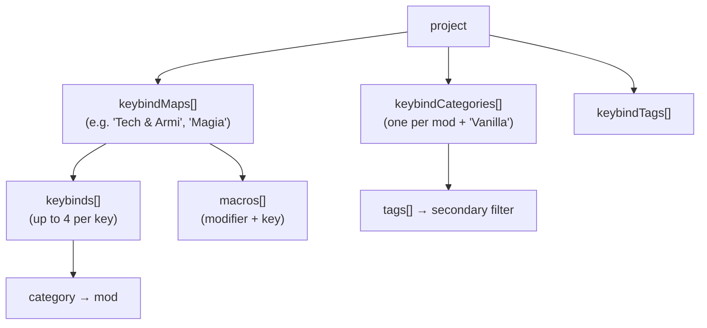
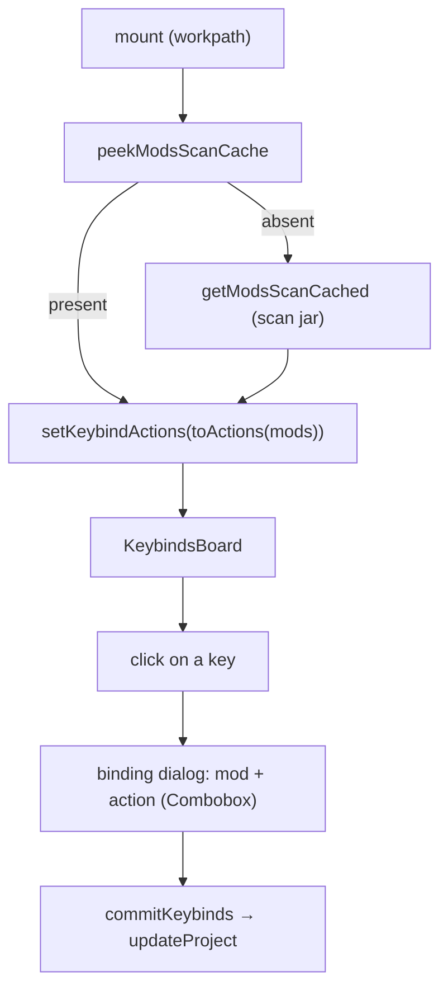
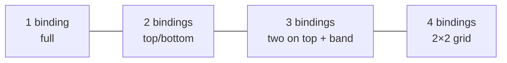

# 08 — Keybinds

The richest section of the app: a **graphical representation of the keyboard** (ISO/IT layout +
numpad + mouse) on which to assign mod actions, organized into multiple **maps/profiles** with
two classification axes (Mod and Tag).

## Concepts

- **Map** (`keybindMap`): a profile with its own set of `keybinds` and `macros`. The project has
  more than one; a selector at the top with add/remove.
- **Category** (`keybindCategory`): primary axis = a **mod** (`name` = mod name), with `color` and
  `tags[]`. The default non-mod category is **"Vanilla"**.
- **Tag** (`keybindTag`): secondary filter axis, associated with the mods.
- The binding stores only `category` (the mod); the tags derive from the mod.

## Keyboard layout

[`keyboard-layout.ts`](../../../src/lib/keyboard-layout.ts) is **data-driven** (rem units). Each key has a
**stable** `id`: it is the key the bindings are tied to, so it must not be changed once in use.

- `KeyDef { id, label, w?, tall? }` and `Spacer { spacer }` (with the `isSpacer` type guard).
- `MAIN_ROWS`: 6 rows (function, numbers, qwerty, home, shift, bottom) with navigation cluster and
  arrows; `NUMPAD_ROWS`/`NUMPAD_SIDE` for the numeric keypad; `MOUSE_KEYS` for the mouse buttons.
- The IT key ids include the accented ones (`igrave`, `egrave`, `agrave`, `ograve`, `ugrave`).

## Template for a new map

[`keybind-template.ts`](../../../src/lib/keybind-template.ts) — separate from the layout — defines what
a new map is born from:

- **`defaultKeybinds()`**: the **vanilla** Minecraft keybinds with the default keys (movement,
  inventory, UI, multiplayer, hotbar 1-9 → `digit1..9`), all with a valid `actionKey` → exportable.
  It also includes **hardcoded** functions without an `actionKey` (`esc`→Menu, `f1`→Toggle HUD, `f3`→Debug) as a
  reference (they occupy fixed keys, not exportable).
- **`defaultCategories()`**: the sole non-mod category **"Vanilla"** (color `#6b7280`).
- **`defaultTags()`**: a predefined list of thematic tags (Movement, Inventory, Technology, Magic…).
- **`vanillaActions()`**: the complete list of vanilla keybinds (`{actionKey, label}`), used as a
  fallback in the dialog when the category is not a scanned mod.

When a map is created, the template is merged into the project's categories/tags **without
duplicates**.

## Page flow

- **Bootstrap**: at mount it reads the unified cache; if absent it runs the scan (so the page is
  usable even without having opened List Mods first). `scanKeybinds(force)` for the manual refresh.
- **`actionsForCategory(name)`**: if the category is non-mod (Vanilla) → `vanillaActions()`; otherwise
  it resolves the mod and returns the scanned keybinds, or `null` (→ free input) if the mod has none.
- **`commit(next)`** = `dispatch(updateProject(next))`; `commitKeybinds`/`commitMacros` update
  only the active map.

## Multi-binding per key

A key can have up to **4** bindings (`MAX_BINDINGS = 4`). The `KeyCap` divides the background into
tiles, one color per mod:

The key dialog manages the drafts (`addDraftBinding`, `updateDraftBinding`, `removeDraftBinding`,
`draftToKeybinds`) and saves with `saveBinding` (active map only) or `saveBindingToAll` (all maps).

## Action selection

The dialog does not use free text but a **Combobox** with the real actions of the selected mod
(from the unified scan), searchable by label. The binding stores both `action` (label) and
`actionKey` (translation key, optional → backward-compatible). The `actionKey` is what the
export needs.

## Filters

Two combined filter bars (`matchesFilters`): **Mods** (category) + **Tags** + text search.
Keys outside the filters are "dimmed" (attenuated), not hidden.

## Managing mods, tags, maps

| Action | Main effect |
|--------|--------------------|
| **Add/Edit Mod** | Combobox over the mods → `name` = mod name, color, associated tags. Renaming propagates to all bindings of all maps. After adding a new one, it runs `scanKeybinds(true)` if not in cache |
| **Remove Mod** | Removes the category and its bindings |
| **Add/Edit Tag** | Name (+ renaming updates the categories' tags) |
| **Add/Edit Map** | New map pre-populated with `defaultKeybinds()`; adds missing categories/tags |
| **Remove Map** | Removes the map |
| **Macro** | `openAddMacro`/`saveMacro`/`removeMacro`: modifier + base key + action |

Persistence: everything via `updateProject` → `unsaved` → SaveBar. The **Export** and **Import**
dialogs are mounted here (see [09 — Keybind I/O](./09-keybind-io.md)); the import report is shown in a
Card with a table (Map / Action / Key / Problem).

## Macros

Macros (`macro`) are **modifier + key** combinations (e.g. Ctrl+A) tied to an action.
They live in the `keybindMap`, separate from the normal keybinds. A single modifier per combination
(`ctrl` | `shift` | `alt`), the standard supported by mods like Keyset.

> ⚠️ Macros are **not** representable in the vanilla `options.txt` format: on export they are
> skipped and reported (see [09](./09-keybind-io.md)).
