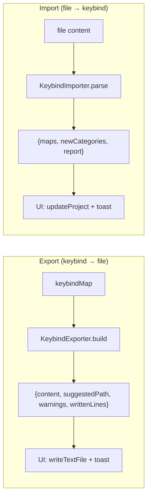
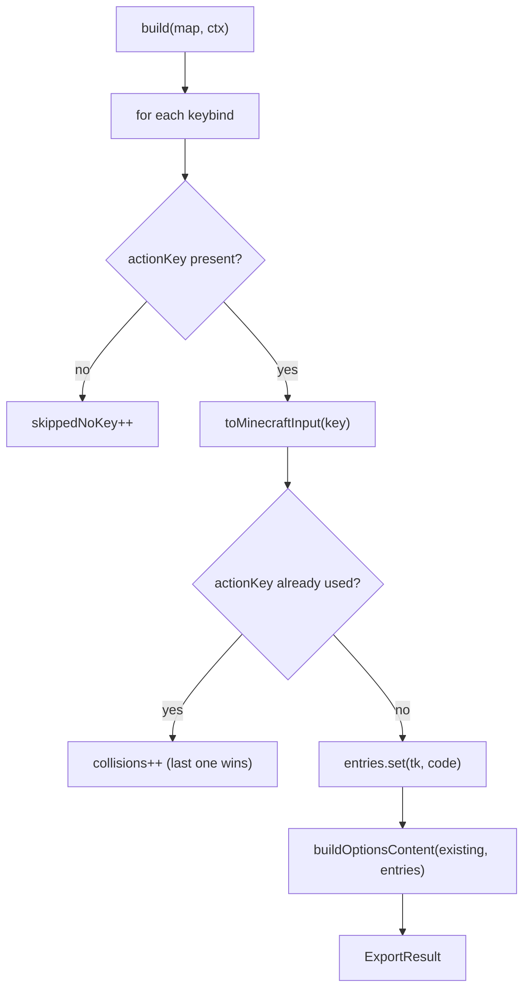
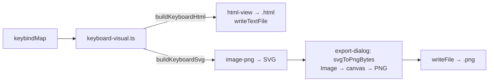
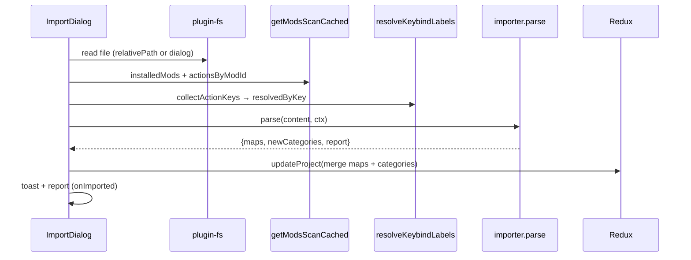

# 09 — Keybind Import / Export

Two symmetric and **pure** abstractions (no disk I/O): reading/writing the file and the toasts
stay in the UI, so permissions and error handling are centralized.

## Export

[`keybind-export/`](../../../src/lib/keybind-export). The `EXPORTERS` registry orders the exporters as
shown in the UI; `getExporter(id)` retrieves them.

### `KeybindExporter` interface

| Field | Meaning |
|-------|-------------|
| `id` | `"options-txt"` \| `"keyset"` |
| `label` | Label in the dialog |
| `defaultFileName` | E.g. `options.txt` |
| `available` | `false` = disabled in UI (format not ready) |
| `build(map, ctx)` | Exports a single map → `ExportResult` |
| `buildAll?(maps, ctx)` | Optional: exports all maps into one file (multi-profile formats) |

`ExportResult`: `{ content, suggestedPath, warnings[], writtenLines }`. `ExportContext`:
`{ project, workpath, readExisting(absPath) }` (`readExisting` is injected by the UI for exporters
that perform a merge).

### `options-txt` (active)

[`options-txt.ts`](../../../src/lib/keybind-export/options-txt.ts) exports Minecraft vanilla's
`options.txt` file.

Warnings generated: keybinds without a translation key skipped, non-mappable keys (`unknown`), actions with
multiple keys (last one kept), macros not supported.

### Conservative merge

[`merge-options.ts`](../../../src/lib/keybind-export/merge-options.ts) — `buildOptionsContent(existing,
entries)` — is the anti-data-loss core: `options.txt` contains many non-keybind lines
(graphics/audio) that must **not** be touched.

| Line | Behavior |
|------|---------------|
| non `key_*` | preserved unchanged |
| `key_*` present in the project | overwritten with the new input code |
| `key_*` not in the project | left unchanged (bindings of unmanaged mods) |
| new `key_*` | appended at the end |

It also preserves the existing line ending (CRLF/LF) and the presence/absence of a trailing newline. If the file
does not exist, it emits only the keybind lines (LF).

### Key → Minecraft input code translation

[`mc-keycodes.ts`](../../../src/lib/mc-keycodes.ts):

- **`toMinecraftInput(keyId)`**: layout id → MC input code (`"w"` → `key.keyboard.w`,
  `"shiftleft"` → `key.keyboard.left.shift`, `"mouse1"` → `key.mouse.left`, `"num5"` →
  `key.keyboard.keypad.5`). Fallback `UNMAPPED` (`key.keyboard.unknown`) for accented IT keys and
  non-US symbols, which do not have a stable vanilla input code.
- **`fromMinecraftInput(code)`**: the inverse (used by import); `null` if not recognized. For codes
  with multiple ids (e.g. `enter1`/`enter2` → `key.keyboard.enter`) the first one inserted in `SPECIAL` wins.

### Keyboard visualization: interactive HTML and PNG image

Besides the config formats, you can export the **graphical representation** of the keybind map. The
rendering lives in [`keyboard-visual.ts`](../../../src/lib/keybind-export/keyboard-visual.ts), a **pure**
module (no DOM) that reproduces the look of the Keybinds page keyboard (Keyboard + Numpad + Mouse
blocks, colored rectangles per binding, one color per mod):

- **`buildKeyboardSvg(map, categories, labels?, opts?)`** → `{ svg, width, height, boundCount }`:
  builds the SVG (geometry in px: `UNIT=40`, `GAP=4`; `colorRectsPx` for 1/2/3/4 multi-bindings).
  With `opts.legend = true` it draws a **legend** (color swatch → mod name) below the keyboard for the
  mods used in the map — used by the PNG export. Each key exposes `data-key` and `data-b` (binding
  list as JSON) for click interaction.
- **`buildKeyboardHtml(map, categories, labels?)`** → standalone HTML document: inline SVG + native
  tooltips (`<title>`) + a **clickable** legend (mods and tags) that dims the non-matching keys +
  a **modal window**: clicking a key opens a panel with that key's **actions and mod**. All with
  embedded CSS/JS (works offline, view-only).

Two exporters use the module:

| Exporter | File | `image` | Output |
|----------|------|---------|--------|
| `html-view` | [`html-view.ts`](../../../src/lib/keybind-export/html-view.ts) | — | `<map>.html` (text) |
| `image-png` | [`image-png.ts`](../../../src/lib/keybind-export/image-png.ts) | `true` | `<map>.png` (binary) |

The **`image`** flag on `KeybindExporter` signals that `content` is not text to write but the **SVG**
markup to rasterize. Rasterization happens on the UI side in
[`export-dialog.tsx`](../../../src/components/keybinds/export-dialog.tsx) (`svgToPngBytes`): the SVG is
loaded into an `Image`, drawn onto a `canvas` (2× scale for sharpness) and written as PNG bytes via
`writeFile` (requires `fs:allow-write-file` in the capabilities). The other exporters use
`writeTextFile`.

### `keyset` (placeholder)

[`keyset.ts`](../../../src/lib/keybind-export/keyset.ts) is set up but `available: false` (format still
to be defined).

## Import

[`keybind-import/`](../../../src/lib/keybind-import). `IMPORTERS` registry + `getImporter(id)`. Symmetric
to the exporters: the importers receive the already-read content and return the reconstructed maps + the
categories to ensure.

### `KeybindImporter` interface

`{ id, label, defaultFileName, available, relativePath[], parse(content, ctx) }`. `relativePath` is the
path relative to the workpath (e.g. `["config", "keybindprofiles.json"]`).

`ImportContext`:

| Field | Role |
|-------|-------|
| `project` | Current project |
| `installedMods` | **Installed** mods (`modId` + `name`); a binding of a mod that is not installed (and not vanilla) is **discarded** |
| `actionsByModId` | Actions scanned from the jars → relinks `actionKey` to mod + label |
| `resolvedByKey?` | Targeted resolution `actionKey → {modId, label}` (via `resolve_keybind_labels`): the most reliable link, also covers non-standard names |

`ImportResult`: `{ maps: ImportedMap[], newCategories: keybindCategory[], report: ImportReport }`.

### Import flow (UI `import-dialog.tsx`)

The merge upserts the maps by name (`byName`) and adds the missing categories.

### Report and issues

`ImportReport { maps, bindings, issues[] }`. Each `ImportIssue { map, actionKey, keyCode, reason }`.
"Unbound" bindings (without a key) are silently ignored, they do not enter the report.

| `ImportIssueReason` | Meaning |
|---------------------|-------------|
| `not-installed` | The binding's mod is not among the installed ones → discarded |
| `unmapped` | The key is not mappable on the layout |
| `overflow` | Beyond the limit of 4 bindings per key |

Bindings with modifiers (SHIFT/CTRL/ALT) are reconstructed as **macros**.
