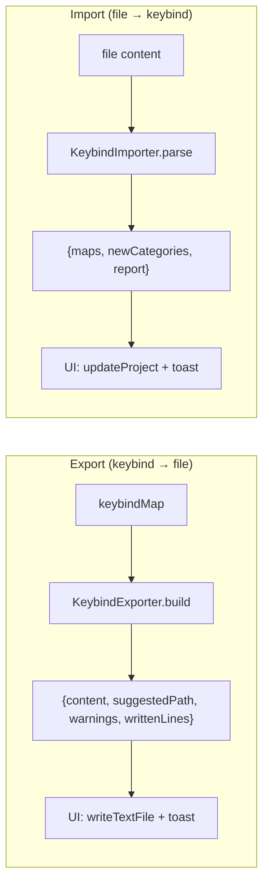
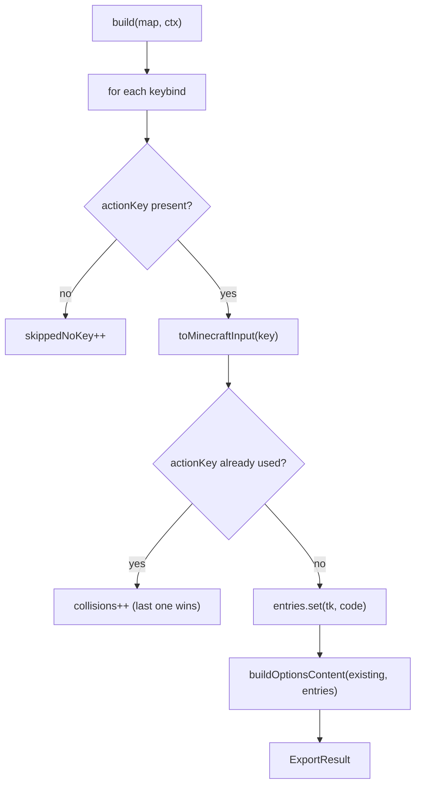
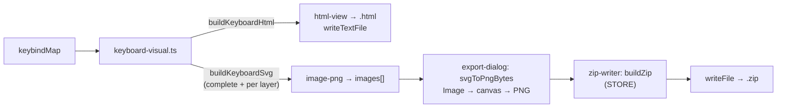
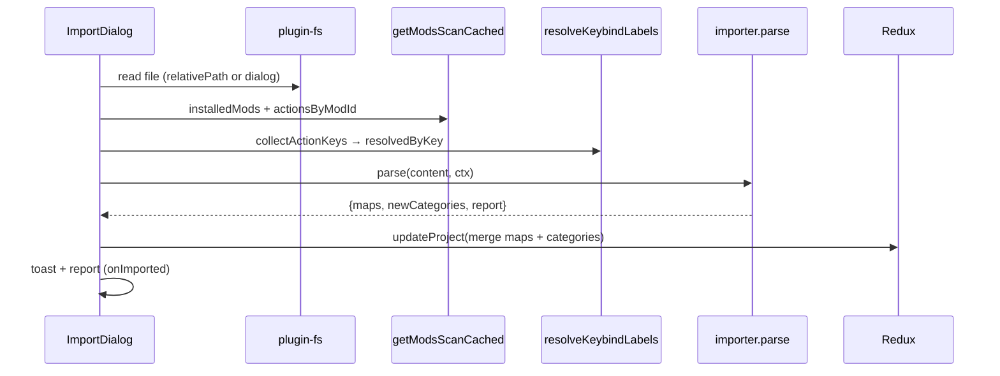

# 09 — Keybind Import / Export

Two symmetric and **pure** abstractions (no disk I/O): reading/writing the file and the toasts
stay in the UI, so permissions and error handling are centralized.



## Export

[`keybind-export/`](../../../src/lib/keybind-export). The `EXPORTERS` registry orders the exporters as
shown in the UI; `getExporter(id)` retrieves them.

### `KeybindExporter` interface

| Field | Meaning |
|-------|-------------|
| `id` | `"options-txt"` \| `"html-view"` \| `"image-png"` \| `"keyset"` |
| `label` | Label in the dialog |
| `defaultFileName` | E.g. `options.txt` |
| `available` | `false` = disabled in UI (format not ready) |
| `maps` | `ExporterMapMode`: `"all-in-one"` \| `"single"` \| `"per-map"` (see below) |
| `output?` | `ExporterOutput`: `"text"` (default) \| `"image"` (SVG to rasterize) \| `"image-zip"` (several SVGs → archive) |
| `build(map, ctx)` | Exports a single map → `ExportResult` |
| `buildAll?(maps, ctx)` | Required for `maps === "all-in-one"`: exports all maps into one file |

`ExportResult`: `{ content, suggestedPath, warnings[], writtenLines, images? }` (`images` only for
`"image-zip"`: `{ name, svg }[]`, where `name` is the path INSIDE the zip). `ExportContext`:
`{ project, workpath, readExisting(absPath) }` (`readExisting` is injected by the UI for exporters
that perform a merge).

### Dialog behavior: format → map

In the dialog ([`export-dialog.tsx`](../../../src/components/keybinds/export-dialog.tsx)) you pick the
**format first**; the exporter's `maps` field decides whether and how the map selector appears:

| `ExporterMapMode` | Map selector | "All" option | Behavior | Examples |
|-------------------|--------------|--------------|----------|----------|
| `all-in-one` | hidden | — | **always** exports all maps into one file (`buildAll`) | `keyset` |
| `single` | single map | no | exports a single map (`build`) | `options-txt` |
| `per-map` | single map | yes | one map, or "All" = one file **per** map | `html-view`, `image-png` |

With `per-map` + "All" the UI loops `build` over each map and writes one file per map: into the
workpath, or into a **folder** picked with `openDialog({ directory: true })` (the destination becomes
"Choose folder…"). Summary toast `exportSuccessMulti`.

The dialog **does not close on an outside click** (`onInteractOutside` with `preventDefault`): the
configuration takes several steps and one stray click threw it away, or interrupted an export already
under way. The X and `Esc` still close it.

### `options-txt` (active)

[`options-txt.ts`](../../../src/lib/keybind-export/options-txt.ts) exports Minecraft vanilla's
`options.txt` file.



Warnings generated: keybinds without a translation key skipped, non-mappable keys (`unknown`), actions with
multiple keys (last one kept), macros not supported.

### Conservative merge

[`merge-options.ts`](../../../src/lib/keybind-export/merge-options.ts) — `buildOptionsContent(existing,
entries)` — is the anti-data-loss core: `options.txt` contains many non-keybind lines
(graphics/audio) that must **not** be touched.

| Line | Behavior |
|------|---------------|
| non `key_*` | preserved unchanged |
| `key_*` present in the project | overwritten with the new input code |
| `key_*` not in the project | left unchanged (bindings of unmanaged mods) |
| new `key_*` | appended at the end |

It also preserves the existing line ending (CRLF/LF) and the presence/absence of a trailing newline. If the file
does not exist, it emits only the keybind lines (LF).

### Key → Minecraft input code translation

[`mc-keycodes.ts`](../../../src/lib/mc-keycodes.ts):

- **`toMinecraftInput(keyId)`**: layout id → MC input code (`"w"` → `key.keyboard.w`,
  `"shiftleft"` → `key.keyboard.left.shift`, `"mouse1"` → `key.mouse.left`, `"num5"` →
  `key.keyboard.keypad.5`). Fallback `UNMAPPED` (`key.keyboard.unknown`) for accented IT keys and
  non-US symbols, which do not have a stable vanilla input code.
- **`fromMinecraftInput(code)`**: the inverse (used by import); `null` if not recognized. For codes
  with multiple ids (e.g. `enter1`/`enter2` → `key.keyboard.enter`) the first one inserted in `SPECIAL` wins.

### Keyboard visualization: interactive HTML and PNG image

Besides the config formats, you can export the **graphical representation** of the keybind map. The
rendering lives in [`keyboard-visual.ts`](../../../src/lib/keybind-export/keyboard-visual.ts), a **pure**
module (no DOM) that reproduces the look of the Keybinds page keyboard (Keyboard + Numpad + Mouse
blocks, colored rectangles per binding, one color per mod):

- **`buildKeyboardSvg(map, categories, labels?, opts?)`** → `{ svg, width, height, boundCount }`:
  builds the SVG. Geometry aligned with the Keybinds page (`KEY_SCALE = 1.35`): `UNIT=54`, `GAP=5`
  (5.4 rounded, to keep coordinates on clean numbers); `colorRectsPx` for 1/2/3/4 multi-bindings. The
  **text does not scale**, as in the UI, but the action goes on **two lines** (`wrapTwoLines`, the
  equivalent of `line-clamp-2`) and the character budget is derived from the font size
  (`maxCharsFor`), so the extra room buys more readable text, not bigger text.
  `opts.layer` selects the **layer** (a number = only its bindings, with keys used elsewhere marked by
  the folded corner; `"all"` = all together, the default → the PNG behaves as before).
  `opts.legend = true` draws a **legend** (color swatch → mod name) below the keyboard for the mods
  used in the map — used by the PNG export. `opts.interactive`/`opts.solo`/`opts.idPrefix` serve the
  HTML (see below). Each key exposes `data-key` and `data-b` (binding list as JSON, with the layer)
  for click interaction.
- **`buildKeyboardHtml(map, categories, labels?)`** → standalone HTML document, aligned with the UI:
  - **one SVG per layer** plus one with all layers together, and a selector at the top with the counts:
    you look at one layer at a time, as in the Keybinds page. On a single-layer map (maps saved before
    layers) the selector is omitted and the single view stays exactly as before.
  - **mod/tag filters that isolate** instead of dimming: a key shows only the matching bindings, at full
    color, and keys with no match go back to "free". As in the UI, with a filter on the layers flatten
    (it switches to the "all" view) and a note says so.
  - **no drawing engine in JS**: every key carries pre-rendered the colored state (`.on`), the free
    state (`.off`) and one group per binding (`.solo`, full color across the key); CSS swaps the state
    and the JS only toggles classes. The file stays a static artifact. Per-view `idPrefix` keeps
    `clipPath` ids unique (several SVGs live in the same document).
  - native tooltips (`<title>`) and a **modal window** on key click, with action, mod and layer.

  Known limitation: filtering by **tag**, if two of the filtered mods share the same key the isolated
  view shows the first one (the UI would show two tiles). The click modal still lists every binding on
  the key, so no information is lost.

Two exporters use the module:

| Exporter | File | `output` | Output |
|----------|------|----------|--------|
| `html-view` | [`html-view.ts`](../../../src/lib/keybind-export/html-view.ts) | — (text) | `<map>.html` |
| `image-png` | [`image-png.ts`](../../../src/lib/keybind-export/image-png.ts) | `"image-zip"` | `<map>.zip` (binary) |

**`image-png` produces an ARCHIVE**, not a single PNG:

```
<map name>/
  complete.png     ← all layers together (shared keys as tiles)
  layer-1.png      ← one image per layer
  layer-2.png
```

A single PNG is no longer enough now that a map has layers: the complete image shows shared keys split
into tiles, while it's the per-layer view that reads well — both are needed. On a single-layer map the
archive holds only `complete.png` (`layer-1.png` would be identical). Each image carries a **caption** at
the top (`opts.caption`, e.g. "Tech & Armi — Layer 2"): without it, the layer keyboards would only be
distinguishable by file name.

`output` on `KeybindExporter` tells the UI how to write the result. Rasterization and packing happen on
the UI side in [`export-dialog.tsx`](../../../src/components/keybinds/export-dialog.tsx) — the exporters
stay **pure**, and the `canvas` only exists in the webview: `svgToPngBytes` loads the SVG into an
`Image`, draws it onto a `canvas` (2× scale for sharpness) and extracts the PNG bytes; then
[`zip-writer.ts`](../../../src/lib/zip-writer.ts) (`buildZip`) builds the archive and `writeFile` writes
it (requires `fs:allow-write-file` in the capabilities). Text exporters use `writeTextFile`.

**`zip-writer.ts`** is a hand-written ZIP writer, in pure TypeScript: **STORE** method only (no
compression), because PNGs are already compressed — deflate would gain a few percent and is not worth an
extra npm dependency nor shipping the bytes to the Rust backend. It is **deterministic** (fixed entry
timestamp: two exports of the same map produce an identical file), writes names in UTF-8 (flag bit 11,
required for map names with accents) and has no ZIP64 support (4 GB per entry and 65535 entries, orders
of magnitude above an image export).



### `keyset` (active)

[`keyset.ts`](../../../src/lib/keybind-export/keyset.ts) exports the file of the
[BeeBoyD/Keyset](https://github.com/BeeBoyD/Keyset) mod: a **single** multi-profile JSON
`config/keybindprofiles.json` (`maps: "all-in-one"` → no map choice, **all** maps are exported). Each
`keybindMap` becomes a **profile**.

```jsonc
{
  "schema": 1,                 // = KeysetCoreMetadata.CONFIG_SCHEMA
  "activeProfile": "<id>",      // first exported profile if there is no valid active one
  "profiles": {
    "<id>": {                   // slug of the map name ("-" separator, like the mod's slugify)
      "name": "<map name>",
      "builtIn": false,
      "bindings": {
        "<actionKey>": {        // key = the action's translation key (keybind.actionKey)
          "key": "<inputCode>", // key.keyboard.*/key.mouse.*; OMITTED if unbound/non-mappable
          "modifiers": [],       // always present; "SHIFT"/"CTRL"/"ALT" for macros
          "sticky": true         // marks the bindings as user-customized
        }
      }
    }
  }
}
```

The format is **verified against the mod's authoritative codec**
(`modules/core/.../profile/KeysetProfilesJson.java`): field order, `modifiers` always present,
`sticky` written only when `true`, 2-space pretty-print with no HTML escaping. **Critical constraint**:
the mod only accepts `schema` `0` (legacy) or exactly `CONFIG_SCHEMA` (currently `1`), otherwise it
rejects the file → the number must not be changed arbitrarily. `key` is **omitted** when
`toMinecraftInput` returns `UNMAPPED` (unbound binding, the mod's canonical form).

The export does a **conservative merge**: `parseExisting` reads the existing file, regenerated profiles
overwrite same-`id` ones, unmanaged profiles (e.g. the mod's `default`) stay intact. `buildAll`
deduplicates ids within the batch (suffix `-N`) so two maps with similar names don't overwrite each
other. On read the mod re-normalizes ids and always injects a `default` profile.

## Import

[`keybind-import/`](../../../src/lib/keybind-import). `IMPORTERS` registry + `getImporter(id)`. Symmetric
to the exporters: the importers receive the already-read content and return the reconstructed maps + the
categories to ensure.

### `KeybindImporter` interface

`{ id, label, defaultFileName, available, relativePath[], parse(content, ctx) }`. `relativePath` is the
path relative to the workpath (e.g. `["config", "keybindprofiles.json"]`).

`ImportContext`:

| Field | Role |
|-------|-------|
| `project` | Current project |
| `installedMods` | **Installed** mods (`modId` + `name`); a binding of a mod that is not installed (and not vanilla) is **discarded** |
| `actionsByModId` | Actions scanned from the jars → relinks `actionKey` to mod + label |
| `resolvedByKey?` | Targeted resolution `actionKey → {modId, label}` (via `resolve_keybind_labels`): the most reliable link, also covers non-standard names |

`ImportResult`: `{ maps: ImportedMap[], newCategories: keybindCategory[], report: ImportReport }`.

### Import flow (UI `import-dialog.tsx`)



The merge upserts the maps by name (`byName`) and adds the missing categories.

### Report and issues

`ImportReport { maps, bindings, issues[] }`. Each `ImportIssue { map, actionKey, keyCode, reason }`.
"Unbound" bindings (without a key) are silently ignored, they do not enter the report.

| `ImportIssueReason` | Meaning |
|---------------------|-------------|
| `not-installed` | The binding's mod is not among the installed ones → discarded |
| `unmapped` | The key is not mappable on the layout |

Bindings with modifiers (SHIFT/CTRL/ALT) are reconstructed as **macros**.
