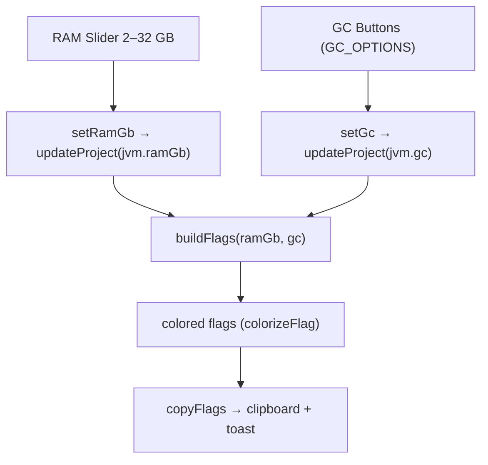

# 10 — JVM

The `/jvm` page configures the modpack's RAM allocation and garbage collector, and generates the
corresponding JVM flags (copyable). The settings live in `project.jvm` (`{ ramGb, gc }`).

## Model

- `jvmSettings = { ramGb: number, gc: gcType }`
- `gcType = "g1" | "zgc" | "shen"`
- Default `defaultJvmSettings()` → `{ ramGb: 4, gc: "g1" }` (also for projects saved before
  the `jvm` field was introduced).

## Page

No Tauri command: only `buildFlags`/`GC_OPTIONS` from [`jvm.ts`](../../../src/lib/jvm.ts) and `setByPath`.

## Flag generation ([`jvm.ts`](../../../src/lib/jvm.ts))

`buildFlags(ram, gc)` always starts from `-Xms{ram}G -Xmx{ram}G` (fixed heap), then adds the GC flags.

| GC | `GC_OPTIONS` label | Flag set |
|----|--------------------|-------------|
| `g1` | G1GC (Aikar) | **Aikar** preset (de-facto standard for modded servers); some values scale if `ram ≥ 12` |
| `zgc` | ZGC | `-XX:+UseZGC -XX:+ZGenerational` + AlwaysPreTouch, DisableExplicitGC, PerfDisableSharedMem, ConcGCThreads=2 |
| `shen` | Shenandoah | `-XX:+UseShenandoahGC -XX:ShenandoahGCMode=iu` + AlwaysPreTouch, DisableExplicitGC, UseNUMA |

### G1 preset scaling (Aikar)

Some parameters vary based on RAM (threshold 12 GB):

| Flag | `ram < 12` | `ram ≥ 12` |
|------|-----------|-----------|
| `G1NewSizePercent` | 30 | 40 |
| `G1MaxNewSizePercent` | 40 | 50 |
| `G1HeapRegionSize` | 8M | 16M |
| `G1ReservePercent` | 20 | 15 |
| `InitiatingHeapOccupancyPercent` | 15 | 20 |

The other G1 flags (ParallelRefProcEnabled, MaxGCPauseMillis=200, DisableExplicitGC, AlwaysPreTouch,
SurvivorRatio=32, MaxTenuringThreshold=1, etc.) are fixed, plus the markers `-Dusing.aikars.flags`
and `-Daikars.new.flags=true`.
