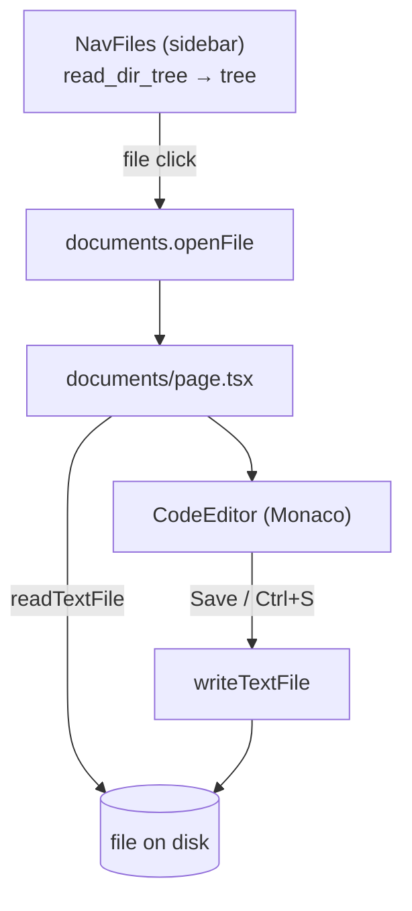
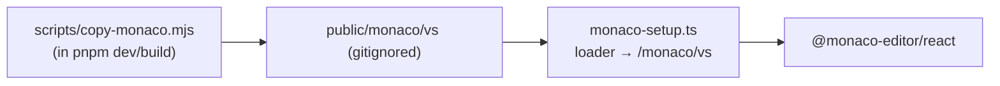
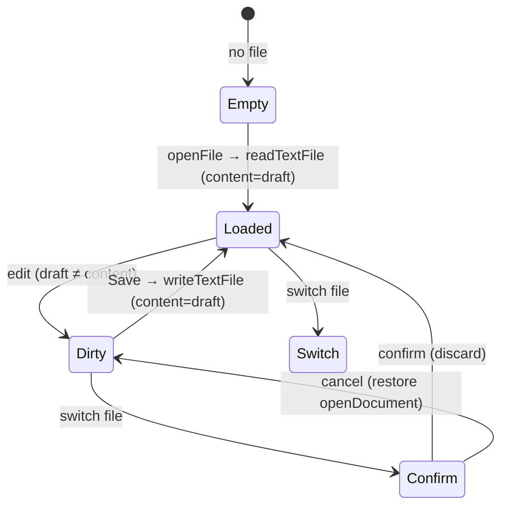
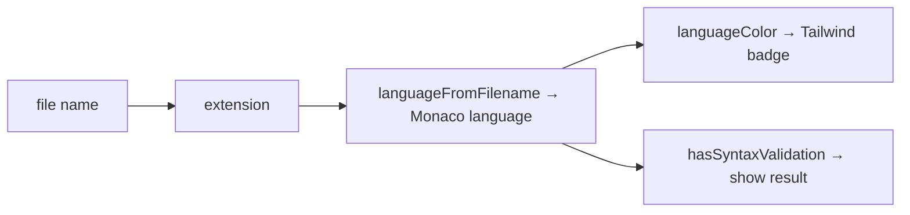

# 11 — Documents: code editor

The Documents section is a **Monaco** editor for the modpack's configuration files
(`config/`, `kubejs/`). It has a save cycle that is **independent** of `project.json`: config files
do not live in the project.

## Architecture

- The **file tree** lives in the sidebar ([`nav-files.tsx`](../../../src/components/nav-files.tsx) →
  [`file-tree.tsx`](../../../src/components/documents/file-tree.tsx)), decoupled from the editor via Redux
  (`documents-slice`).
- The **page** renders only the editor of the open file. Missing folders are skipped.

## Monaco offline

The app runs offline, so Monaco must **not** be loaded from the CDN:

- [`copy-monaco.mjs`](../../../scripts/copy-monaco.mjs) copies `node_modules/monaco-editor/min/vs` into
  `public/monaco/vs`; it is chained into `pnpm dev` and `pnpm build`.
- [`monaco-setup.ts`](../../../src/lib/monaco-setup.ts) points the loader at the local assets
  (`setupMonacoLoader()`, called once).

## Editing flow

- Editor state: `content` (on disk), `draft` (in editor), `dirty = content !== null && draft !== content`.
- When switching file with unsaved changes, it asks for confirmation; if cancelled it restores the previous
  selection (`openDocument`).
- `handleSave()`: `writeTextFile(openFile.path, draft)` → updates `content` + toast.
- `usePageSaveShortcut(handleSave, dirty)`: Ctrl/Cmd+S even outside the editor focus.

## `CodeEditor` ([`code-editor.tsx`](../../../src/components/documents/code-editor.tsx))

Wrapper of `@monaco-editor/react` (`key={filename}`, `theme="vs-dark"`). Exposes the types
`CursorInfo { line, column, lineCount }` and `Diagnostics { errors, warnings }`.

- **Diff gutter**: `refreshDiff()` uses `diffLines(original, value)` ([`line-diff.ts`](../../../src/lib/line-diff.ts))
  for +/~/- counts and decorations (`dirty-line-added/modified/deleted`).
- **Diagnostics**: from `getModelMarkers`/`onDidChangeMarkers` → `onDiagnostics`.
- **Cursor**: from `onDidChangeCursorPosition`/`onDidChangeModelContent` → `onCursorChange`.
- Ctrl/Cmd+S also registered inside the editor (`saveRef`).

## Language from the file ([`file-language.ts`](../../../src/lib/file-language.ts))

- `languageFromFilename(filename)`: maps extension → Monaco language (default `plaintext`).
  E.g. `.toml`/`.cfg`/`.properties` → `ini`; `.json`/`.json5`/`.mcmeta` → `json`; `.js`/`.zs` →
  `javascript`; `.snbt`/`.nbt` → `plaintext`.
- `languageColor(language)`: Tailwind class for the file type badge.
- `hasSyntaxValidation(language)`: `true` only for languages with native Monaco validation
  (`json`, `javascript`, `typescript`, `css`, `html`) → for those the status bar shows
  "valid / errors".

## File tree ([`file-tree.tsx`](../../../src/components/documents/file-tree.tsx))

Mirrors the `FileNode` struct of `read_dir_tree`. File operations (via `plugin-fs`, with
`useConfirm` for deletion):

| Operation | Implementation |
|------------|-----------------|
| New file | `join` + `exists` + `writeTextFile("")` → `onFileCreated` + select |
| Rename | `prompt` → `join(parent, newName)` + `exists` + `rename` → `onFileRenamed` |
| Delete | `confirm` → `remove` → `onFileDeleted` |

Tree updates are optimistic and immutable (`insertFileNode`, `replaceFileNode`,
`removeFileNodeByPath` in `nav-files.tsx`).
