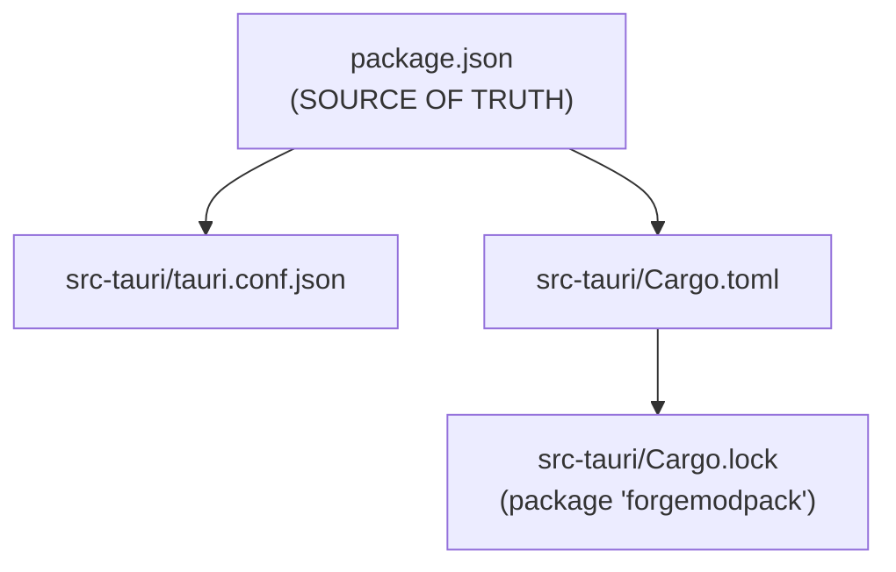
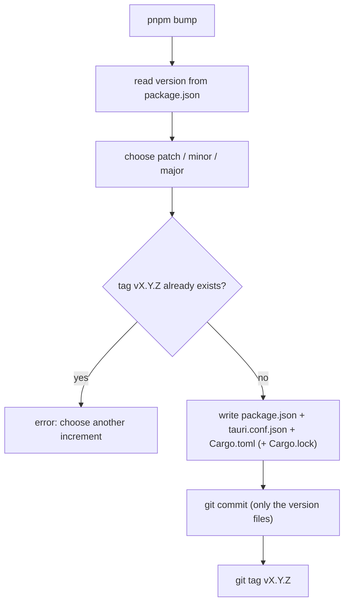
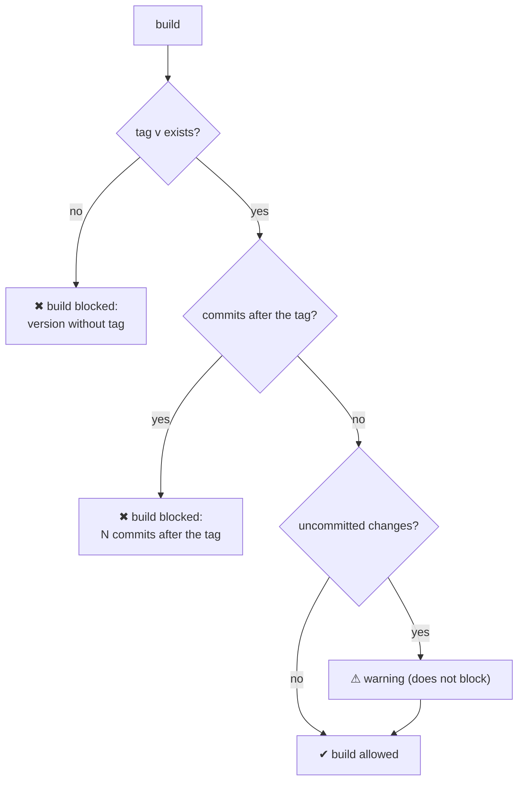
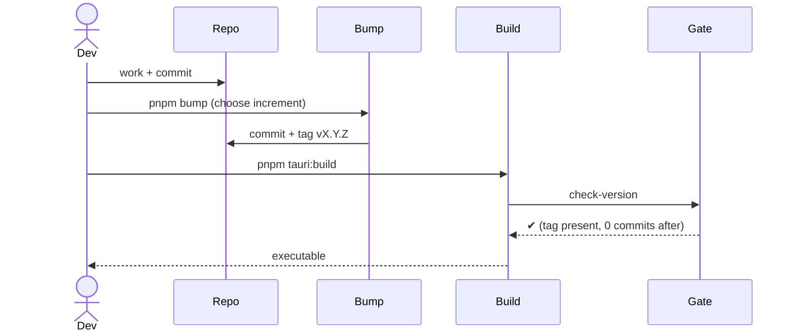

# 12 — Versioning and build gate

The app version lives in **three files** that must be kept aligned; a build is **blocked** until the
current version has been "freshly generated" with `pnpm bump`.

## The three files (+ lock)

## `pnpm bump` ([`bump-version.mjs`](../../../scripts/bump-version.mjs))

Interactive bump that synchronizes all the files and creates a commit + tag.

- `package.json` is the source of truth; it must be semver `X.Y.Z`.
- Updates: `package.json` and `tauri.conf.json` (JSON, indent 2), `Cargo.toml` (only the first line
  `version = "..."`), `Cargo.lock` (version of the `forgemodpack` package, if the lock exists).
- Creates a commit (limited to the version files) and tag `vX.Y.Z`. Fails if the tag already exists.

## Build gate ([`check-version.mjs`](../../../scripts/check-version.mjs))

Chained into the `beforeBuildCommand` of `tauri.conf.json` → applies both to `pnpm tauri:build` and
`tauri build`.

Blocking rules:
1. the git tag `v<version>` must exist (created by `pnpm bump`);
2. there must be no commits **after** that tag (otherwise you did new work without bumping →
   "stale" version).

Uncommitted changes only produce a **warning** (they do not block).

## Typical release flow

> In practice: bump **right before** every build. Any commit following the tag requires a
> new bump before you can rebuild.
