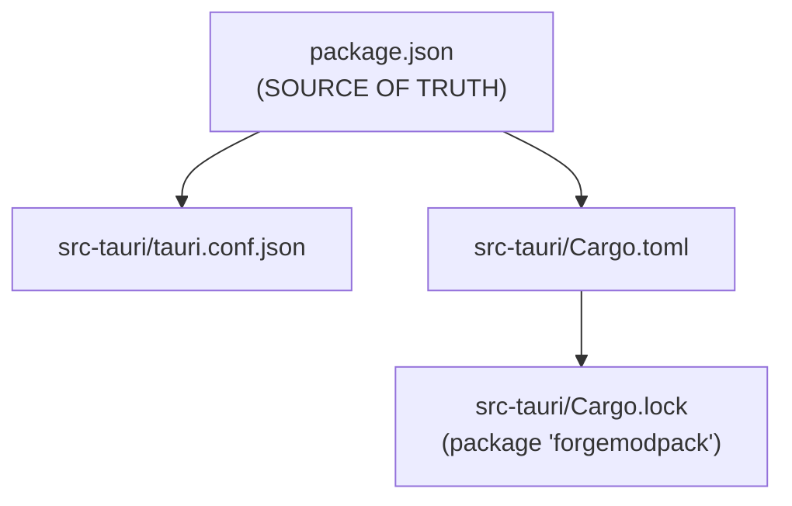
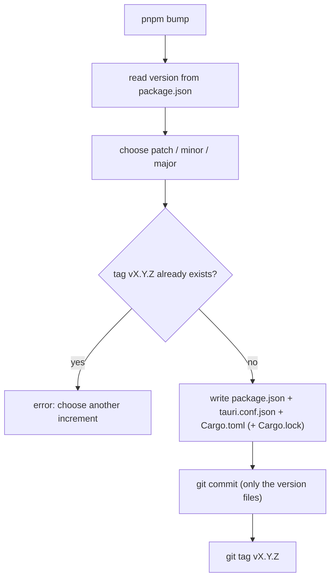
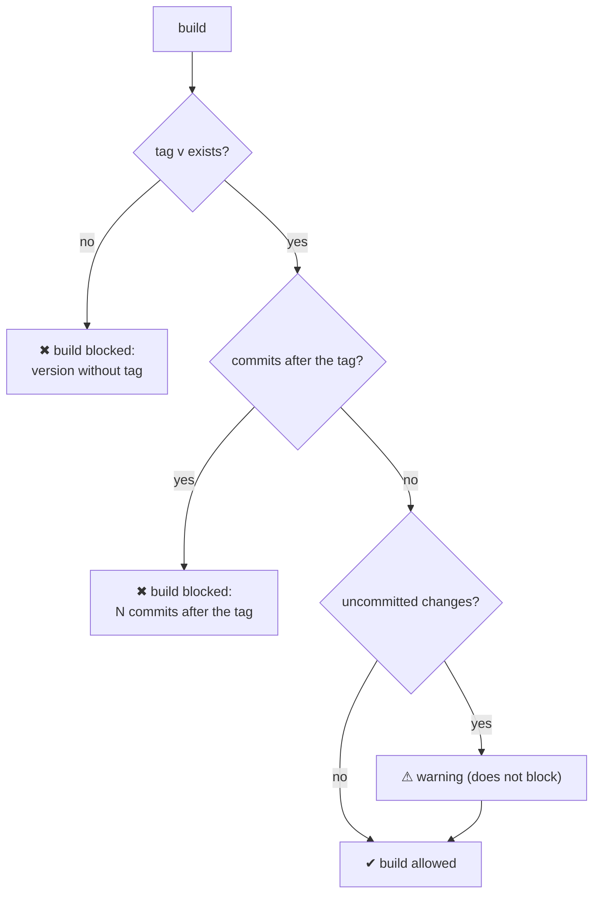
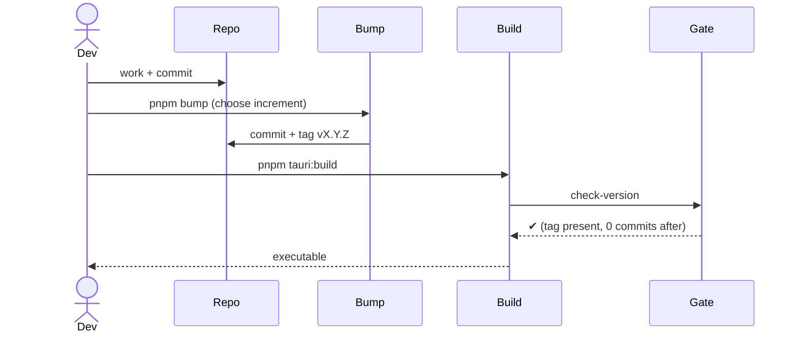

# 12 — Versioning and build gate

The app version lives in **three files** that must be kept aligned; a build is **blocked** until the
current version has been "freshly generated" with `pnpm bump`.

## The three files (+ lock)

## `pnpm bump` ([`bump-version.mjs`](../../../scripts/bump-version.mjs))

Interactive bump that synchronizes all the files and creates a commit + tag.

- `package.json` is the source of truth; it must be semver `X.Y.Z`.
- Updates: `package.json` and `tauri.conf.json` (JSON, indent 2), `Cargo.toml` (only the first line
  `version = "..."`), `Cargo.lock` (version of the `forgemodpack` package, if the lock exists).
- Creates a commit (limited to the version files) and tag `vX.Y.Z`. Fails if the tag already exists.

## Build gate ([`check-version.mjs`](../../../scripts/check-version.mjs))

Chained into the `beforeBuildCommand` of `tauri.conf.json` → applies both to `pnpm tauri:build` and
`tauri build`.

Blocking rules:
1. the git tag `v<version>` must exist (created by `pnpm bump`);
2. there must be no commits **after** that tag (otherwise you did new work without bumping →
   "stale" version).

Uncommitted changes only produce a **warning** (they do not block).

## Typical release flow

> In practice: bump **right before** every build. Any commit following the tag requires a
> new bump before you can rebuild.

## Update check ([`update-check.ts`](../../../src/lib/update-check.ts))

The app **checks** whether a newer version exists, but it **does not update itself**: it does not use
`tauri-plugin-updater`, so no signing key and no `latest.json` to publish. When a newer version is
found the release page opens in the browser (`openUrl`) and the user downloads the installer manually.

- **Source**: `GET https://api.github.com/repos/Alexkill536ITA/ForgeModpack/releases?per_page=30`
  through `@tauri-apps/plugin-http`. **Not** `/releases/latest`, which ignores pre-releases: when you
  publish betas, GitHub's "latest" stays behind (v1.1.0 and v1.2.0 are pre-releases, so for GitHub the
  latest is still v1.0.0). The app does the pre-release filtering itself. The
  `https://api.github.com/**` host is whitelisted in
  [`capabilities/default.json`](../../../src-tauri/capabilities/default.json), and the request sends an
  explicit `User-Agent`: without it the GitHub API answers **403** (Tauri's HTTP client does not send
  one by default).
- **Installed version**: `getVersion()` from `@tauri-apps/api/app` (covered by `core:default`), i.e.
  the version in `tauri.conf.json`. Under plain `pnpm dev` (browser) it is unavailable and the check
  does not run.
- **Comparison**: `compareVersions` is a **pure** reduced semver (numeric core + pre-release, `+build`
  metadata ignored); it is needed because comparing strings fails silently (`"1.10.0" < "1.9.0"`). A
  non-versioned tag (`nightly`) yields 0, meaning "I don't know" → no update offered.
  `pickLatestRelease` drops drafts, filters pre-releases according to the preference and **does not
  trust the API ordering**: it compares versions.
- **Pre-release preference**: `fmp.updates.includePrerelease` in `localStorage` (like the language: a
  user preference, not modpack data). Off by default; the checkbox lives in the dialog and re-runs the
  check when toggled.

### UI ([`update-provider.tsx`](../../../src/providers/update-provider.tsx))

`UpdateProvider` (mounted in [`layout.tsx`](../../../src/app/layout.tsx) inside `ConfirmProvider`, so
that it wraps the sidebar) holds the check state and renders the dialog; callers use
`useUpdateCheck()` → `{ checkNow, updateAvailable, latestVersion }`.

| Mode | Trigger | Behaviour |
| --- | --- | --- |
| Automatic | provider mount, once per app start | Silent: opens the dialog **only** if a newer version exists; a network error stays in `console.error` (the app works offline) |
| Manual | **Check for Updates** entry in the sidebar menu | Opens the dialog right away, showing "you're up to date" or the error too |

The automatic check is guarded by a ref so it does not hit the API twice under StrictMode (GitHub rate
limit: 60 requests/hour per IP). Here the guard sits **before** the `await` — unlike
[`mods-sync.ts`](../../../src/lib/mods-sync.ts) — because there is no work to resume: its only purpose
is avoiding the duplicate request. When an update is available the menu trigger shows a dot and the
menu entry a badge with the version. The `BusyOverlay` is not used: this is a lightweight HTTP
request, not a blocking operation.
