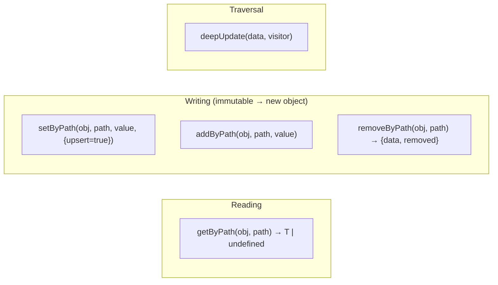

# 13 — Library helpers

Cross-cutting utilities in [`src/lib/`](../../../src/lib). The most important are the immutable
project-editing functions (`json-data`), used by (almost) every page before `updateProject`.

## `json-data.ts` — immutable project editing

[`json-data.ts`](../../../src/lib/json-data.ts) exposes `getByPath` / `setByPath` / `addByPath` /
`removeByPath` with **dot + bracket notation** and filters. All write functions are
**immutable**: they return a new object (fundamental for React/Redux state).

### Path notation

| Path | Meaning |
|------|-------------|
| `metadata.name` | nested key |
| `mods[name=jei].version` | filters `mods` by `name === "jei"`, then reads/writes `version` |
| `mods[name=jei]` | the entire mod object (or creates it on upsert) |
| `keybindMaps[0].keybinds[0].key` | index → key → index → key |
| `configs.workpath` | simple key |

The parser (`parsePath`) produces `key` / `index` / `filter` segments.

### API

- **`getByPath<T>(obj, path)`**: read-only walk; `undefined` if the path does not exist.
- **`setByPath<T>(obj, path, value, {upsert=true})`**: writes/updates. In **upsert** (default) it creates
  the missing intermediate nodes (keys, indices, filtered elements); with `upsert:false` it throws an error if
  a node does not exist. If the value is an object on a filtered element, it **merges** the fields.
- **`addByPath<T>(obj, path, value)`**: append to an array located by the path.
- **`removeByPath<T>(obj, path)`**: removes a key/index/filtered element; returns `{ data, removed }`.
- **`deepUpdate(data, visitor)`**: recursive traversal with a visitor (already immutable).

> **Central pattern**: `const next = setByPath(project, "metadata.name", "X"); dispatch(updateProject(next))`.
> Used everywhere, e.g. in `page.tsx` via `handleUpdateField`.

## `line-diff.ts` — per-line diff

[`line-diff.ts`](../../../src/lib/line-diff.ts) computes the "dirty diff" between the content on disk and the content
in the editor (Monaco gutter markers + status bar counts). See [11 — Documents](./11-documents-editor.md).

- **`diffLines(original, current) → LineChange`**: classic LCS (DP `Uint32Array`) + backtracking,
  then groups the operations into `added` / `modified` / `deletedAt` blocks.
- `LineChange`: `{ added[], modified[], deletedAt[], counts: {added, modified, removed} }`.
- Optimization: if `original === current` it returns `EMPTY`; if `n*m > MAX_CELLS` (4M) it gives up the
  detail (returns `EMPTY`) to avoid paying the O(n·m) cost.

## `database.ts` — basic file I/O

[`database.ts`](../../../src/lib/database.ts): `saveData(data, path, name)` (writes a file next to
`path` with `../` + `name`) and `loadData(filePath)` (reads bytes). Thin wrappers over `plugin-fs`.

## `monaco-setup.ts`

`setupMonacoLoader()` points Monaco's loader at the local assets `/monaco/vs` (offline app).
See [11 — Documents](./11-documents-editor.md).

## `utils.ts`

`cn(...inputs)`: Tailwind class merge (`clsx` + `tailwind-merge`). shadcn/ui convention.

## Summary of the `lib/` modules

| Module | Role | Doc |
|--------|-------|-----|
| `json-data.ts` | Immutable project editing | this one |
| `cache-db.ts` | SQLite key-value cache | [07](./07-cache-manifest.md) |
| `manifest-cache.ts` | TTL + offline fallback | [07](./07-cache-manifest.md) |
| `get-manifest.ts` | Fetch remote manifests | [07](./07-cache-manifest.md) |
| `mods-scan.ts` | Mod scan (cache) | [06](./06-scansione.md) |
| `keybind-cache.ts` | Keybind actions per mod + targeted resolution | [06](./06-scansione.md) |
| `datapacks-scan.ts` | Datapack scan (cache) | [06](./06-scansione.md) |
| `keyboard-layout.ts` | Data-driven keyboard layout | [08](./08-keybinds.md) |
| `keybind-template.ts` | Map templates + vanilla actions | [08](./08-keybinds.md) |
| `keybind-export/` | Export to config files | [09](./09-keybind-io.md) |
| `keybind-import/` | Import from config files | [09](./09-keybind-io.md) |
| `mc-keycodes.ts` | Key ↔ Minecraft input code | [09](./09-keybind-io.md) |
| `jvm.ts` | JVM flags | [10](./10-jvm.md) |
| `file-language.ts` | Monaco language from extension | [11](./11-documents-editor.md) |
| `forge-spec.ts` | Version hint for the scan (MC + Forge) | [06](./06-scansione.md) |
| `mods-sync.ts` | Mod/datapack sync with disk on every open | [06](./06-scansione.md) |
| `new-project.ts` | Empty project factory (`emptyProject`) | [08](./08-keybinds.md) |
| `zip-writer.ts` | ZIP writer (STORE, pure) for the image export | [09](./09-keybind-io.md) |
| `use-busy.ts` | Blocking-overlay hook | [04](./04-state-redux.md) |
| `update-check.ts` | Version check against GitHub Releases | [12](./12-versioning-build.md) |
| `line-diff.ts` | Per-line diff | this one |
| `database.ts` / `utils.ts` / `monaco-setup.ts` | Utilities | this one |
