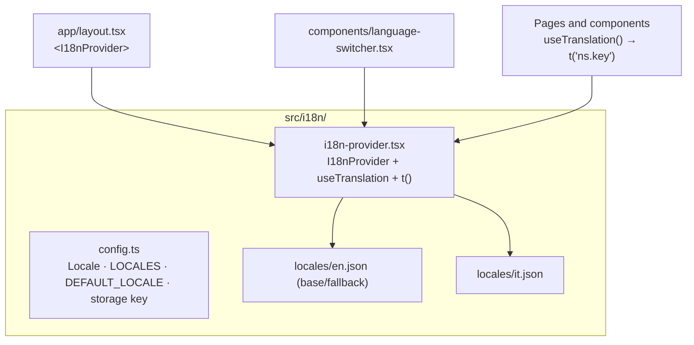
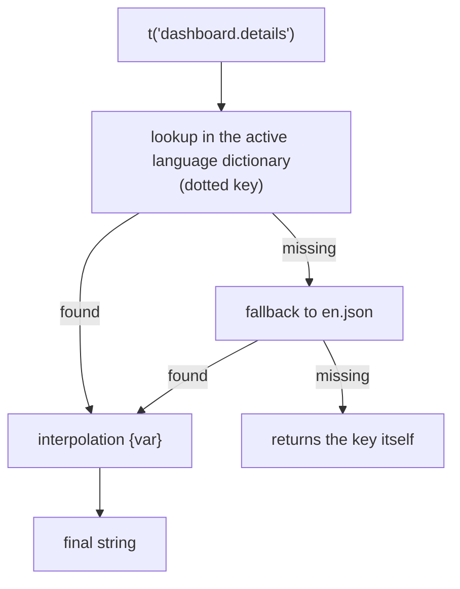
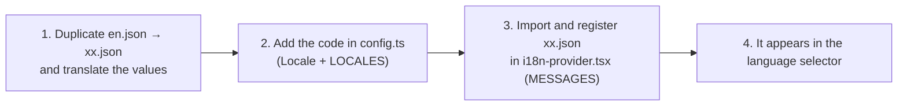

# 14 — Internationalization (i18n)

The app is internationalized with a **lightweight custom** system (no external dependency): React
Context + per-language JSON dictionaries + a `t()` hook. **English** is the base/fallback language;
**Italian** is the first translation. The language is a user preference, persisted locally.

## Architecture

| File | Role |
|------|------|
| [`config.ts`](../../../src/i18n/config.ts) | `Locale` type (`"en" \| "it"`), `LOCALES` list, `DEFAULT_LOCALE`, `LOCALE_STORAGE_KEY`, `isLocale` guard |
| [`i18n-provider.tsx`](../../../src/i18n/i18n-provider.tsx) | `I18nProvider` (context), `useTranslation()` hook, `t()` function |
| [`locales/en.json`](../../../src/i18n/locales/en.json) | English dictionary (base) |
| [`locales/it.json`](../../../src/i18n/locales/it.json) | Italian dictionary |
| [`language-switcher.tsx`](../../../src/components/language-switcher.tsx) | Language selector (in the header) |

## The provider and the hook

`I18nProvider` (mounted in [`layout.tsx`](../../../src/app/layout.tsx) inside `ReduxProvider`) holds
the current language in React state:

- It always starts from `DEFAULT_LOCALE` to avoid hydration mismatches (SSG), then on mount it reads
  the saved preference from `localStorage` (`fmp.locale`).
- `setLocale(next)` updates the state and persists the choice.
- A `useEffect` keeps `document.documentElement.lang` aligned with the active language.

`useTranslation()` returns `{ locale, setLocale, t }`.

## The `t(key, vars?)` function

- **Dotted key**: `t("namespace.key")` walks the nested JSON.
- **Fallback**: active language → English → the key itself (so a missing key is visible but doesn't
  break the UI).
- **Interpolation**: `{name}` placeholders replaced by the passed values, e.g.
  `t("documents.saved", { name: file })` with value `"Saved {name}"`.

> ⚠️ `t` comes from a hook: it must be called **inside** a React component (or another hook), never
> at module level. For module-level label objects (e.g. reason→text mappings) map to a **sub-key**
> and resolve it at the point of use: `t("keybinds.reason." + reason)`.

## Namespaces

Strings are organized by area (top-level JSON namespaces):

| Namespace | Area |
|-----------|------|
| `common` | Shared labels (save, cancel, add…) |
| `language`, `header` | Language selector, header |
| `dashboard` | Home / modpack data |
| `listmods` | List Mods |
| `keybinds` | Keybind editor (+ `keybinds.reason`, `keybinds.modifier`, `keybinds.importReport`) |
| `keybindIo` | Keybind import/export dialogs |
| `jvm` | JVM page |
| `documents` | Documents editor |
| `analytics` | Analytics page |
| `sidebar`, `saveBar`, `projectGate`, `files`, `fileTree`, `confirm` | Sidebar, save bar, project gate, file tree, confirm dialog |

The two dictionaries have **key parity** (same keys in EN and IT).

## Persisted data vs UI strategy

Crucial point: some **user-facing** strings are also **data saved** in `project.json`. The rule is:
**the persisted value stays in canonical English**; translation happens only at **display** time.
This way, switching language doesn't alter saved projects nor break matching with the Minecraft
export.

| String | Treatment |
|--------|-----------|
| Default tags ([`keybind-template.ts`](../../../src/lib/keybind-template.ts) `TAG`) | Canonical English values, saved in `project.keybindTags` |
| `"Vanilla"` category, vanilla action labels | Canonical English values (also used by the export) |
| Asset types (`ASSET_TYPES`) | Canonical English values saved in `asset.type` |
| Key labels ([`keyboard-layout.ts`](../../../src/lib/keyboard-layout.ts)) | Pure UI (not persisted): English; not yet localized per individual key |

> **Purely UI** strings (titles, buttons, placeholders, toasts, messages) are localized via `t()`.

## What is NOT localized (by choice)

- The **exporter warnings** in [`keybind-export/`](../../../src/lib/keybind-export) (pure functions,
  no hook access): they stay in English.
- Technical names: GC labels (`G1GC (Aikar)`, `ZGC`, `Shenandoah`), generated JVM flags, the editor's
  file language (derived from the extension), command/folder names, Tauri dialog filters.
- `console.error`/logs (not user-facing).
- The "Forge Modpack" brand and the copyright.

## Adding a new language

1. Copy `en.json` to `locales/<code>.json` and translate the values (keeping the same keys).
2. Add the code to the `Locale` type and the `LOCALES` array in `config.ts`.
3. Import the file and add it to the `MESSAGES` map in `i18n-provider.tsx`.

The selector ([`language-switcher.tsx`](../../../src/components/language-switcher.tsx)) automatically
shows every entry in `LOCALES`.
