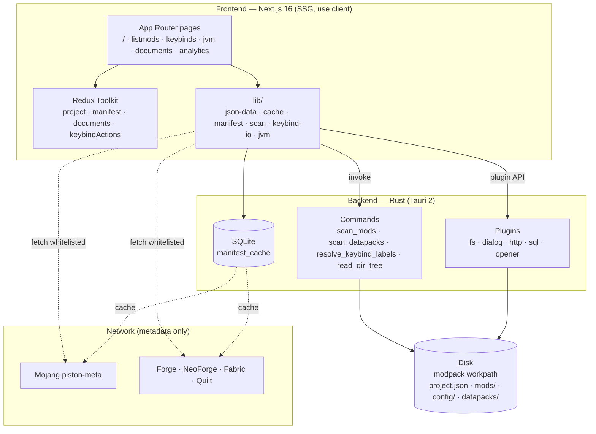

# ForgeModpack V2 — Documentation

Technical documentation for the **ForgeModpack V2** desktop application: a manager/editor
for the dependencies and configurations of a Minecraft modpack (Tauri 2 + Next.js 16).

> **What it is (and what it is NOT)**: the app reads the directory of an **already existing**
> modpack on disk, interprets its mods, datapacks and configurations and — only when needed —
> downloads version metadata online (MC + modloader). **It does not download the mods** and
> **it does not launch Minecraft**: it is a configuration editor, not a launcher.

## Index

| # | Document | Content |
|---|-----------|-----------|
| 00 | [Overview](./00-panoramica.md) | Goal, technology stack, commands, glossary |
| 01 | [Architecture](./01-architettura.md) | Layer diagram, data flow, Rust↔JS boundary |
| 02 | [Data model](./02-modello-dati.md) | The `project.json` file, all the types, entity diagram |
| 03 | [Frontend — Pages and navigation](./03-frontend-pagine.md) | The 6 routes, ProjectGate, SaveBar, sidebar |
| 04 | [Global state (Redux)](./04-state-redux.md) | The slices, actions, state shape |
| 05 | [Rust backend](./05-backend-rust.md) | Tauri commands, plugins, SQLite migrations |
| 06 | [Mod, datapack and keybind scanning](./06-scansione.md) | `scan_mods`, JarJar, keybind recognition |
| 07 | [SQLite cache and remote manifests](./07-cache-manifest.md) | MC/modloader manifests, TTL, scan cache |
| 08 | [Keybinds](./08-keybinds.md) | Graphical keyboard, multi-map, categories/tags, macros |
| 09 | [Keybind Import / Export](./09-keybind-io.md) | `options.txt`, keyset, conservative merge |
| 10 | [JVM](./10-jvm.md) | RAM allocation + garbage collector (Aikar flags) |
| 11 | [Documents — Code editor](./11-documents-editor.md) | Monaco offline, file tree, languages |
| 12 | [Versioning and build gate](./12-versioning-build.md) | `pnpm bump`, `check-version`, the three aligned files |
| 13 | [Library helpers](./13-helper-lib.md) | `json-data` (getByPath/setByPath), various utilities |
| 14 | [Internationalization (i18n)](./14-i18n.md) | Provider + `t()`, JSON dictionaries, data/UI strategy, adding a language |

## High-level map

## Documentation conventions

- The diagrams use **Mermaid** (rendered natively by GitHub and by many Markdown editors).
- Code references point to `file:line` where useful.
- UI text in English, documentation and comments in Italian (as per the project convention).
