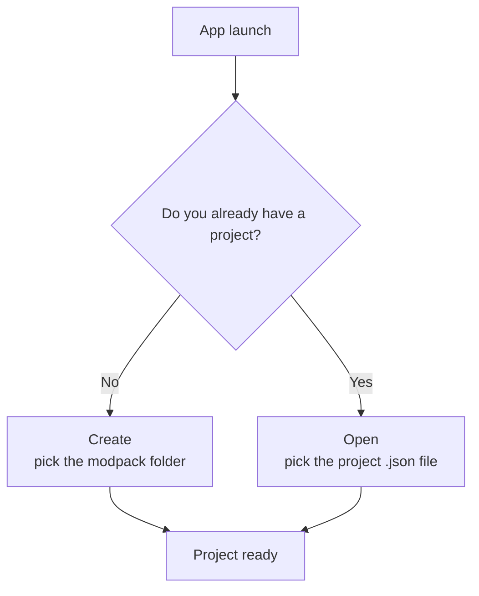

# 1 — Getting started

## What you need

- A modpack that's **already on your disk**: a folder containing at least the `mods` subfolder
  (and, if you use datapacks, a datapacks folder).
- The app does not install or download mods: it works on what you already have.

## The workspace folder (workpath)

The **workspace folder** is the main directory of your modpack. The app uses it as the reference point
for finding `mods`, `config`, `kubejs`, the datapacks and for saving the project file.

Typical structure:

```
📁 MyModpack/              ← workspace folder (workpath)
├── 📁 mods/               ← the mods' .jar files
├── 📁 config/             ← mod configurations
├── 📁 kubejs/             ← KubeJS scripts (if any)
├── 📁 datapacks/          ← datapacks (if used)
└── 📄 MyModpack.json      ← the project file created by the app
```

## Creating or opening a project

At startup, if no project is open, the app shows two buttons:



- **Create** — Create a new project: pick the modpack folder. The app starts with basic settings
  (Forge modloader, no mods listed yet) that you can change right away from the Dashboard.
- **Open** — Open an existing project: pick the `.json` file you saved earlier.

> If you try to open a section without an active project, you'll see the "No project selected" message
> with the same two buttons: that's normal, just create or open a project.

## The File menu

From the **File** menu (at the top of the sidebar) you can manage the project at any time:

| Item | What it does | Shortcut |
|------|---------|-------------|
| New | Create a new project | Ctrl/Cmd + N |
| Open | Open an existing project | Ctrl/Cmd + O |
| Save | Save the project | Ctrl/Cmd + S |
| Save As | Save to a new location/name | Ctrl/Cmd + Shift + S |
| Close | Close the current project | Ctrl/Cmd + W |
| Change Workspace | Change the workspace folder | — |
| Exit | Close the app | Ctrl/Cmd + Q |

> If there are unsaved changes, the app asks for confirmation before closing or switching projects, so
> you don't lose your work.

## Saving your work

When you change something, a **save bar** appears at the top: click **Save** to write everything to the
`<name>.json` file inside the workspace folder. The bar stays visible until you save.

> Note: the **configuration files** edited in the Documents section have their own separate save
> (inside the editor). See [chapter 7](./07-documenti.md) and [chapter 8](./08-salvataggio-e-versioni.md).

## Changing the interface language

The app is available in **English** and **Italian**. Use the language selector (the languages icon,
top-right in the header) and pick your preferred language. The choice is remembered and applies to all
projects.

> The language only affects the **interface**: the data saved in the project (names, tags, etc.) stays
> unchanged when you switch language, so your modpacks are not altered.

## Do you need the internet?

Only to download the list of Minecraft and modloader **versions** (for the dropdown menus). This data
is cached: after the first load the app works offline too. You can force an update from the Dashboard.
No mod is ever downloaded.
