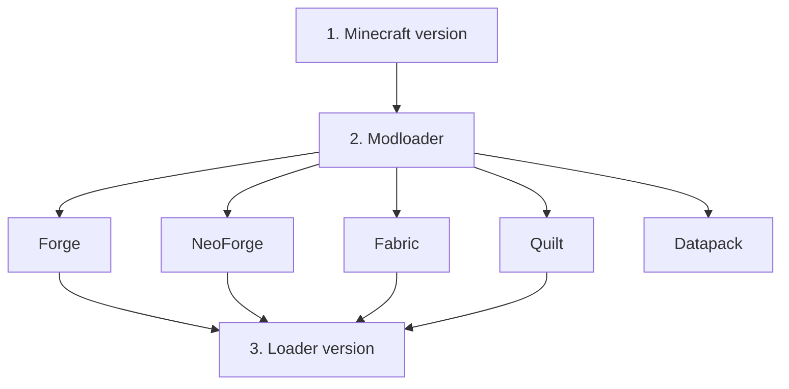
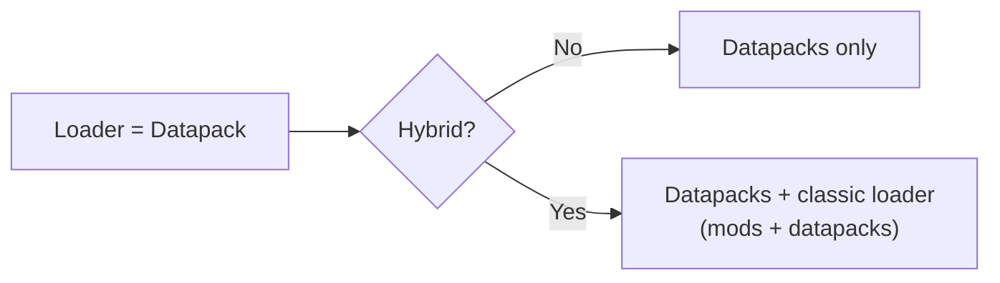

# 2 — Dashboard: modpack data

The **Dashboard** (the Home icon in the sidebar) is where you set the modpack's general information:
name, pack version, the modloader and the Minecraft version, plus the extra assets and notes.

## Details

Fill in the pack's identifying data:

- **Name** — the modpack name (it's also the name of the saved project file).
- **Version** — your pack's version (e.g. `1.0.0`).
- **Description** — a short description.

## Dependencies: MC and modloader version

Here you choose what the modpack runs on:

1. **Minecraft version** — pick the MC version from the menu (it shows releases only).
2. **Modloader** — choose between Forge, NeoForge, Fabric, Quilt or **Datapack**.
3. **Loader version** — pick the modloader version (the list is filtered based on the chosen MC
   version).

> When you change the MC version or the loader type, the loader version is reset: you'll have to pick
> it again (it's a safeguard, because not all versions are compatible with each other).

Some loaders don't exist on every Minecraft version and stay **unselectable** until you pick a
compatible one:

| Loader | Available from |
| --- | --- |
| **NeoForge** | Minecraft 1.20.1 |
| **Datapack** | Minecraft 1.13 (data packs don't exist before that) |

If your project is on **Datapack** and you drop to a version older than 1.13, the loader goes back to
**Forge** automatically (with a warning) and hybrid mode is turned off: that combination wouldn't
exist in the game.

### Datapack-only modpacks and hybrid mode

If you choose **Datapack** as the loader, the pack depends only on the Minecraft version (no loader
version). A **Hybrid** checkbox appears:

- **Hybrid off** — datapack-only modpack.
- **Hybrid on** — a **mixed** modpack: mods *and* datapacks. You also pick a classic loader
  (Forge/NeoForge/Fabric/Quilt) and its version.

You can also point to the **datapacks folder** if it isn't the default one (`datapacks/` inside the
workspace folder): use the folder picker. This is handy because the datapacks' location changes
depending on whether they are client-side (per world) or server-side.

## Assets

In the **Assets** table you can list extra pack resources that aren't mods, for example:

- Resource Pack, Shader Pack, Data Pack, Config, Icon, Splash, Other.

For each asset you set a **type**, a **name**, a **path** and optionally a **link** (the source URL).
You can:

- **Add** an asset (Add button).
- **Edit** or **remove** an asset from its row.
- Open the asset's **link** in the browser.
- Add **notes** to the individual asset.

## Project notes

You can keep **free-form notes** about the modpack (reminders, TODOs, jottings): add them from the
dedicated button and remove them when you no longer need them. They are saved in the project.

## Updating the available versions

If recent versions are missing from the dropdown menus, use the **refresh** button to re-download the
lists of Minecraft and modloader versions from the internet. Normally you don't need to: the app uses a
cache that refreshes itself periodically.
