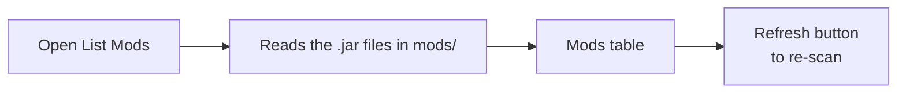
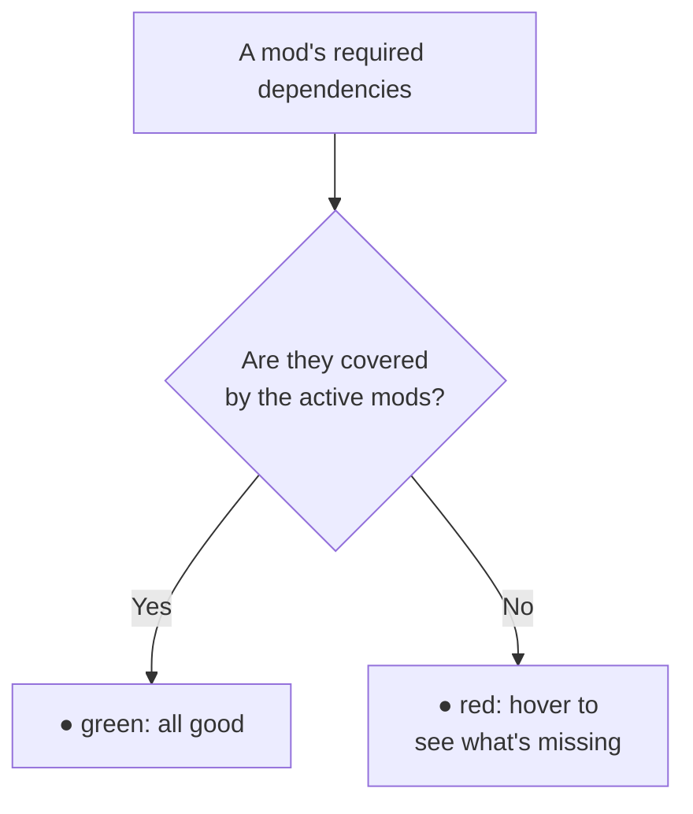
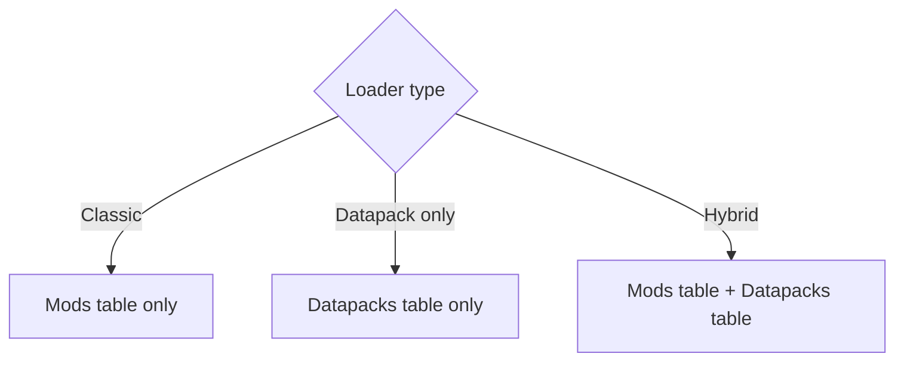

# 3 — Mods and datapacks

The **List Mods** section (in the sidebar) shows what your modpack actually contains: it reads the
`.jar` files from the `mods` folder (and the datapacks, if any) and lists them with all their details.

## How scanning works

The first time you open the section, the app **scans** the `mods` folder and reads the name, version,
authors, modloader and dependencies from each jar. The result is remembered, so it's instant the next
times.

> Use **Refresh** when you add, update or remove mods from the folder: it updates the list by reading
> the files again.

## The mods table

At the top you'll find the summaries: the **total** count, **active** mods, **inactive** ones,
those with **missing dependencies** and those **with warnings** from reading the jars.

The table shows, for each mod:

| Column | Meaning |
|---------|-------------|
| **On** | Toggle to enable/disable the mod |
| **Mod** | Mod name |
| **Version** | Version |
| **Loader** | Forge / NeoForge / Fabric / Quilt (colored badge) |
| **Format** | Which file the data was read from (see below) |
| **Authors** | Authors |
| **Dependencies** | Dependency status (see below) |

### Enabling and disabling mods

The **On** toggle lets you mark a mod as active or inactive. It's a way to keep track of what's part of
the pack without deleting files. The state is saved in the project.

### Searching for a mod

Use the **search** bar: you can type just a few letters of the name ("fuzzy" search) and the list
reorders itself to show the best matches first.

## Format and reading warnings

Every mod describes itself in a file inside the jar, and that file **changes with the Minecraft
version**. The app recognises all the formats and the **Format** column tells you which one it used:

| Badge | Where the data comes from |
|-------|---------------------------|
| `mods.toml` | Forge/NeoForge mods from Minecraft 1.13 onwards |
| `mcmod.info` | Forge mods **up to 1.12.2** (old format) |
| `fabric.mod.json` / `quilt.mod.json` | Fabric / Quilt mods |
| `MANIFEST.MF` | No recognised format: data taken from the jar manifest |
| `not recognized` | The jar holds no readable information (only the file name is left) |

If a **yellow triangle** appears next to the badge, hover it: the app explains what did not add up
while reading that jar. The most common cases:

- the jar is for a **different Minecraft version** than the one set in the dashboard (typical when a
  mod is copied into the wrong folder);
- the mod's description file is **malformed**: the data was recovered as best as possible;
- the jar has **no English texts**, so its keybinds cannot be detected in the Keybinds section.

> The Minecraft version set in the dashboard is part of what the app uses to figure out the format:
> if you change it, the scan is redone from scratch the next time you open List Mods.

## Missing dependencies

The **Dependencies** column warns you if a mod is missing something it needs to work:

- **Green dot** — all required dependencies are satisfied by the other active mods.
- **Red dot** — something is missing: hover over it to see the list of missing dependencies.

The check also accounts for dependencies **bundled inside** another jar (many Forge mods include the
libraries they need), so it reduces false alarms.

> 💡 If you open an old project and see lots of false "missing dependency" warnings, press **Refresh**:
> a fresh scan recognizes bundled libraries better.

## Datapacks

If your modpack uses **datapacks** (Datapack loader, or hybrid mode — see
[chapter 2](./02-dashboard.md)), a dedicated datapacks table also appears, with:

| Column | Meaning |
|---------|-------------|
| **On** | Enable/disable the datapack |
| **Datapack** | Name |
| **Pack format** | Datapack format |
| **Description** | Description |

What you see depending on the loader:

Datapacks are read from the datapacks folder (default `datapacks/`, or the one you set in the
Dashboard). Here too the **Refresh** button re-reads the folder.
