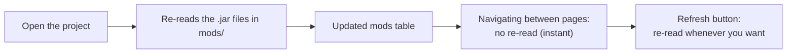
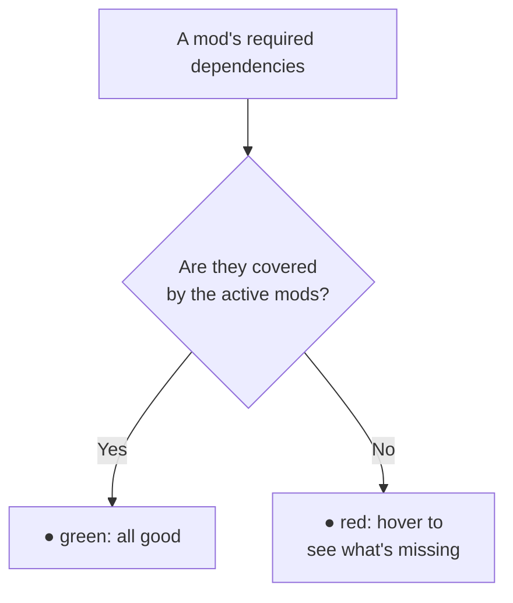
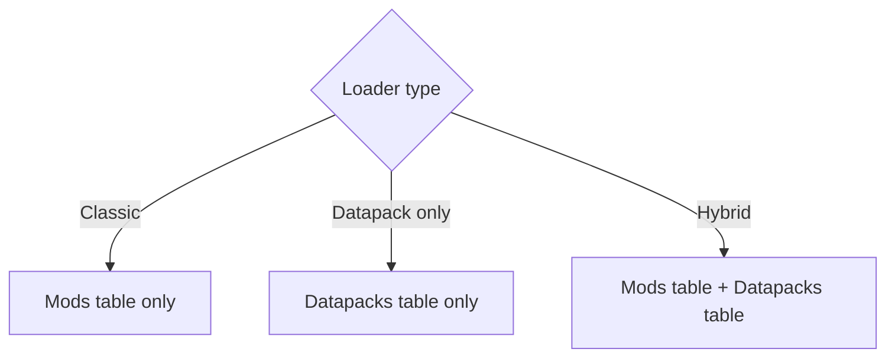

# 3 — Mods and datapacks

The **List Mods** section (in the sidebar) shows what your modpack actually contains: it reads the
`.jar` files from the `mods` folder (and the datapacks, if any) and lists them with all their details.

## How scanning works

**Every time you open a project** the app re-reads the `mods` folder and updates the list: name,
version, authors, modloader and dependencies of every jar. This happens for already-saved projects
too, so if you **added, updated or deleted** mods between sessions the list realigns by itself — mods
that are gone disappear from the list.

Within the same session the list is not re-read on every page change (that would be needlessly slow
on big modpacks): if you change the folder **while** the app is open, use **Refresh**.

> While the scan runs a **waiting screen** with a loading animation appears: the app stays put on
> purpose, because switching project or page halfway through the read would leave inconsistent data. On
> small modpacks (or when the data is already cached) it is so quick you won't see it.

> When the list changes, a notice appears in the top-right corner telling you how many mods were
> added, removed or updated, and the save bar reminds you to save the project. If nothing changed on
> disk, nothing shows up.

The same applies to the **datapacks** list.

## The mods table

At the top you'll find the summaries: the **total** count, **active** mods, **inactive** ones,
those with **missing dependencies**, the ones **incompatible** with the Minecraft version and those
**with warnings** from reading the jars.

The table shows, for each mod:

| Column | Meaning |
|---------|-------------|
| **On** | Toggle to enable/disable the mod |
| **Mod** | Mod name |
| **Version** | Version |
| **Loader** | Forge / NeoForge / Fabric / Quilt (colored badge) |
| **MC** | Minecraft version declared by the mod + comparison result (see below) |
| **Format** | Which file the data was read from (see below) |
| **Authors** | Authors |
| **Dependencies** | Dependency status (see below) |
| **Actions** | Free note and check corrections (see below) |

### Enabling and disabling mods

The **On** toggle lets you mark a mod as active or inactive. It's a way to keep track of what's part of
the pack without deleting files. The state is saved in the project.

### Searching for a mod

Use the **search** bar: you can type just a few letters of the name ("fuzzy" search) and the list
reorders itself to show the best matches first.

### Filtering with chips

To the right of the search box there are five **chips** showing how many mods are in each condition
(the same numbers as the cards at the top of the page): **Active**, **Inactive**, **Missing
dependencies**, **Incompatible** and **With warnings**. Click one to show only those mods; click it again to remove it.

You can select more than one, and they combine like this:

- chips in the **same group** → *or*: Missing dependencies + With warnings = mods that have at least
  one of the two problems;
- chips in **different groups** → *and*: Active + With warnings = only active mods that have warnings.

> Missing dependencies are only counted for **active** mods (a disabled mod can't break the pack), so
> the "Inactive + Missing dependencies" combination returns no rows.

The **Clear filters** button removes the chips and the search text together; the table title shows how
many rows you are seeing out of the total (e.g. `(12/148)`).

### Sorting the table

The table always starts **sorted by name** (A to Z), so you find mods where you expect them even when
the files on disk are named differently from the mod itself.

Click a column header to change the order: the **first** click sorts ascending, the **second**
descending, the **third** goes back to the starting order. The arrow next to the column name shows the
active order.

- **On** — active first (or inactive first, reversed).
- **Version** — "natural" order: 1.10 comes **after** 1.9 (alphabetical sorting would do the
  opposite).
- **MC** — compatible mods first, then the unverifiable ones, then the incompatible ones (reverse the
  order to bring problems to the top).
- **Dependencies** — by number of missing dependencies: reverse the order to bring the problematic
  mods to the top.

Sorting and filters combine with the search. While you **search**, the list shows the best matches
first instead of alphabetical order (otherwise the most relevant result would end up at the bottom); if
you click a header at that point, the order you picked takes precedence.

## Minecraft version compatibility

The **MC** column shows which Minecraft version the mod declares support for, read from its own
metadata, with a dot telling you how it compares to your project's version:

| Dot | Meaning |
|---|---|
| 🟢 green | the mod covers the project's MC version |
| 🔴 red | the mod declares other versions: almost certainly the wrong jar |
| ⚪ grey | the mod declares something the app couldn't interpret: check it by hand |
| `—` | the mod declares no version at all (common in older mods) |

Hover the value for the full explanation. Red mods are counted in the **Incompatible** card at the top
of the page and can be isolated with the **Incompatible** chip; each one also gets a warning in the
**Format** column.

> Grey and `—` are **not** errors: they mean "can't be checked", and the app would rather say so than
> report a problem that isn't there. Unlike missing dependencies, the incompatible count includes
> disabled mods too: it depends on the jar, not on whether it's enabled.

The check uses the Minecraft version picked in the Dashboard: change it and the mods are re-read, so the
column updates.

## Format and reading warnings

Every mod describes itself in a file inside the jar, and that file **changes with the Minecraft
version**. The app recognises all the formats and the **Format** column tells you which one it used:

| Badge | Where the data comes from |
|-------|---------------------------|
| `mods.toml` | Forge/NeoForge mods from Minecraft 1.13 onwards |
| `mcmod.info` | Forge mods **up to 1.12.2** (old format) |
| `fabric.mod.json` / `quilt.mod.json` | Fabric / Quilt mods |
| `MANIFEST.MF` | No recognised format: data taken from the jar manifest |
| `not recognized` | The jar holds no readable information (only the file name is left) |

If a **yellow triangle** appears next to the badge, hover it: the app explains what did not add up
while reading that jar. The most common cases:

- the jar is for a **different Minecraft version** than the one set in the dashboard (typical when a
  mod is copied into the wrong folder);
- the mod's description file is **malformed**: the data was recovered as best as possible;
- the jar has **no English texts**, so its keybinds cannot be detected in the Keybinds section.

> The Minecraft version set in the dashboard is part of what the app uses to figure out the format:
> if you change it, the scan is redone from scratch the next time you open List Mods.

## Missing dependencies

The **Dependencies** column warns you if a mod is missing something it needs to work:

- **Green dot** — all required dependencies are satisfied by the other active mods.
- **Red dot** — something is missing: hover over it to see the list of missing dependencies.

The check also accounts for dependencies **bundled inside** another jar (many Forge mods include the
libraries they need), so it reduces false alarms.

> 💡 If you open an old project and see lots of false "missing dependency" warnings, press **Refresh**:
> a fresh scan recognizes bundled libraries better.

## Notes and false positives (Actions column)

The last column of the table, **Actions**, opens two per-mod actions from the `⋯` button.

### Note

**Add note** opens a window where you can write a free reminder about the mod (for example "do not
update: the new version breaks the recipes"). After saving, a small **amber** icon appears in the
top-right corner of the name cell: hover it to read the note, click it to edit. To drop the note,
reopen the window and press **Remove note**.

The note lives in the project and **survives** Refresh and reopening: scanning the jars does not wipe
it. It only disappears if you remove the mod from the folder.

### Mark as false positive

The automatic checks (MC, Format/warnings, Dependencies) read whatever the mod authors wrote in the
metadata, and sometimes that data is incomplete or wrong: the result is an alarm that does not match
reality. **Mark as false positive** opens a window listing the issues found for that mod, **one
section per check column**:

| Section | What you can do |
|---------|-----------------|
| **Minecraft version** | Write the correct constraint and/or declare the mod compatible |
| **Missing dependencies** | Fix the modId being looked up (one by one) or declare it not missing |
| **Scan warnings** | Silence the individual warnings that are not real problems |

Every entry has a **False positive** switch and a **Reason** field: writing the reason is not
mandatory, but it is the whole point of the feature — whoever opens the project next (or you in six
months) has to understand why that alarm was silenced.

- Fixing a **modId** immediately tells you whether it now resolves ("Solved by the correction").
- If you only fix the **MC constraint** (without ticking "False positive") the dot turns **grey**, i.e.
  "cannot be checked": the automatic comparison was made against the old constraint, so it no longer
  holds. If you know the mod works, tick **False positive** too.
- Whatever you mark as a false positive **leaves the counters** of the cards at the top and the chip
  filters: the mod no longer counts as problematic.
- In its place, the cell shows a small **wrench**: hover it to see what was corrected by hand and
  why. It keeps "check passed" from looking the same as "check silenced".
- Corrections are **per issue**, not per whole column: if a jar update introduces a new missing
  dependency, you still see it.

> 💡 If the window says "No issue detected for this mod", there is nothing to correct: that mod passed
> every check.

## Datapacks

If your modpack uses **datapacks** (Datapack loader, or hybrid mode — see
[chapter 2](./02-dashboard.md)), a dedicated datapacks table also appears, with:

| Column | Meaning |
|---------|-------------|
| **On** | Enable/disable the datapack |
| **Datapack** | Name |
| **Pack format** | Datapack format |
| **Description** | Description |

What you see depending on the loader:

Datapacks are read from the datapacks folder (default `datapacks/`, or the one you set in the
Dashboard). Here too the **Refresh** button re-reads the folder.
