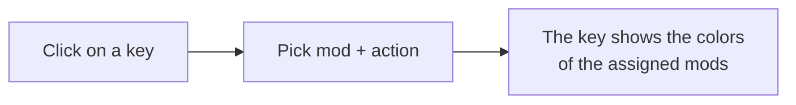
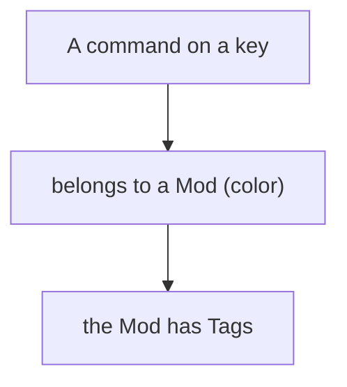
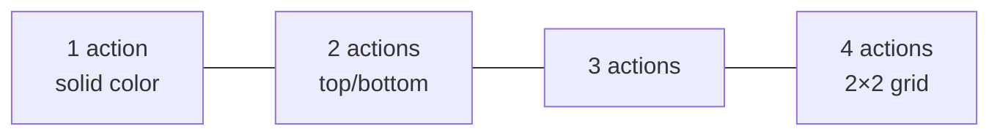

# 4 — Keybinds: mapping the keys

The **Keybinds** section is a visual keyboard editor for organizing the modpack's commands (keybinds):
which key does which action, from which mod, in which "profile".

## The keyboard

In the center you see a keyboard (Italian layout) with a numpad and mouse buttons. Every key is
clickable: clicking it assigns one or more actions to that key.

## Maps (profiles)

You can have **multiple maps**, that is different keybind profiles (e.g. "Tech & Weapons", "Magic"),
each with its own set of keys. At the top you'll find the map selector with buttons to **add** and
**remove** a map.

> A new map already starts with the **Minecraft vanilla** commands (movement, inventory, hotbar, etc.)
> on their default keys, so you don't start from scratch.

## Mods and Tags: organizing commands

There are two ways to classify commands, also used as filters:

- **Mod** — a command's primary category: the mod it belongs to (with its own **color**). Use the
  **Add Mod** button to add a mod (you pick it from the list of installed mods), give it a color and
  associate tags with it.
- **Tag** — a secondary label (e.g. "Technology", "Magic", "Movement") to group commands across the
  board. Use **Add Tag** to create new ones.

## Assigning an action to a key

1. Click the key.
2. Choose the **mod** (category).
3. Choose the **action**: for recognized mods, a dropdown menu shows that mod's real actions
   (searchable by name). For vanilla commands you'll find Minecraft's standard actions. If a mod
   doesn't expose its actions, you can type the action by hand.
4. Confirm.

> The top of the list holds the actions **read directly from the mod's code** (so certainly keyboard
> commands); further down are the ones recognized from the translation name alone, where the odd entry
> may not actually be a command.

> You can save the assignment to the current map only, or apply it to **all maps** at once.

## Multiple actions on the same key

A key can have up to **4** different actions (from different mods). The key's background splits into
colored panels, one per mod:

This way, looking at the keyboard, you can tell at a glance which keys are used and by which mods.

## Filtering the view

The **Mods** and **Tags** filter bars, plus the text search, help you focus: the keys that don't match
the filters are dimmed (they stay visible but in the background).

## Macros (combinations with a modifier)

Besides single keys, you can define **macros**: combinations with a modifier, like **Ctrl+A**,
**Shift+F**, **Alt+G**. They are handled separately from the dedicated button (pick a modifier, a base
key, a mod and an action).

> ⚠️ Macros are not supported by Minecraft's `options.txt` format: if you export to that format they
> are skipped and flagged. See [chapter 5](./05-import-export-keybind.md).

## Saving

All changes to keybinds (maps, mods, tags, macros) make the **save bar** appear at the top: click
**Save** to store them in the project.

To bring your keybinds into Minecraft (or import them from an existing file), see
[chapter 5](./05-import-export-keybind.md).
