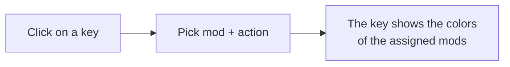
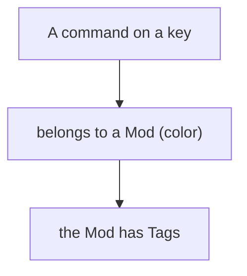
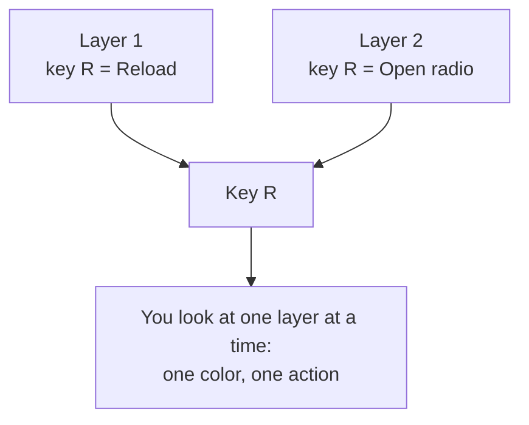

# 4 — Keybinds: mapping the keys

The **Keybinds** section is a visual keyboard editor for organizing the modpack's commands (keybinds):
which key does which action, from which mod, in which "profile".

## The keyboard

In the center you see a keyboard (Italian layout) with a numpad and mouse buttons. Every key is
clickable: clicking it assigns one or more actions to that key.

## Maps (profiles)

You can have **multiple maps**, that is different keybind profiles (e.g. "Tech & Weapons", "Magic"),
each with its own set of keys. At the top you'll find the map selector with buttons to **add** and
**remove** a map.

> A new map already starts with the **Minecraft vanilla** commands (movement, inventory, hotbar, etc.)
> on their default keys, so you don't start from scratch.

## Mods and Tags: organizing commands

There are two ways to classify commands, also used as filters:

- **Mod** — a command's primary category: the mod it belongs to (with its own **color**). Use the
  **Add Mod** button to add a mod (you pick it from the list of installed mods), give it a color and
  associate tags with it.
- **Tag** — a secondary label (e.g. "Technology", "Magic", "Movement") to group commands across the
  board. A **list of thematic tags is ready** in every new project, so you can associate them with mods
  right away, even before creating the first map; use **Add Tag** to add more, and click an existing tag
  to rename or delete it.

## Assigning an action to a key

1. Click the key.
2. Choose the **mod** (category).
3. Choose the **action**: for recognized mods, a dropdown menu shows that mod's real actions
   (searchable by name). For vanilla commands you'll find Minecraft's standard actions. If a mod
   doesn't expose its actions, you can type the action by hand.
4. Confirm.

> The top of the list holds the actions **read directly from the mod's code** (so certainly keyboard
> commands); further down are the ones recognized from the translation name alone, where the odd entry
> may not actually be a command.

> You can save the assignment to the current map only, or apply it to **all maps** at once.

## Multiple actions on the same key: layers

A key can have **several actions** (there is no maximum), but showing them all at once would fill the
keyboard with multi-colored checkered keys that are hard to read. That's why every map has **layers**:
think of them as stacked transparent sheets. On each layer a key carries **a single action**, so it
stays one solid color.

To the left of the keyboard there's the **layer list**, with how many actions each one holds: click a
layer to see what's on it, or **All layers** to see them stacked (in that case the key goes back to
splitting into panels).

> **The folded corner** — if a key is used on other layers too, its top-right corner looks folded, like
> the tip of a sheet underneath: that way you know the key has other functions even when you can't see
> them right now. Hover it to find out which layers.

### Moving an action to another layer

Click the key: the editor lists the assigned actions, each with a **Layer** menu. Pick the layer from
the menu; its last entry, **New layer**, creates one more and puts the action there. You can create as
many as you need, also from the **Add layer** button in the list on the left.

> If you put two actions on the same layer the app tells you: it's allowed, but on that layer the key
> goes back to splitting into panels.

### Fixing an already crowded map

If you have a map made before layers existed, every action sits on layer 1 and the keys end up split
into panels. The **Spread on layers** button (it only appears when needed) automatically moves the
actions that share a key onto separate layers, one per layer.

A layer can only be removed if it's **empty**, and only the last one: that way you can't throw actions
away without noticing what disappeared. To empty it, move its actions to another layer from the **Layer** menu.

> When importing a `keybindprofiles.json` the layers are assigned automatically: a key's first action
> goes to layer 1, the second to layer 2, and so on, without dropping anything.

## Filtering the view

The filter bars list **only the mods (and tags) this map actually uses**: if a mod doesn't have a single
key here, filtering by it would give you an empty keyboard, so it isn't listed. Switch map and the list
changes with it. The chips take **two rows at most** and scroll horizontally (trackpad or Shift+wheel);
**All** always stays on the left, outside the scrolling area.

The **Mods** and **Tags** filter bars, plus the text search, help you focus. As soon as you turn a
filter on, the keyboard becomes the **view dedicated** to what you picked: every key keeps only the
matching action (at full color), everything else goes back to empty like on a brand new map, and all
layers are shown together. So picking a mod shows you its map and nothing else, instead of a keyboard
full of every mod's colors.

> A key with other actions hidden by the filter keeps the **folded corner** in its top-right: the
> tooltip tells you which mods use it, so you don't reassign it thinking it's free. Macros outside the
> filter are hidden too, not dimmed.

## Macros (combinations with a modifier)

Besides single keys, you can define **macros**: combinations with a modifier, like **Ctrl+A**,
**Shift+F**, **Alt+G**. They are handled separately from the dedicated button (pick a modifier, a base
key, a mod and an action).

> ⚠️ Macros are not supported by Minecraft's `options.txt` format: if you export to that format they
> are skipped and flagged. See [chapter 5](./05-import-export-keybind.md).

## Saving

All changes to keybinds (maps, mods, tags, macros) make the **save bar** appear at the top: click
**Save** to store them in the project.

To bring your keybinds into Minecraft (or import them from an existing file), see
[chapter 5](./05-import-export-keybind.md).
