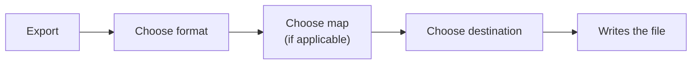
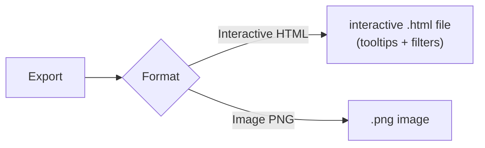
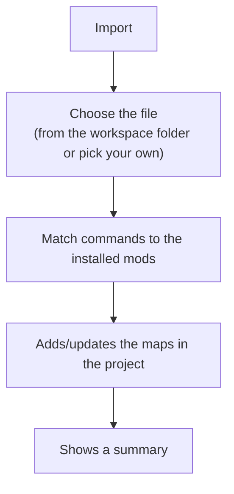

# 5 — Importing and exporting keybinds

Once you have organized your keybinds (see [chapter 4](./04-keybinds.md)), you can **export** them to a file
that Minecraft or the mods can read, or **import** keybinds from an existing file.

## Exporting keybinds

From the maps bar, the **Export** button opens a window where you choose:

1. **The target format** (chosen first).
2. **Which map** to export — appears only if the format supports it (see below).
3. **Where to save** the file (in the workspace folder or in a location of your choice).

Depending on the format, the map choice changes:

| Format | Map choice |
|--------|------------|
| **Keyset** (`keybindprofiles.json`) | none: exports **all** maps together into the single file |
| **Minecraft `options.txt`** | a single map |
| **HTML / PNG** | one map, or **All** = one file per map |

With **All** (HTML/PNG only) you can save the files into the workspace folder or pick a destination
**folder**.

### `options.txt` format (Minecraft)

This is Minecraft's options file, which also contains the assigned keys. The export is **safe**:

- It **does not touch** your other settings (graphics, audio, etc.): it leaves them intact.
- It **updates** only the keys managed by your project.
- It **does not delete** keys from mods you are not managing.

When finished, a message tells you how many lines were written and any **warnings**, for example:

- commands without a "translation key" (not exportable) → skipped;
- keys that cannot be mapped (e.g. some accented Italian keys) → written as "unknown";
- multiple keys on the same action → the last one is kept;
- **macros** with modifiers → not supported by `options.txt`, so skipped.

### `keyset` format (Keyset mod)

Generates the single `config/keybindprofiles.json` file of the
[Keyset](https://github.com/BeeBoyD/Keyset) mod: **each map becomes a profile** inside the same file,
so you don't pick which map to export — **all** of them are included. The export **respects existing
profiles** (e.g. those created directly in-game): it only updates the ones with the same name as your
maps and leaves the others intact. Non-mappable keys are exported as "unbound". Unlike `options.txt`,
here **macros** (key + modifier) are supported.

### Interactive HTML and keyboard image

Besides the config files, you can export the **graphical representation** of the keybind map — handy
for sharing it or documenting your modpack. Pick the format in the **Export** dialog:

- **Interactive HTML (keyboard view)** — generates a standalone `.html` file with the colored keyboard
  (one color per mod). Open it in a browser: hovering a key shows a preview, and **clicking a key**
  opens a window listing that key's **actions** and its **mod**. The legend at the top lets you
  **filter** keys by mod or by tag. It's view-only (it doesn't change the project) and works
  **offline** too.
- **Image (PNG)** — generates a `.png` **image** of the keyboard, with a **legend of the mod colors** at
  the bottom, ready to drop into a guide, a post or a README.

Both reflect the selected map, with the mod colors and multi-action keys split into rectangles, exactly
like in the Keybinds page.

## Importing keybinds

The **Import** button reads an existing keybind file and rebuilds its maps inside the
project.

During the import, the app:

- matches each command to the corresponding **installed mod** (by reading your jars);
- **discards** commands from mods you have not installed (and that are not vanilla);
- rebuilds modifier combinations as **macros**.

### The import summary

When finished, you see a table with any **skipped** commands and the reason:

| Reason | Meaning |
|--------|---------|
| **not-installed** | The mod for that command is not among the installed ones → discarded |
| **unmapped** | The key cannot be represented on the app's keyboard |
| **overflow** | The key already had 4 commands (the maximum) → not added |

Commands "without a key" (unassigned) are simply ignored, without ending up among the problems.

> Remember to **save** (save bar) after an import to keep the imported maps in the
> project.
