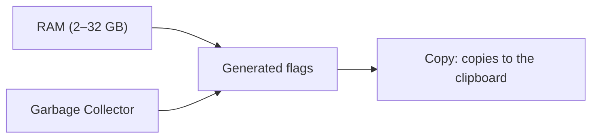

# 6 — Memory and performance (JVM)

The **JVM** section helps you prepare Minecraft's startup parameters related to **memory** and
**performance**. The app generates a list of "flags" for you, ready to paste into your launcher.

> The app **does not launch** Minecraft: here you only prepare the parameters, then you copy them
> wherever you need (e.g. into your launcher's settings).

## Settings

- **RAM** — how much memory to assign to the game, with a slider from 2 to 32 GB. Set a value
  suited to your pack (more mods = more memory).
- **Garbage Collector** — the Java Virtual Machine's memory management system. You can choose:

| Option | When to use it |
|--------|----------------|
| **G1GC (Aikar)** | Recommended and most common choice for servers/modpacks |
| **ZGC** | Modern low-latency alternative |
| **Shenandoah** | Another low-latency alternative |

## The generated flags

Below the settings appears the list of corresponding **flags** (color-coded for easier reading),
already complete with minimum/maximum memory and the options for the chosen garbage collector. Some values
adjust automatically when you assign a lot of RAM (12 GB or more).

## Copying the flags

The **Copy** button copies all the flags to the clipboard: paste them into your launcher's
configuration (the "JVM arguments" field or similar). A message confirms the copy was done.

> The settings (RAM and garbage collector) are saved in the project: the save bar
> will appear when you change them.
