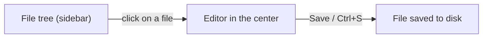
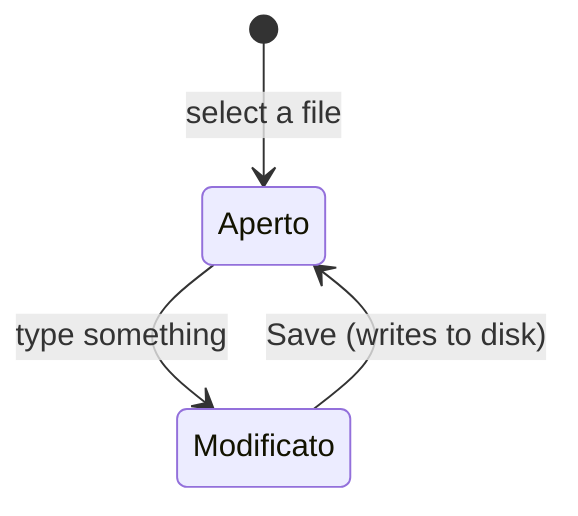

# 7 — Documents: editing config files

The **Documents** section is a built-in text/code editor for editing the modpack's configuration
files (the `config` and `kubejs` folders) without leaving the app.

## The file tree

In the sidebar you'll find the **file tree** of the `config` and `kubejs` folders of your workspace
folder. Folders first, then files, in alphabetical order.

From the tree you can also:

- **Create** a new file ("+" button on a folder).
- **Rename** a file.
- **Delete** a file (with a confirmation prompt).
- **Update** the tree (Refresh button) if you change the files externally.

## The editor

Clicking a file opens it in the code editor in the center. The editor:

- **Detects the language** from the extension (JSON, TOML/config, JavaScript/KubeJS, etc.) and colors the
  syntax accordingly.
- Shows a **status bar** at the bottom with: total lines, cursor position, file type and — for
  formats that support it (e.g. JSON) — whether the content is **valid** or contains errors.
- Highlights the **modified lines** compared to the saved file (margin indicators + count of
  additions/changes/removals).

## Saving a file

Changes stay "in draft" until you save:

- Click **Save**, or press **Ctrl/Cmd + S**.
- As long as there are unsaved changes, you see the **● unsaved** indicator next to the file name.

> **Important**: saving configuration files is **independent** from saving the
> project. The general save bar (at the top) concerns the project `.json` file; the
> config files are saved from their editor with Save/Ctrl+S. If you try to switch files with unsaved
> changes, the app asks for confirmation.
