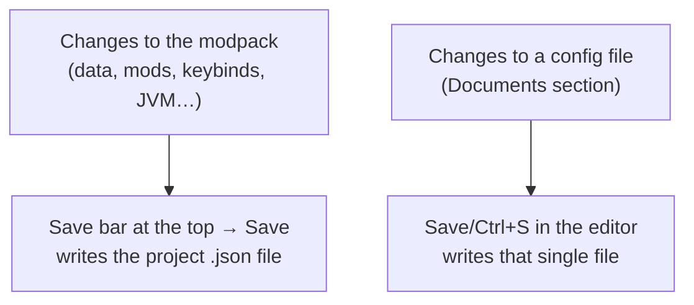
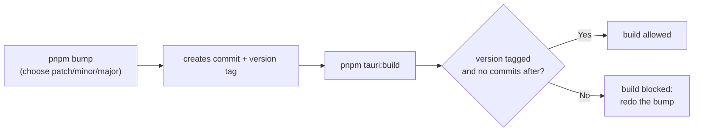

# 8 — Saving and versions

## Two types of saving

In the app there are **two** distinct kinds of saving, which are best not to confuse:

| What you change | How it is saved |
|-----------------|-----------------|
| Pack data, active mods/datapacks, keybinds, JVM settings, notes, assets | **Save bar** at the top → `Save` (writes `<name>.json`) |
| A file inside `config`/`kubejs` (Documents section) | **Save** or **Ctrl/Cmd+S** inside the editor |

## The save bar

When you change something related to the project, a bar appears at the top reminding you to
save. Click **Save** to write everything to the `.json` file in the workspace folder. After
saving, the bar disappears.

> If the project has no name, saving will tell you: set the **Name** in the Dashboard
> ([chapter 2](./02-dashboard.md)).

## Save As / change folder

From the **File** menu:

- **Save As** — save the project to a new location or under a different name (the workspace folder is
  updated accordingly).
- **Change Workspace** — change the workspace folder of the current project.

If there are unsaved changes, the app always asks for confirmation before operations that could cause
you to lose your work (closing, opening another one, quitting).

## Application versions

> This part is mainly of interest to those who **build** the app themselves; a normal user doesn't need to do anything with it.

The app keeps its version aligned across multiple files and uses a small "gate" that **prevents
building** an out-of-date version:

In practice, before generating the executable you run `pnpm bump` to increment the version; without
this step the build is blocked. The technical details are in the
[technical documentation](../technical/12-versioning-build.md).
