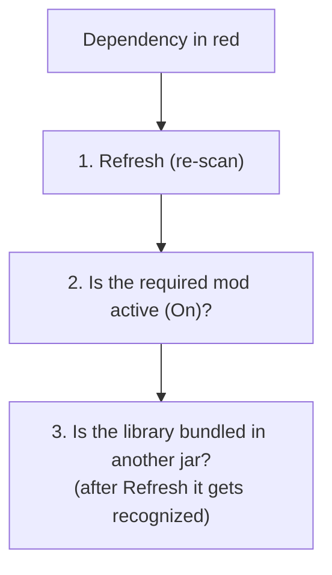

# 9 — FAQ and troubleshooting

Frequently asked questions and fixes for the most common issues. If you can't find an answer here,
check the chapter dedicated to the feature you're using.

## Project and startup

### I see "No project selected"
No project is open. Click **Create** to start a new one (pick the modpack folder) or **Open** to open
an existing `.json` project file. See [chapter 1](./01-primi-passi.md).

### I closed the app: are my changes still there?
Only if you had **saved**. When there are unsaved changes, the save bar appears at the top: click
**Save**. Remember that configuration files (Documents section) are saved separately, from their own
editor. See [chapter 8](./08-salvataggio-e-versioni.md).

## Mods and datapacks

### I don't see my mods / the list is empty
1. Make sure the mods (`.jar`) are in the **`mods`** subfolder of the workspace folder.
2. Press **Refresh** in List Mods to re-read the folder.
3. If the message says the folder wasn't found, check that you picked the right workspace folder
   (File menu → *Change Workspace*).

### I added/updated a mod but it doesn't show up
The list is "cached" for speed. Press **Refresh** to force a new scan of the `mods` folder.

### Dependencies are red but the game runs anyway
This can happen with projects created with older versions of the app or after changing the folder:

- Press **Refresh** in List Mods. The new scan also recognizes the **libraries bundled inside** other
  jars (common on Forge), reducing false alarms.
- Remember that the check compares the **mandatory** dependencies against the **active** mods: if you
  disabled a mod that satisfies another one, it will show up in red.

### My datapacks don't show up
- Datapacks are only shown if the loader is **Datapack** or if you enabled **Hybrid** mode
  (see [chapter 2](./02-dashboard.md)).
- Check the **datapacks folder**: by default it's `datapacks/` in the workspace folder, but you may
  have set a different one in the Dashboard.
- Press **Refresh**.

## Keybinds

### Some of a mod's actions don't appear in the menu
The app reads actions from the language files inside the jars. Some mods use non-standard names and
aren't recognized by the automatic scan: in those cases you can **type the action by hand** in the key
dialog. Many of these are recovered anyway when you **import** an existing keybind file.

### I can't assign a fifth action to a key
The limit is **4 actions per key**. Remove an existing action or use another key.

### I created a new map and it already has commands
That's intended: every new map starts with the **vanilla Minecraft** commands on their default keys,
so you don't start from an empty keyboard. You can change or remove them.

## Export and import

### The Italian accented keys (à, è, ì, ò, ù) aren't exported
Minecraft's `options.txt` format has **no** stable code for accented keys and for some symbols not
found on US keyboards: these keys are written as "unknown" and reported among the warnings. If you need
that command, assign it to a standard key (letters, numbers, function keys, keypad).

### My macros (Ctrl+…, Shift+…) aren't in the export
The `options.txt` format does **not** support modifier combinations: macros are skipped and reported.
They stay saved in the project anyway. See [chapter 5](./05-import-export-keybind.md).

### Some commands were skipped during import
At the end of the import you see a summary with the reason:

| Reason | What it means |
|--------|----------------|
| **not-installed** | The mod for that command isn't installed → discarded |
| **unmapped** | The key can't be represented on the app's keyboard |
| **overflow** | The key already had 4 commands (the maximum) |

Commands not assigned to any key are ignored and don't appear in the summary.

### Did the export overwrite my game settings?
No. The export to `options.txt` is conservative: it changes **only** the lines for the keys managed by
your project and leaves graphics, audio and the keys of unmanaged mods untouched.

## Versions and internet

### The version menus (MC / modloader) are empty or outdated
The lists are downloaded from the internet and then kept in a cache. A connection is needed the first
time you open them; afterwards the app works offline too. Use the **refresh** button in the Dashboard
to re-download the lists.

### The app build is blocked
This only concerns those who **build** the app: before the build you need to run `pnpm bump` to
generate a new version. This is intended behavior. Details in the
[technical documentation](../technical/12-versioning-build.md).

## Saving

### Why are there two different saves?
One concerns the **project** (pack data, mods, keybinds, JVM…): it's saved from the bar at the top and
writes the `.json` file. The other concerns the **configuration files** opened in the Documents
section: they are saved from their own editor with **Save** / **Ctrl/Cmd+S**. They are independent. See
[chapter 8](./08-salvataggio-e-versioni.md).
