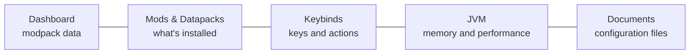

# ForgeModpack V2 — User Guide

A practical guide to using **ForgeModpack V2**, the desktop app for managing the mods, datapacks,
keybinds and settings of a Minecraft modpack that already lives on your computer.

> **In short**: pick a modpack folder, the app reads what's inside it and lets you organize mods and
> datapacks, map your keys, set the game's memory and edit the configuration files — all saved in a
> single project file. **The app does not download mods and does not launch Minecraft**: it's an
> organizer/editor.

## Who it's for

Anyone who creates or maintains a modpack and wants to keep dependencies, keybinds and configurations
under control without editing files by hand one at a time.

## Contents

| # | Chapter | What you'll learn |
|---|----------|----------------|
| 1 | [Getting started](./01-primi-passi.md) | Opening/creating a project, the workspace folder, saving |
| 2 | [Dashboard: modpack data](./02-dashboard.md) | Name/version, modloader and versions, datapack/hybrid, assets, notes |
| 3 | [Mods and datapacks](./03-mods-e-datapack.md) | Listing, enable/disable, search, missing dependencies |
| 4 | [Keybinds: mapping the keys](./04-keybinds.md) | Keyboard, maps, mods and tags, multiple actions per key, macros |
| 5 | [Importing and exporting keybinds](./05-import-export-keybind.md) | Writing `options.txt`, importing profiles |
| 6 | [Memory and performance (JVM)](./06-jvm.md) | RAM and garbage collector, copying the flags |
| 7 | [Documents: editing the config files](./07-documenti.md) | Code editor, file trees, saving |
| 8 | [Saving and versions](./08-salvataggio-e-versioni.md) | Save bar, save/save as, versions |
| 9 | [FAQ and troubleshooting](./09-faq.md) | Mods not showing up, dependencies in red, accented keys, macros… |

## App map

These sections are reached from the sidebar on the left. The name of the open modpack appears at the
top; a save bar shows up automatically whenever there are changes to save.

> 💡 The technical documentation (for developers) is in [`docs/en/technical/`](../technical/README.md).
