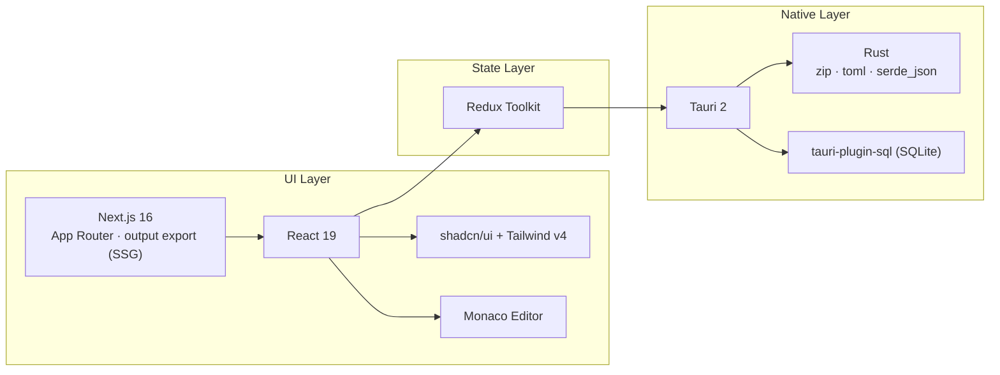

# 00 — Panoramica

## Obiettivo

**ForgeModpack V2** è un'app desktop per **gestire le dipendenze e le configurazioni di un
modpack Minecraft esistente**. L'utente indica una directory (`workpath`); l'app:

1. legge dal disco mod (`.jar`), datapack, config e keybind;
2. recupera online — **solo se serve** — i metadati delle versioni Minecraft e dei modloader;
3. permette di editare metadata del pack, elenco mod/datapack, keybind, argomenti JVM e file
   di configurazione;
4. salva tutto in un unico file di progetto `<nome>.json` nella `workpath`.

**Non** scarica i mod e **non** avvia Minecraft: è un manager/editor, non un launcher.

## Stack tecnologico



| Area | Tecnologia | Note |
|------|------------|------|
| Shell desktop | **Tauri 2** | plugin fs, dialog, http, sql, opener, process |
| UI | **Next.js 16 App Router** | `output: "export"` (SSG puro, niente server/route handler) |
| Componenti | **shadcn/ui** + **Tailwind v4** | tema `dark` forzato; non editare `ui/` a mano |
| State | **Redux Toolkit** | slice `project`, manifest MC/ML, `documents`, `keybindActions` |
| Editor | **@monaco-editor/react** | caricato **offline** da `public/monaco/vs` |
| Backend | **Rust** | scansione jar/datapack, lettura albero file |
| Cache | **SQLite** | tabella key-value `manifest_cache` |
| Linguaggio | **TypeScript strict** | alias import `@/*` → root |

## Comandi

```bash
pnpm dev          # Next dev server (web, http://localhost:3000)
pnpm tauri:dev    # App desktop in dev (avvia anche pnpm dev)
pnpm tauri:build  # Build dell'eseguibile (BLOCCATA senza bump di versione)
pnpm build        # Export statico Next -> ./out (consumato da Tauri)
pnpm bump         # Bump interattivo versione (patch/minor/major) + commit + tag
pnpm lint
```

> ⚠️ Usare **pnpm** (non npm/yarn). Le API `@tauri-apps/plugin-*` (fs, dialog, http, sql)
> **non funzionano** nel solo `pnpm dev`: per testare le feature reali serve `pnpm tauri:dev`.

## Glossario

| Termine | Significato |
|---------|-------------|
| **workpath** | Directory del modpack scelta dall'utente; contiene `project.json`, `mods/`, `config/`, `datapacks/` |
| **project** | L'oggetto/file `<nome>.json` che rappresenta tutto lo stato salvabile del modpack |
| **modloader** | Forge / NeoForge / Fabric / Quilt / Datapack (+ modalità ibrida) |
| **provides** | Tutti i `modId` messi a disposizione da un jar (multi-mods + `provides` + dipendenze JarJar) |
| **JarJar** | Meccanismo Forge/NeoForge di bundling di jar dentro jar (`META-INF/jarjar/*.jar`) |
| **keybind** | Associazione tasto fisico → azione, con `actionKey` (translation key) opzionale per l'export |
| **actionKey** | Chiave di traduzione Minecraft (es. `key.jei.toggleOverlay`), usata per scrivere i file di config |
| **manifest** | Elenco versioni scaricato dalle API MC/modloader, cachato in SQLite con TTL 24h |
