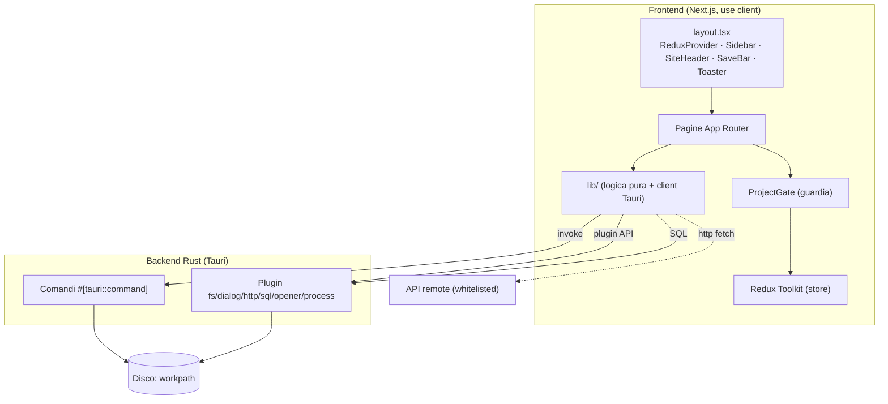
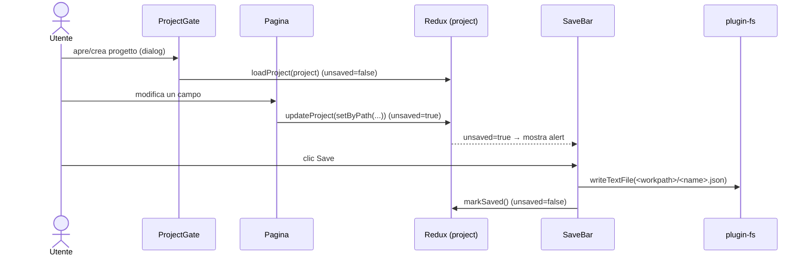
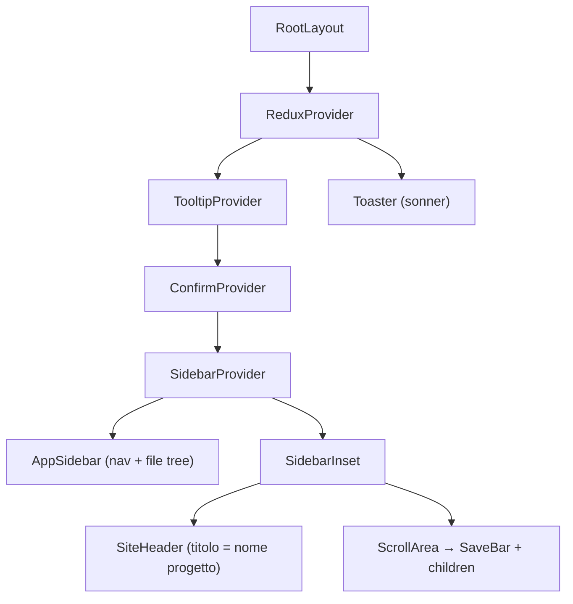
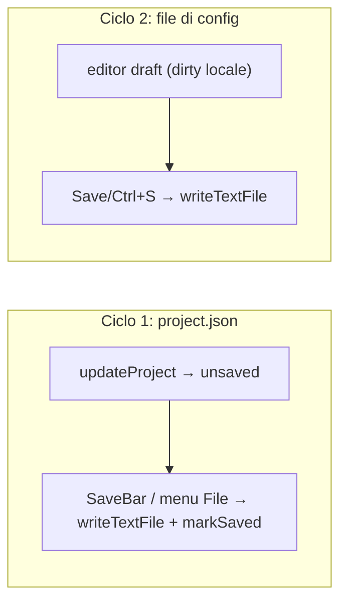
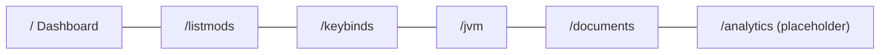

# 01 — Architettura

## Layer

## Boundary Rust ↔ JavaScript

Due percorsi verso il nativo, con responsabilità distinte:

| Percorso | Uso | Esempi |
|----------|-----|--------|
| **Comandi custom** (`invoke`) | Lettura pesante del disco (apertura jar/zip, alberi) | `scan_mods`, `scan_datapacks`, `resolve_keybind_labels`, `read_dir_tree` |
| **Plugin Tauri** (API JS) | I/O testuale, dialog, rete, DB | `readTextFile`/`writeTextFile`, `open`/`save`, `fetch`, `Database` |

> Gli host di rete consentiti sono **whitelistati** in
> [`capabilities/default.json`](../../../src-tauri/capabilities/default.json): ogni nuovo host va
> aggiunto lì, altrimenti la fetch fallisce. Le scritture SQL richiedono `sql:allow-execute`.

## Flusso dati principale

Il pattern centrale di modifica è **immutabile**: si usa `setByPath`/`addByPath`/`removeByPath`
([`json-data.ts`](../../../src/lib/json-data.ts)) per produrre un nuovo `project`, poi
`dispatch(updateProject(next))`. Le pagine **non** gestiscono più save/unsaved localmente: basta
dispatchare `updateProject` e la `<SaveBar />` globale compare ovunque. Vedi [13 — Helper](./13-helper-lib.md).

## Componenti trasversali del layout

`layout.tsx` monta una sola volta l'infrastruttura condivisa:

- **`ReduxProvider`**: store globale.
- **`ConfirmProvider`**: dialog di conferma riusabile (`useConfirm()`), es. per scartare modifiche.
- **`AppSidebar`**: menu File (New/Open/Save/Save As/Close/Exit + scorciatoie Ctrl/Cmd), nav voci
  (`NavMain`) e albero file config (`NavFiles`).
- **`SaveBar`**: alert di salvataggio globale, unica fonte per scrivere `project.json`.
- **`Toaster`**: necessario perché i `toast(...)` di sonner siano visibili (montato una sola volta).

## Persistenza — due cicli separati

Il progetto (`project.json`) e i **file di config** (sezione Documents) hanno cicli di salvataggio
**indipendenti**: i file di config **non** vivono nel project e hanno un proprio stato "dirty"
nell'editor, slegato dalla `SaveBar`.

## Route dell'app

Ogni route (tranne il placeholder) è avvolta in `<ProjectGate>`: senza progetto mostra il blocco
create/open. Dettagli in [03 — Frontend](./03-frontend-pagine.md).
