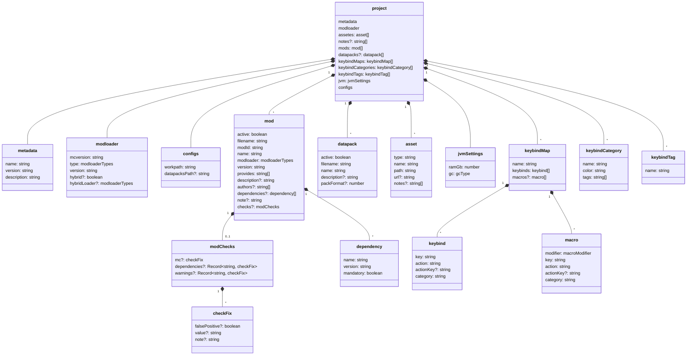
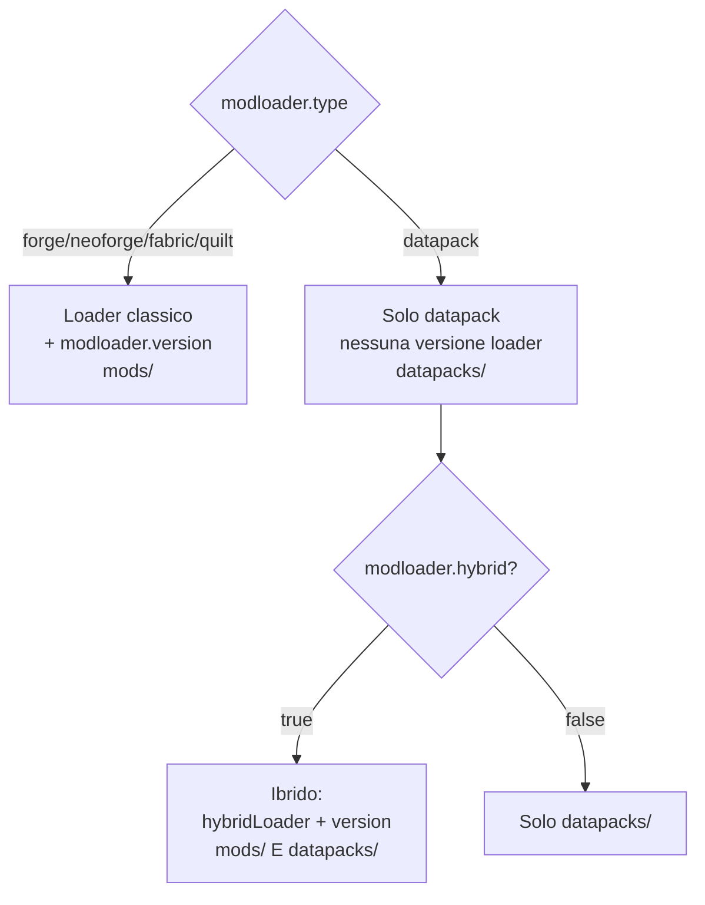

# 02 — Modello dati

Tutto lo stato salvabile di un modpack vive in un unico oggetto `project`
([`src/model/models.ts`](../../../src/model/models.ts)), serializzato nel file
`<workpath>/<nome>.json`. I tipi dei manifest remoti stanno invece in
[`src/model/manifest-mc-ml.ts`](../../../src/model/manifest-mc-ml.ts).

## Diagramma delle entità

## `project` — campi principali

| Campo | Tipo | Note |
|-------|------|------|
| `metadata` | `{ name, version, description }` | Metadati del pack |
| `modloader` | vedi sotto | Loader + versioni + modalità ibrida |
| `assetes` | `asset[]` | Risorse (resource/shader pack…) — nome storico con refuso |
| `notes?` | `string[]` | Note libere del progetto (opzionale, retrocompatibile) |
| `mods` | `mod[]` | Elenco mod, derivato dalla scansione |
| `datapacks?` | `datapack[]` | Datapack (opzionale, retrocompatibile) |
| `keybindMaps` | `keybindMap[]` | Mappe di keybind (multi-mappa) |
| `keybindCategories` | `keybindCategory[]` | Categorie primarie = mod (+ "Vanilla") |
| `keybindTags` | `keybindTag[]` | Tag secondari di filtro |
| `jvm` | `jvmSettings` | RAM + garbage collector |
| `configs` | `{ workpath, datapacksPath? }` | Percorsi del progetto |

### `modloader` e la modalità ibrida

`modloaderTypes` (enum): `forge`, `neoforge`, `fabric`, `quilt`, `datapack`, `unknown`.

- Con `type` classico: il modpack ha solo mod; `version` = versione del loader.
- Con `type === "datapack"`: nessuna versione di loader, dipende solo da `mcversion`.
  - Se `hybrid === true`: `hybridLoader` è il loader classico aggiuntivo e `version` diventa
    la sua versione → modpack con **mod E datapack**.

### `mod`

Popolato dalla scansione dei jar (vedi [06 — Scansione](./06-scansione.md)). Il campo chiave è
`provides`: **tutti** i modId messi a disposizione dal jar (multi-`[[mods]]`, campo `provides`
e dipendenze bundlate via JarJar). Serve alla verifica dipendenze di List Mods per evitare falsi
"dipendenza mancante". `active` è preservato per `filename` tra le scansioni.

> ⚠️ I `keybinds` letti dallo scan **non** vengono copiati in `project.json`: restano solo nella
> cache SQLite, così il file di progetto resta leggero.

### `note` e `checks` — dati dell'utente sulla mod

Sono gli unici campi di `mod` che **non** vengono dalla scansione, quindi
[`toProjectMods`](../../../src/lib/mods-sync.ts) li preserva per `filename` insieme ad `active`
(altrimenti la rilettura dei jar li cancellerebbe); sono esclusi dalla firma del diff, come
`active`. Una mod che sparisce dal disco si porta via anche la sua nota.

- **`note?: string`** — nota libera dell'utente sulla mod ("non aggiornare: rompe le ricette…").
  In List Mods compare come icona nell'angolo della cella del nome, col testo nel tooltip.
- **`checks?: modChecks`** — correzioni manuali dei controlli diagnostici. I controlli
  (compatibilità MC, dipendenze mancanti, avvisi) leggono metadati scritti a mano dagli autori dei
  mod: possono sbagliare. Un `checkFix` registra `falsePositive` (il problema non è reale), `value`
  (il valore giusto: vincolo MC o modId della dipendenza) e `note` (**il motivo**), così la
  decisione resta scritta nel progetto invece di vivere nella testa di chi l'ha presa.

`modChecks` ha una voce per **colonna di controllo**, e per dipendenze/avvisi la correzione è
indicizzata sul **singolo problema** (modId dichiarato / testo dell'avviso): un falso positivo "su
tutta la colonna" nasconderebbe anche i problemi che compaiono dopo un aggiornamento del jar.
La logica che applica le correzioni è in [`mod-checks.ts`](../../../src/lib/mod-checks.ts)
(funzioni pure), usata sia dalle celle sia dai conteggi/filtri di List Mods.

### `keybind` / `macro` / `keybindCategory` / `keybindTag`

- **`keybind`**: `key` (id del tasto fisico, vedi [`keyboard-layout.ts`](../../../src/lib/keyboard-layout.ts)),
  `action` (label leggibile), `actionKey?` (translation key per l'export, retrocompatibile),
  `category` (nome mod o "Vanilla").
- **`macro`**: come `keybind` ma con un `modifier` (`ctrl` | `shift` | `alt`) — combinazioni tipo
  Ctrl+A; vivono nella mappa separate dai keybind normali.
- **`keybindCategory`**: categoria primaria = una mod (`name` = nome mod), con `color` HEX e `tags[]`.
- **`keybindTag`**: secondo asse di filtro (solo `name`).

Dettagli in [08 — Keybinds](./08-keybinds.md).

### `jvmSettings`

`{ ramGb: number, gc: gcType }` con `gcType = "g1" | "zgc" | "shen"`. Default via
`defaultJvmSettings()` → `{ ramGb: 4, gc: "g1" }`. Vedi [10 — JVM](./10-jvm.md).

## Tipi dei manifest remoti

[`manifest-mc-ml.ts`](../../../src/model/manifest-mc-ml.ts) definisce le forme delle risposte API:

- **`MinecraftManifest`**: `{ latest: {release, snapshot}, versions: VersionEntry[] }`.
- **`ForgeMavenMetadata`**: mappa `{ [mcVersion]: string[] }`.
- **`NeoForgeVersions`**: `{ isSnapshot: boolean, versions: string[] }`.
- **Fabric / Quilt**: risposte separate per loader e game version, ricomposte in `ModLoaderManifest`
  da [`get-manifest.ts`](../../../src/lib/get-manifest.ts).

Vedi [07 — Cache e manifest](./07-cache-manifest.md).

## `toastStyles`

`models.ts` esporta anche `toastStyles` (info/success/warning/destructive): oggetti di CSS
custom properties per colorare i toast di sonner in modo coerente col tema.
