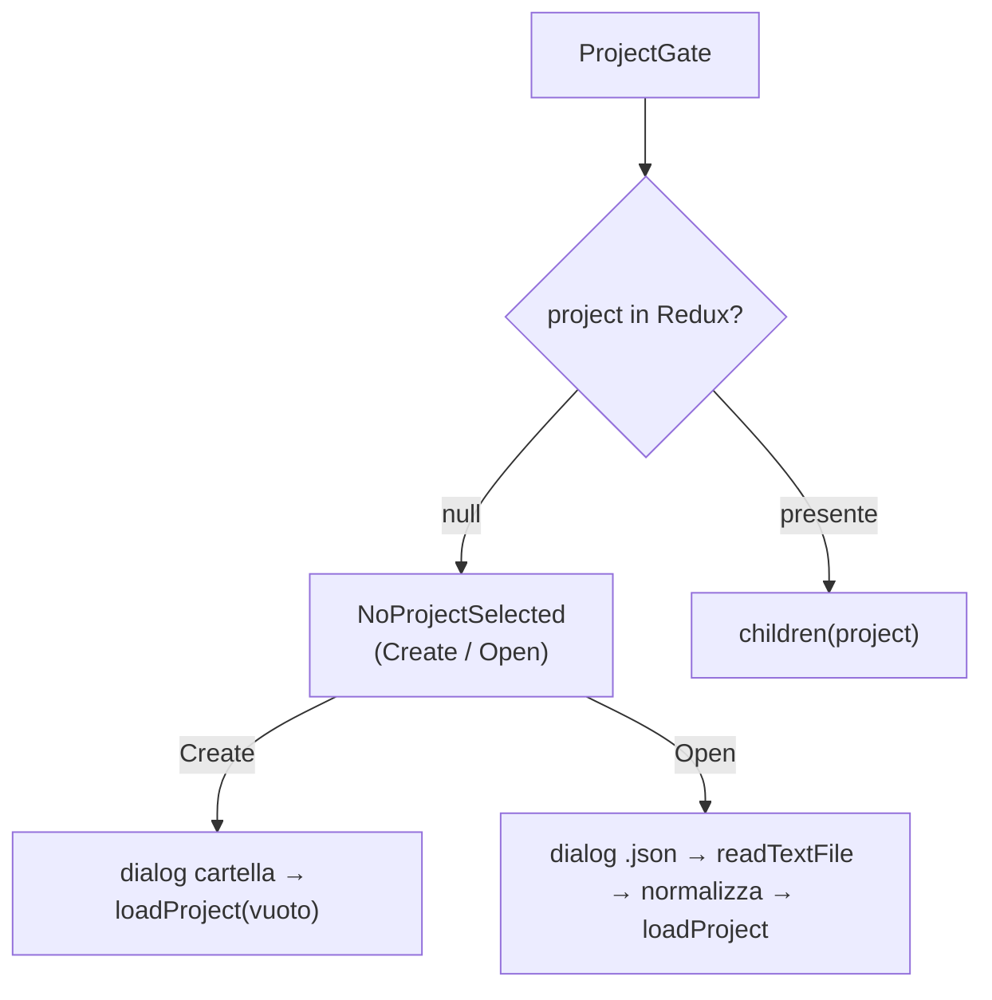
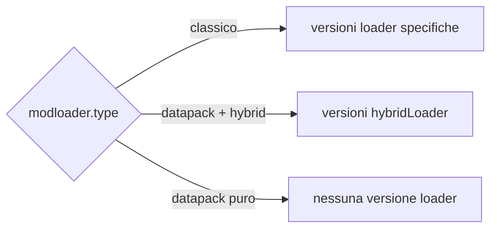
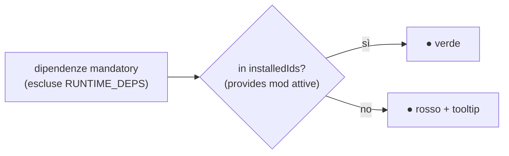
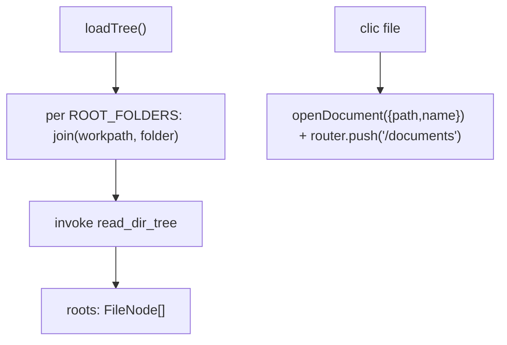
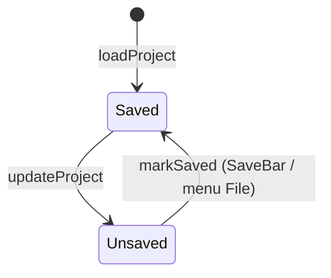

# 03 — Frontend: pagine e navigazione

Tutte le pagine sono `"use client"` (SSG puro, `output: "export"`). Ognuna che richiede un progetto
è avvolta in `<ProjectGate>` e riceve il `project` non-null via render prop.

## Guardia: `ProjectGate`

[`project-gate.tsx`](../../../src/components/project-gate.tsx) è la fonte unica del blocco
"No project selected".



- **Create**: `open({directory:true})` sceglie il workpath, poi `loadProject` con un progetto vuoto
  (`modloader.type = FORGE`, array vuoti, `jvm = defaultJvmSettings()`, `configs.workpath`).
- **Open**: `open({filters json})` → `readTextFile` → `JSON.parse` → **normalizza** i campi opzionali
  (`assetes`, `notes`, `mods`, `datapacks`, `keybindMaps`, `keybindCategories`, `keybindTags`, `jvm`)
  per retrocompatibilità → `loadProject`.

> ⚠️ **Gotcha del cambio progetto**: `ProjectGate` rende sempre lo **stesso** componente figlio,
> quindi passando da un progetto all'altro React **riusa l'istanza** e lo stato locale della pagina
> sopravvive — liste, filtri, dati scansionati della sessione precedente. Le pagine che tengono stato
> derivato dal progetto passano quindi una `key` legata all'identità del progetto
> (`${loadId}::${workpath}`) per forzare il remount: vedi
> [`listmods/page.tsx`](../../../src/app/listmods/page.tsx) e
> [`keybinds/page.tsx`](../../../src/app/keybinds/page.tsx).

## Le pagine

### `/` — Home / Dashboard ([`page.tsx`](../../../src/app/page.tsx))

Editor di metadata, modloader/versioni e assets.

- **Legge**: `state.project`, `state.minecraftManifest`, `state.modLoaderManifest`.
- **Scrive**: `updateProject`, `updateMinecraftManifest`, `loadManifest`.
- **Bootstrap** (una volta, ref anti-StrictMode): `getMinecraftManifestCached()` +
  `getModLoaderManifestCached()` in parallelo → dispatch.
- **`handleUpdateField(path, value)`**: `setByPath` sul project; azzera `modloader.version` quando
  cambia `mcversion`/`type`; uscendo da DATAPACK azzera `hybrid`/`hybridLoader`; scendendo sotto
  MC 1.13 con `type = DATAPACK` riporta il loader a FORGE e azzera l'ibrido (con toast), perché i
  datapack non esistono prima della 1.13.
- **Loader non disponibili per versione**: `isBelowMcMinor(mc, minMinor)` (helper puro) alimenta
  `neoforgeDisabled` (`NEOFORGE_MIN_MINOR = 20`) e `datapackDisabled` (`DATAPACK_MIN_MINOR = 13`) →
  `disabled` sui rispettivi `ToggleGroupItem`. L'helper ragiona **solo** sullo schema "1.x" (la minor
  è la generazione del gioco); con `major != "1"` (nuovi schemi tipo "26.1") la feature esiste sempre,
  e senza versione scelta il toggle resta disabilitato. Sotto i toggle compare una riga che spiega
  da quale versione i datapack esistono (un toggle disabilitato senza motivo sembra un bug).
- **Versioni filtrate** (useMemo): `minecraftVersions` (solo `release`), `forgeVersions`,
  `neoforgeVersions` (min minor 20), `fabricVersions`, `quiltVersions` → `modloaderVersions` scelte in
  base a `effectiveLoader` (il type stesso, oppure `hybridLoader` in modalità datapack+hybrid).
- **Assets**: dialog Add/Edit (`ASSET_TYPES` = Resource/Shader/Data Pack, Config, Icon, Splash, Other),
  upsert in `project.assetes`; note per progetto e per singolo asset; `openUrl` per i link.
- **`updateManifest()`**: refresh forzato (`force=true`) dei due manifest + toast.



### `/listmods` — List Mods ([`listmods/page.tsx`](../../../src/app/listmods/page.tsx))

Scansiona `mods/` (e `datapacks/`), elenca con toggle attivo, ricerca fuzzy, verifica dipendenze.

- **Prop** `project`; scrive `updateProject` su `mods` e `datapacks`.
- **Visibilità**: `showMods = type !== DATAPACK || hybrid`; `showDatapacks = type === DATAPACK`.
- **`scan(force)`**: `getModsScanCached(workpath, force)` → mappa in `mod[]` preservando `active` per
  `filename` (Map); **non** copia i keybind. Auto-scan solo la prima volta per workpath e solo se la
  lista è vuota (ref `initialized`).
- **`scanDatapacks(force)`**: dir = `configs.datapacksPath` o `<workpath>/datapacks`.
- **`missingDependencies`**: dipendenze `mandatory` non in `RUNTIME_DEPS` né in `installedIds`
  (unione dei `provides` — o `modId` fallback — delle mod **attive**).
- **`fuzzyMatch`/`modScore`**: ricerca a sottosequenza con punteggio; ordina `visibleMods`.
- **`visibleMods`** (useMemo): pipeline a tre passaggi **chip → ricerca → ordinamento**.
  `installedIds`/`missing`/`withWarnings` sono memoizzati: ricreandoli a ogni render la memoizzazione
  della pipeline sarebbe inutile.
- **Ordinamento di default**: `effectiveSort = sort ?? (query ? null : DEFAULT_SORT)` con
  `DEFAULT_SORT = {key: "name", dir: "asc"}`. La tabella parte quindi **alfabetica per nome** (l'ordine
  della scansione è alfabetico per *filename*, che non coincide col nome mostrato); mentre si cerca,
  senza una scelta esplicita, vince la **rilevanza fuzzy** (ordinare per nome i risultati di una
  ricerca sotterrerebbe il match migliore). Un ordinamento cliccato **batte** sempre la rilevanza.
  `effectiveSort` è ciò che alimenta sia la pipeline sia le frecce degli header.
- **Ordinamento**: `sortState = {key, dir} | null`, ciclo `asc → desc → null` su click dell'header
  (`SortableHead`, con `aria-sort`; il ciclo parte da `effectiveSort`, non dallo stato interno, così il
  primo click su "Mod" **inverte** l'ordine già visibile invece di riapplicarlo — e il terzo click
  torna al default). `sortValue` mappa la colonna sul valore da confrontare (`active`
  → 0/1, `deps` → numero di mancanti, `format` → etichetta **mostrata**); `compareMods` usa un
  `Intl.Collator({numeric: true})` — confronto **naturale**, così "1.10.0" viene dopo "1.9.0" — e il
  nome come tie-break stabile. Non si usa semver: le versioni delle mod spesso non lo sono
  (`1.20.1-forge-47.2.0`). Si ordina una **copia** (l'array viene da Redux).
- **Filtri a chip** (`ToggleGroup` multiplo): `matchesFilters` con OR **dentro** il gruppo e AND
  **tra** gruppi — gruppo stato (`active`/`inactive`) e gruppo problemi (`missing`/`warnings`). I
  conteggi sui chip sono gli stessi delle `SummaryCard`; siccome `missing` considera solo le mod
  attive, "inactive + missing" è per costruzione vuoto.
- **UI**: `SummaryCard` (totale/attive/inattive/mancanti/avvisi), barra ricerca + chip + "Azzera
  filtri", tabella mod con header ordinabili (On/Mod/Version/Loader/Format/Authors/Dependencies con
  pallino verde/rosso + tooltip mancanti) e tabella datapack (senza sort/chip: solo ricerca).



### `/keybinds` — Keybinds ([`keybinds/page.tsx`](../../../src/app/keybinds/page.tsx))

Editor visuale della tastiera. Dettaglio completo in [08 — Keybinds](./08-keybinds.md).

### `/jvm` — JVM ([`jvm/page.tsx`](../../../src/app/jvm/page.tsx))

Slider RAM (2–32 GB) + scelta GC → flag generati (`buildFlags`), colorati e copiabili. Scrive
`jvm.ramGb`/`jvm.gc`. Dettaglio in [10 — JVM](./10-jvm.md).

### `/documents` — Documents ([`documents/page.tsx`](../../../src/app/documents/page.tsx))

Editor Monaco del file selezionato nell'albero (sidebar). Ciclo di salvataggio **indipendente** dal
project. Dettaglio in [11 — Documents](./11-documents-editor.md).

### `/analytics` — placeholder

`<ProjectGate>{() => <span>Analytics</span>}</ProjectGate>`. Non collegata nella sidebar.

## Navigazione e sidebar

### `AppSidebar` ([`app-sidebar.tsx`](../../../src/components/app-sidebar.tsx))

Menu **File** (dropdown) + `NavMain` + `NavFiles` + footer.

- **`NAV_MAIN_ITEMS`**: Dashboard `/`, List Mods `/listmods`, keybinds `/keybinds`, JVM `/jvm`
  (Analytics escluso).
- **Azioni File**: `newProject`, `openProject`, `closeProject`, `saveProject`, `saveAsProject`
  (nuovo workpath via `dirname`/`basename`), `changeWorkspace`, `exitApp` (`exit(0)`).
- **Conferma modifiche non salvate** (`confirmDiscardUnsavedChanges`): dialog cancel/continue/save
  prima di azioni distruttive.
- **Scorciatoie** (ignorate se il focus è in input/textarea/contentEditable):

| Combinazione | Azione |
|--------------|--------|
| Ctrl/Cmd + N | New |
| Ctrl/Cmd + O | Open |
| Ctrl/Cmd + W | Close |
| Ctrl/Cmd + S | Save |
| Ctrl/Cmd + Shift + S | Save As |
| Ctrl/Cmd + Q | Exit |

### `NavMain` ([`nav-main.tsx`](../../../src/components/nav-main.tsx))

Voci con `next/link`; evidenzia l'attiva via `usePathname`.

### `NavFiles` ([`nav-files.tsx`](../../../src/components/nav-files.tsx))

Albero dei file di `config/` e `kubejs/` (`ROOT_FOLDERS`), letto con `read_dir_tree`.



Aggiornamenti ottimistici (`handleFileCreated/Renamed/Deleted`) tramite helper immutabili
(`insertFileNode`, `replaceFileNode`, `removeFileNodeByPath`); bottone Refresh richiama `loadTree`.

### `SiteHeader` ([`site-header.tsx`](../../../src/components/site-header.tsx))

`SidebarTrigger` + titolo = `metadata.name` del progetto (fallback "No project").

## Salvataggio globale: `SaveBar`

[`save-bar.tsx`](../../../src/components/save-bar.tsx) mostra l'alert solo se c'è un progetto e
`state.project.unsaved`. `handleSave()`: valida `metadata.name`, `join(workpath, "<name>.json")`,
`create` + scrive `JSON.stringify(project, null, 2)`, `close`, `markSaved()`, toast.



## Overlay di caricamento globale: `BusyOverlay`

Le operazioni che aprono tutti i jar (scansione mod/keybind, import), scrivono più file (export
HTML/PNG) o vanno in rete (refresh dei manifest) **bloccano di fatto l'interazione**: mentre girano
l'utente non deve poter cambiare progetto o pagina, perché il risultato verrebbe applicato a uno stato
che non esiste più.

[`busy-overlay.tsx`](../../../src/components/busy-overlay.tsx) è montato una volta nel layout (fuori
dal `SidebarProvider`, `z-[100]` per stare sopra i dialog di shadcn) e legge lo slice runtime
[`busy`](./04-state-redux.md). Non si dispatcha a mano: si usa l'hook
[`useBusy`](../../../src/lib/use-busy.ts), che apre il task e lo chiude in `finally`.

```ts
const busy = useBusy()
const mods = await busy(t("busy.scanningMods"), () => getModsScanForLoad(workpath, loadId, hint),
  { detail: workpath })
// operazioni a fasi: il callback riceve setMessage(messaggio, dettaglio)
```

| Dettaglio | Comportamento |
|---|---|
| Comparsa | ritardata di **250 ms**: dentro la stessa apertura le scansioni rispondono dalla cache in pochi ms, e senza soglia l'overlay lampeggerebbe a ogni navigazione |
| Task concorrenti | ammessi (es. mod + datapack): mostra il primo e conta gli altri; l'overlay resta finché l'ultimo non finisce |
| Chiusura | sempre in `finally`, quindi anche su errore o annullamento |
| Dialog di sistema | il wrap parte **dopo** la scelta di file/cartella, così l'overlay non copre il dialog |

Punti coperti: sincronizzazione all'apertura (`ModsSync`), scansione mod e datapack in List Mods
(anche il refresh manuale), scansione keybind, import e export keybind, refresh dei manifest nella
dashboard, lettura dell'albero dei file nella sidebar. Gli spinner locali già presenti (icona del
refresh, bottoni disabilitati) restano: indicano *quale* comando è in corso.
