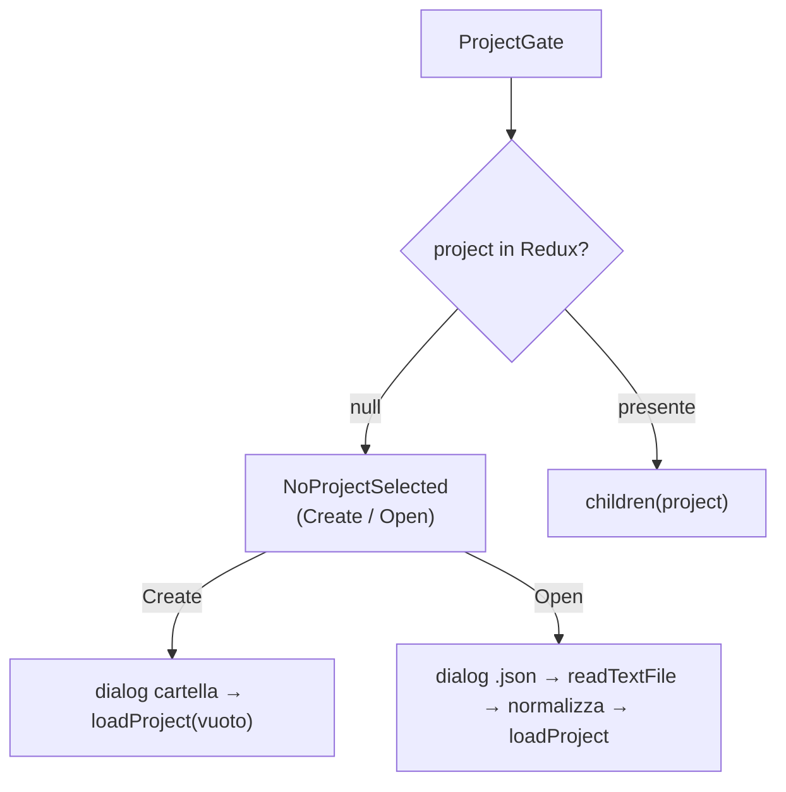
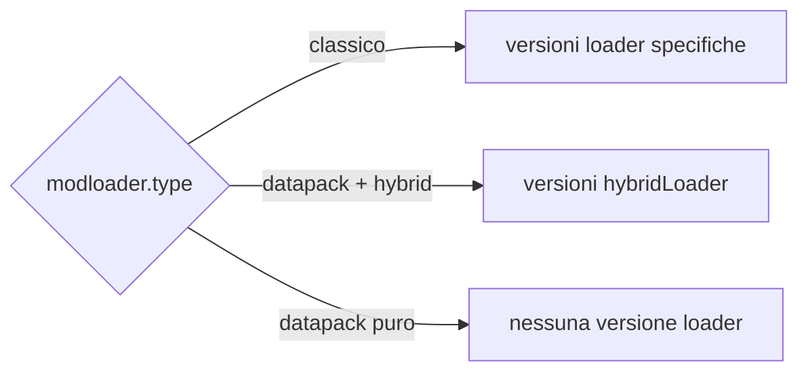
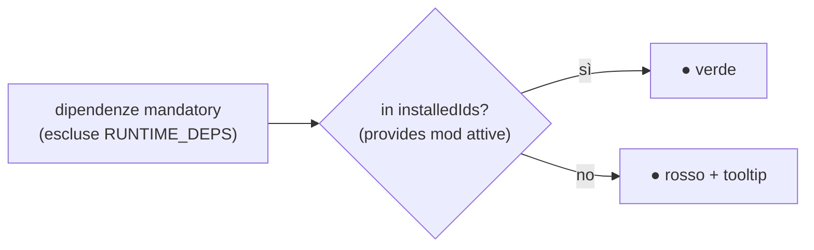
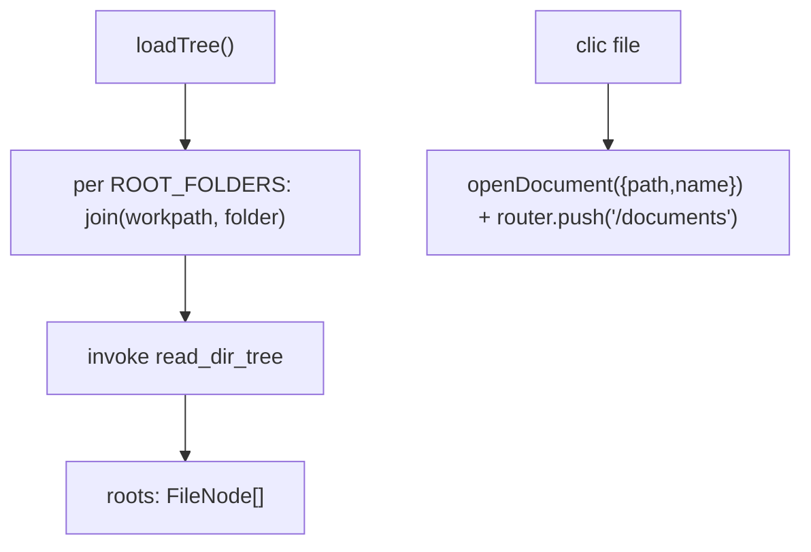
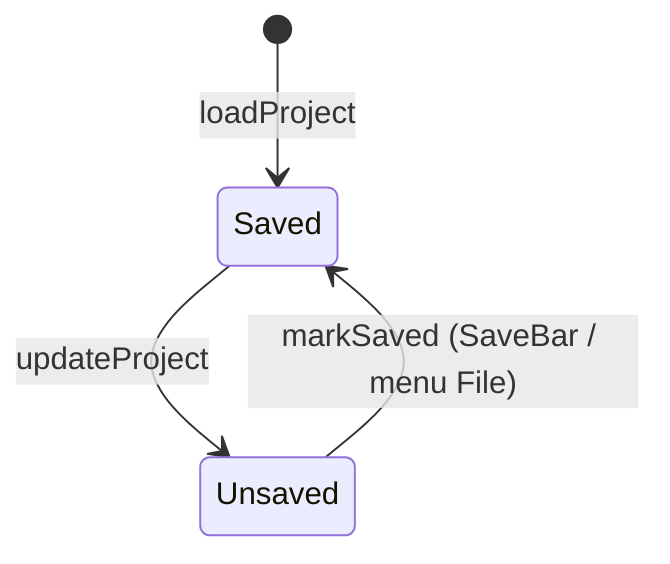

# 03 — Frontend: pagine e navigazione

Tutte le pagine sono `"use client"` (SSG puro, `output: "export"`). Ognuna che richiede un progetto
è avvolta in `<ProjectGate>` e riceve il `project` non-null via render prop.

## Guardia: `ProjectGate`

[`project-gate.tsx`](../../../src/components/project-gate.tsx) è la fonte unica del blocco
"No project selected".

- **Create**: `open({directory:true})` sceglie il workpath, poi `loadProject` con un progetto vuoto
  (`modloader.type = FORGE`, array vuoti, `jvm = defaultJvmSettings()`, `configs.workpath`).
- **Open**: `open({filters json})` → `readTextFile` → `JSON.parse` → **normalizza** i campi opzionali
  (`assetes`, `notes`, `mods`, `datapacks`, `keybindMaps`, `keybindCategories`, `keybindTags`, `jvm`)
  per retrocompatibilità → `loadProject`.

## Le pagine

### `/` — Home / Dashboard ([`page.tsx`](../../../src/app/page.tsx))

Editor di metadata, modloader/versioni e assets.

- **Legge**: `state.project`, `state.minecraftManifest`, `state.modLoaderManifest`.
- **Scrive**: `updateProject`, `updateMinecraftManifest`, `loadManifest`.
- **Bootstrap** (una volta, ref anti-StrictMode): `getMinecraftManifestCached()` +
  `getModLoaderManifestCached()` in parallelo → dispatch.
- **`handleUpdateField(path, value)`**: `setByPath` sul project; azzera `modloader.version` quando
  cambia `mcversion`/`type`; uscendo da DATAPACK azzera `hybrid`/`hybridLoader`.
- **Versioni filtrate** (useMemo): `minecraftVersions` (solo `release`), `forgeVersions`,
  `neoforgeVersions` (min minor 20), `fabricVersions`, `quiltVersions` → `modloaderVersions` scelte in
  base a `effectiveLoader` (il type stesso, oppure `hybridLoader` in modalità datapack+hybrid).
- **Assets**: dialog Add/Edit (`ASSET_TYPES` = Resource/Shader/Data Pack, Config, Icon, Splash, Other),
  upsert in `project.assetes`; note per progetto e per singolo asset; `openUrl` per i link.
- **`updateManifest()`**: refresh forzato (`force=true`) dei due manifest + toast.

### `/listmods` — List Mods ([`listmods/page.tsx`](../../../src/app/listmods/page.tsx))

Scansiona `mods/` (e `datapacks/`), elenca con toggle attivo, ricerca fuzzy, verifica dipendenze.

- **Prop** `project`; scrive `updateProject` su `mods` e `datapacks`.
- **Visibilità**: `showMods = type !== DATAPACK || hybrid`; `showDatapacks = type === DATAPACK`.
- **`scan(force)`**: `getModsScanCached(workpath, force)` → mappa in `mod[]` preservando `active` per
  `filename` (Map); **non** copia i keybind. Auto-scan solo la prima volta per workpath e solo se la
  lista è vuota (ref `initialized`).
- **`scanDatapacks(force)`**: dir = `configs.datapacksPath` o `<workpath>/datapacks`.
- **`missingDependencies`**: dipendenze `mandatory` non in `RUNTIME_DEPS` né in `installedIds`
  (unione dei `provides` — o `modId` fallback — delle mod **attive**).
- **`fuzzyMatch`/`modScore`**: ricerca a sottosequenza con punteggio; ordina `visibleMods`.
- **UI**: `SummaryCard` (totale/attive/inattive), tabella mod (On/Mod/Version/Loader/Authors/
  Dependencies con pallino verde/rosso + tooltip mancanti) e tabella datapack.

### `/keybinds` — Keybinds ([`keybinds/page.tsx`](../../../src/app/keybinds/page.tsx))

Editor visuale della tastiera. Dettaglio completo in [08 — Keybinds](./08-keybinds.md).

### `/jvm` — JVM ([`jvm/page.tsx`](../../../src/app/jvm/page.tsx))

Slider RAM (2–32 GB) + scelta GC → flag generati (`buildFlags`), colorati e copiabili. Scrive
`jvm.ramGb`/`jvm.gc`. Dettaglio in [10 — JVM](./10-jvm.md).

### `/documents` — Documents ([`documents/page.tsx`](../../../src/app/documents/page.tsx))

Editor Monaco del file selezionato nell'albero (sidebar). Ciclo di salvataggio **indipendente** dal
project. Dettaglio in [11 — Documents](./11-documents-editor.md).

### `/analytics` — placeholder

`<ProjectGate>{() => Analytics}</ProjectGate>`. Non collegata nella sidebar.

## Navigazione e sidebar

### `AppSidebar` ([`app-sidebar.tsx`](../../../src/components/app-sidebar.tsx))

Menu **File** (dropdown) + `NavMain` + `NavFiles` + footer.

- **`NAV_MAIN_ITEMS`**: Dashboard `/`, List Mods `/listmods`, keybinds `/keybinds`, JVM `/jvm`
  (Analytics escluso).
- **Azioni File**: `newProject`, `openProject`, `closeProject`, `saveProject`, `saveAsProject`
  (nuovo workpath via `dirname`/`basename`), `changeWorkspace`, `exitApp` (`exit(0)`).
- **Conferma modifiche non salvate** (`confirmDiscardUnsavedChanges`): dialog cancel/continue/save
  prima di azioni distruttive.
- **Scorciatoie** (ignorate se il focus è in input/textarea/contentEditable):

| Combinazione | Azione |
|--------------|--------|
| Ctrl/Cmd + N | New |
| Ctrl/Cmd + O | Open |
| Ctrl/Cmd + W | Close |
| Ctrl/Cmd + S | Save |
| Ctrl/Cmd + Shift + S | Save As |
| Ctrl/Cmd + Q | Exit |

### `NavMain` ([`nav-main.tsx`](../../../src/components/nav-main.tsx))

Voci con `next/link`; evidenzia l'attiva via `usePathname`.

### `NavFiles` ([`nav-files.tsx`](../../../src/components/nav-files.tsx))

Albero dei file di `config/` e `kubejs/` (`ROOT_FOLDERS`), letto con `read_dir_tree`.

Aggiornamenti ottimistici (`handleFileCreated/Renamed/Deleted`) tramite helper immutabili
(`insertFileNode`, `replaceFileNode`, `removeFileNodeByPath`); bottone Refresh richiama `loadTree`.

### `SiteHeader` ([`site-header.tsx`](../../../src/components/site-header.tsx))

`SidebarTrigger` + titolo = `metadata.name` del progetto (fallback "No project").

## Salvataggio globale: `SaveBar`

[`save-bar.tsx`](../../../src/components/save-bar.tsx) mostra l'alert solo se c'è un progetto e
`state.project.unsaved`. `handleSave()`: valida `metadata.name`, `join(workpath, "<name>.json")`,
`create` + scrive `JSON.stringify(project, null, 2)`, `close`, `markSaved()`, toast.

