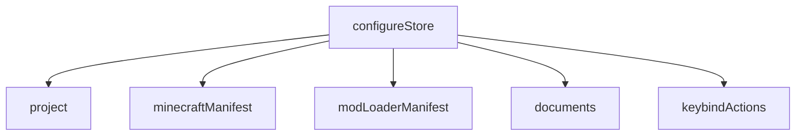
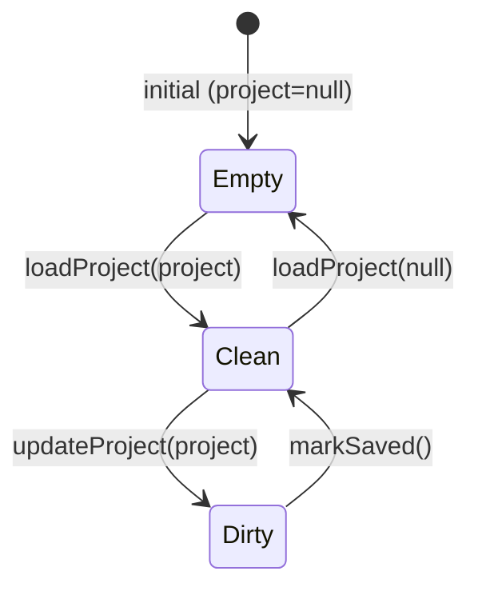

# 04 — State globale (Redux)

Lo store ([`store.ts`](../../../src/redux/store.ts)) combina cinque reducer. L'accesso avviene **sempre**
tramite gli hook tipizzati `useAppSelector`/`useAppDispatch` ([`hooks.ts`](../../../src/redux/hooks.ts)),
mai `useSelector` grezzo. Il `ReduxProvider` è montato in `layout.tsx`.

| Slice | File | Persistito in project.json? | Ruolo |
|-------|------|------------------------------|-------|
| `project` | [project-slice.ts](../../../src/redux/project-slice.ts) | è **il** progetto | Stato salvabile + flag `unsaved` |
| `minecraftManifest` | [metadata-mc-slice.ts](../../../src/redux/metadata-mc-slice.ts) | no (cache SQLite) | Versioni MC |
| `modLoaderManifest` | [metadata-ml-slice.ts](../../../src/redux/metadata-ml-slice.ts) | no (cache SQLite) | Versioni modloader |
| `documents` | [documents-slice.ts](../../../src/redux/documents-slice.ts) | no | File aperto nell'editor |
| `keybindActions` | [keybind-actions-slice.ts](../../../src/redux/keybind-actions-slice.ts) | no (runtime) | Azioni keybind per mod |

## `project`

**State**: `{ project: project | null; unsaved: boolean }`. Initial `{ null, false }`.

| Action | Effetto |
|--------|---------|
| `loadProject(project \| null)` | Imposta `project`, `unsaved=false` (create/open/close: stato pulito) |
| `updateProject(project)` | Imposta `project`, `unsaved=true` (qualsiasi modifica → attiva SaveBar) |
| `markSaved()` | `unsaved=false` (dopo scrittura su file) |

Selector: `selectProject`. **Regola d'oro**: le pagine editano il project solo con `updateProject`;
la scrittura su disco + `markSaved` è centralizzata in SaveBar / menu File.

## `documents`

**State**: `{ openFile: openDocument | null }` con `openDocument = { path, name }`.

| Action | Effetto |
|--------|---------|
| `openDocument({path, name})` | Imposta il file aperto |
| `closeDocument()` | `openFile = null` |

Selector: `selectOpenDocument`. Separato dal project di proposito: i file di config **non** vivono
nel project.json. Disaccoppia sidebar (che apre) ed editor (che rende).

## `keybindActions` (runtime)

**State**: `{ workpath: string | null; byModId: Record<string, scannedKeybindAction[]>; loading: boolean; error: string | null }`.
Tipi: `scannedKeybindAction { key, label }`, `modKeybinds { filename, modId, keybinds[] }`.

| Action | Effetto |
|--------|---------|
| `setKeybindActionsLoading(bool)` | `loading`; se true azzera `error` |
| `setKeybindActionsError(string \| null)` | `error`, `loading=false` |
| `setKeybindActions({ workpath, mods })` | `workpath` + ricostruisce `byModId` (solo mod con `modId`), `loading=false`, `error=null` |

Selector: `selectKeybindActions`. Popolato dalla scansione unificata dei jar; **non** salvato nel
project.json. Fonte delle azioni selezionabili nel dialog dei keybind e per l'import.

## `minecraftManifest`

**State**: tipo `MinecraftManifest` (`latest.release/snapshot`, `versions[]`).

| Action | Effetto |
|--------|---------|
| `updateMinecraftManifest(MinecraftManifest)` | Imposta `latest` e `versions` |

Selector: `selectMinecraftManifest`.

## `modLoaderManifest`

**State**: tipo `ModLoaderManifest` (`forge`, `neoforge`, `fabric.{loader,game}`, `quilt.{loader,game}`).

| Action | Effetto |
|--------|---------|
| `loadManifest(ModLoaderManifest)` | Imposta tutti i sottocampi in blocco |
| `updateForgeManifest` / `updateNeoManifest` | Aggiorna il singolo loader |
| `updateFabricManifest` / `updateFabricGameManifest` | Fabric loader / game |
| `updateQuiltManifest` / `updateQuiltGameManifest` | Quilt loader / game |

Selector: `selectModLoaderManifest`. In pratica la Home usa `loadManifest` col risultato di
`getModLoaderManifestCached`. Vedi [07 — Cache e manifest](./07-cache-manifest.md).
