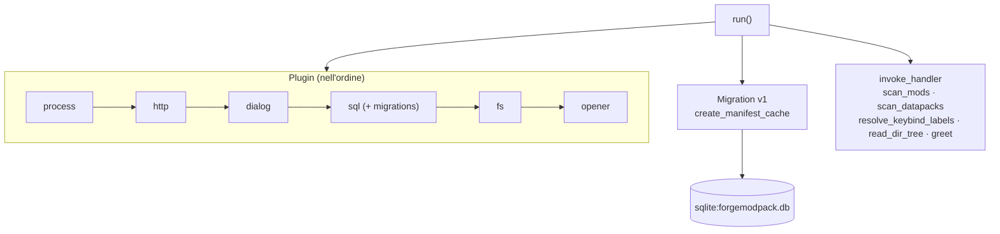
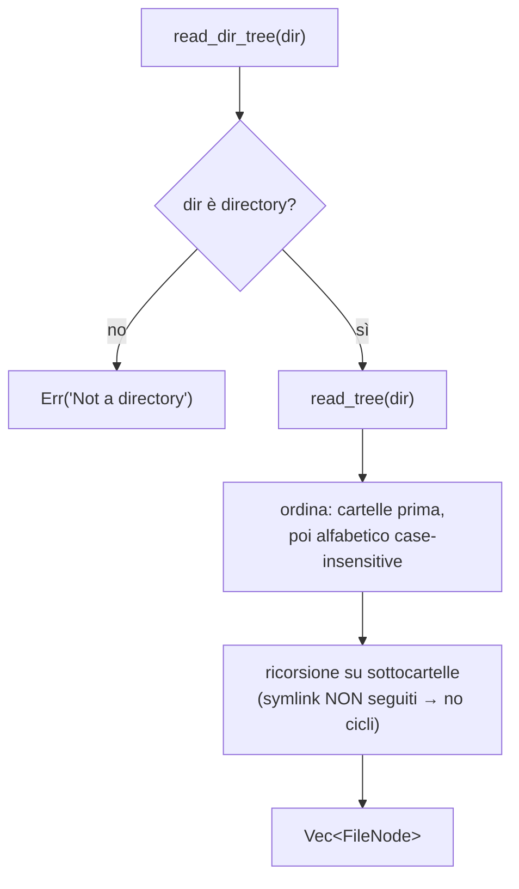

# 05 — Backend Rust

Il backend Tauri vive in [`src-tauri/src/`](../../../src-tauri/src) e ha una responsabilità precisa:
**leggere il disco in modo efficiente** (aprire jar/zip, scandire cartelle) e cachare i risultati.
Tutto ciò che riguarda rete, dialog e I/O testuale semplice passa invece dai **plugin Tauri**
usati direttamente dal frontend.

> I comandi applicativi (`#[tauri::command]` definiti qui) **non** richiedono permessi nelle
> capabilities, a differenza dei comandi dei plugin. La scansione usa `std::fs`, non `plugin-fs`.

## File

| File | Ruolo |
|------|-------|
| [`main.rs`](../../../src-tauri/src/main.rs) | Entry point: delega a `forgemodpack_lib::run()`; nasconde la console su Windows release |
| [`lib.rs`](../../../src-tauri/src/lib.rs) | Setup app, registrazione plugin, migration SQLite, `invoke_handler` |
| [`mods.rs`](../../../src-tauri/src/mods.rs) | Scansione mod, datapack, keybind (apertura jar/zip) |
| [`forge_spec.rs`](../../../src-tauri/src/forge_spec.rs) | Profili di formato dei mod Forge per versione MC (vedi [06](./06-scansione.md)) |
| [`files.rs`](../../../src-tauri/src/files.rs) | Albero file ricorsivo per la sezione Documents |

## Comandi Tauri esposti

| Comando | File | Firma | Ritorno |
|---------|------|-------|---------|
| `scan_mods` | mods.rs | `(dir: String, mc: Option<String>, forge: Option<String>)` | `Result<Vec<ScannedMod>, String>` |
| `scan_datapacks` | mods.rs | `(dir: String)` | `Result<Vec<ScannedDatapack>, String>` |
| `resolve_keybind_labels` | mods.rs | `(dir: String, keys: Vec<String>, mc: Option<String>, forge: Option<String>)` | `Result<Vec<ResolvedKeybind>, String>` |
| `read_dir_tree` | files.rs | `(dir: String)` | `Result<Vec<FileNode>, String>` |
| `greet` | lib.rs | `(name: &str)` | `String` (comando di esempio, non usato) |

## `lib.rs` — setup



**Migration SQLite** (versione 1, `create_manifest_cache`):

```sql
CREATE TABLE IF NOT EXISTS manifest_cache (
  key        TEXT PRIMARY KEY NOT NULL,
  data       TEXT NOT NULL,          -- JSON serializzato
  updated_at INTEGER NOT NULL        -- epoch ms
);
```

Il DB `sqlite:forgemodpack.db` viene registrato con `.add_migrations(...)`. È usato come cache
key-value generica (vedi [07 — Cache](./07-cache-manifest.md)).

## `files.rs` — albero file



**`FileNode`** (`#[serde(rename_all = "camelCase")]`): `name`, `path` (assoluto), `isDir`,
`children` (`None` per i file). Il **contenuto** dei file è letto/scritto lato frontend con
`@tauri-apps/plugin-fs`, non da qui. Se `dir` non esiste il comando ritorna `Err` e il frontend
lo usa per saltare le cartelle assenti.

## `mods.rs` — struct esposte

Tutte con `#[derive(Serialize)]`; quelle marcate camelCase rinominano `mod_id`→`modId`, ecc.

| Struct | Campi (serializzati) |
|--------|----------------------|
| `ScannedMod` | `filename`, `modId`, `name`, `modloader`, `version`, `description?`, `authors[]`, `dependencies[]`, `provides[]`, `keybinds[]` |
| `ModDependency` | `name`, `version`, `mandatory` |
| `KeybindAction` | `key` (translation key), `label` |
| `ScannedDatapack` | `filename`, `name`, `description?`, `packFormat?` |
| `ResolvedKeybind` | `key`, `label`, `modId` |

Il dettaglio di parsing, JarJar e riconoscimento keybind è in
[06 — Scansione mod, datapack e keybind](./06-scansione.md).
