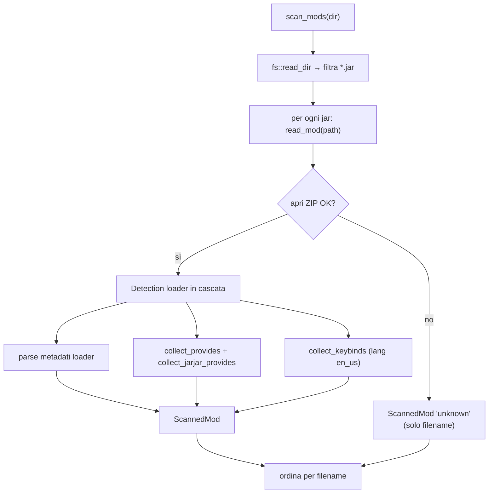
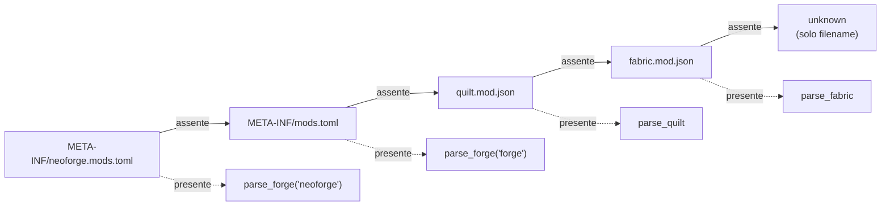
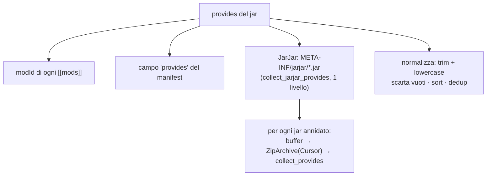
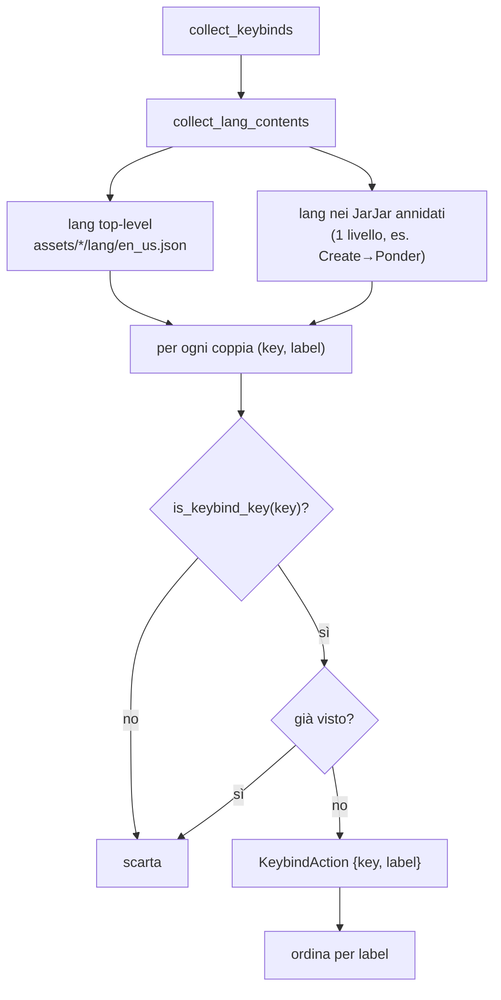

# 06 — Scansione mod, datapack e keybind

Il cuore "letto dal disco" dell'app. Il comando Rust [`scan_mods`](../../../src-tauri/src/mods.rs) apre
ogni `.jar` una sola volta come archivio ZIP ed estrae **in un unico passaggio**: metadati,
elenco `provides` e keybind. È la fonte dati per List Mods e per Keybinds/Import.

## Scansione unificata di un jar

### Detection del loader (cascata)

L'ordine è sempre lo stesso, sia per i metadati sia per i `provides`:

| Formato | File | Parser | Note |
|---------|------|--------|------|
| NeoForge | `META-INF/neoforge.mods.toml` | `parse_forge(..., "neoforge")` | stesso schema TOML di Forge |
| Forge | `META-INF/mods.toml` | `parse_forge(..., "forge")` | legge anche `MANIFEST.MF` |
| Quilt | `quilt.mod.json` | `parse_quilt` | dati sotto `quilt_loader` |
| Fabric | `fabric.mod.json` | `parse_fabric` | |

### Parsing dei metadati — dettagli per loader

**Forge/NeoForge** (`parse_forge`):
- Legge il primo `[[mods]]`: `modId`, `displayName` (fallback `modId`), `version`, `description`.
- Se `version` è vuota o contiene `${file.jarVersion}`, la sostituisce con
  `Implementation-Version` letta dal `MANIFEST.MF` (`manifest_version`).
- `authors`: da stringa `"a, b"` o array (`authors_from_toml`).
- `dependencies`: da `dependencies.<mod_id>`; obbligatoria se `type == "required"` (nuovo) o
  `mandatory` (classico, default `true`) — `forge_dep_mandatory`.

**Fabric** (`parse_fabric`): `id`, `name`, `version`, `description`; `authors` da array di stringhe
o `{name}`; `dependencies` da `depends` (tutte `mandatory: true`).

**Quilt** (`parse_quilt`): tutto sotto `quilt_loader` (`id`, `version`, `metadata.name/description`,
`contributors`); `depends` come stringhe (`version:"*"`, mandatory) o oggetti `{id, versions, optional}`
(`mandatory = !optional`).

## `provides` e JarJar

`provides` = **tutti** i modId che un jar mette a disposizione. Serve a evitare falsi
"dipendenza mancante": su Forge molte dipendenze sono bundlate dentro il jar.

`collect_provides` applica la stessa cascata di detection e raccoglie i modId. `collect_jarjar_provides`
apre ogni jar dentro `META-INF/jarjar/` (leggendolo in un buffer e ri-aprendolo con `Cursor`) e
richiama `collect_provides` — **un solo livello** di profondità.

> ⚠️ I progetti salvati **prima** dell'introduzione di `provides` vanno ri-scansionati (refresh)
> per beneficiare di JarJar; il fallback della verifica usa il solo `modId`.

## Riconoscimento keybind

Nella stessa apertura del jar, `collect_keybinds` legge le chiavi keybind dai file
`assets/*/lang/en_us.json`.

### `is_keybind_key` — euristica

Una chiave è considerata keybind se:
1. **non** contiene `.categories.` né inizia con `key.categories.` (esclude i titoli di categoria);
2. **e** ha almeno un segmento marcatore tra: `key`, `keys`, `keybind`, `keybinds`, `keyinfo`,
   `keymapping`.

Questo copre i prefissi eterogenei dei mod: `key.jei.x`, `cos.key.x`, `create.keyinfo.x`,
`iris.keybind.x`, `keybind.simplyjetpacks.x`, `mod.chiselsandbits.keys.x`.

> **Limite noto**: i mod che nominano le KeyMapping **senza** alcun marcatore (es. `config.jsg.*`,
> `placebo.toggleTrails`) non sono distinguibili dalle altre traduzioni → non coperti dallo scan
> generico. Per quelli si usa la risoluzione mirata (sotto).

## Risoluzione mirata delle keybind

`resolve_keybind_labels(dir, keys)` riceve le chiavi di traduzione **esatte** (es. gli `actionKey`
di un `keybindprofiles.json` importato) e cerca per **match esatto** nei lang di ogni jar la `label`
e il `modId` proprietario. Nessuna euristica → risolve anche le keybind con nomi non standard senza
falsi positivi. Il primo jar che definisce una chiave vince; le chiavi non trovate sono omesse.

È usato dall'import ([09 — Keybind I/O](./09-keybind-io.md)) come primo passo, più affidabile dello
scan generico.

## Datapack

`scan_datapacks(dir)` legge una cartella e, per ogni `.zip` o cartella con `pack.mcmeta`, estrae un
`ScannedDatapack`:

- `read_datapack`: se directory legge `pack.mcmeta` dal disco; se `.zip` lo legge dall'archivio;
  scarta gli elementi senza `pack.mcmeta`.
- `parse_pack_mcmeta`: estrae `pack_format` e `description` **appiattita** dal text component di
  Minecraft (`text_component_to_string` gestisce string/array/oggetti con `text`+`extra`).

## Lato frontend — cache delle scansioni

Le scansioni sono cachate in SQLite (nessun TTL, invalidate solo dal refresh manuale):

| Helper | File | Chiave cache | Comando |
|--------|------|--------------|---------|
| `getModsScanCached` / `peekModsScanCache` | [`mods-scan.ts`](../../../src/lib/mods-scan.ts) | `mods:v2:<workpath>` | `scan_mods` |
| `getKeybindActionsCached` / `peekKeybindActionsCache` | [`keybind-cache.ts`](../../../src/lib/keybind-cache.ts) | (deriva da `mods:v2`) | — |
| `resolveKeybindLabels` | [`keybind-cache.ts`](../../../src/lib/keybind-cache.ts) | (nessuna) | `resolve_keybind_labels` |
| `getDatapacksScanCached` / `peekDatapacksScanCache` | [`datapacks-scan.ts`](../../../src/lib/datapacks-scan.ts) | `datapacks:v1:<dir>` | `scan_datapacks` |

`getModsScanCached` è l'**unica** fonte dati: List Mods ne deriva i metadati (senza copiare i
`keybinds` in `project.json`), Keybinds/Import ne derivano le azioni per mod (`toModKeybinds` filtra
le mod con almeno una keybind). Il prefisso `v2` nella chiave invalida le cache scritte prima
dell'inclusione di keybind + JarJar annidati.
