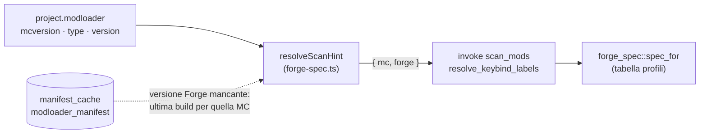
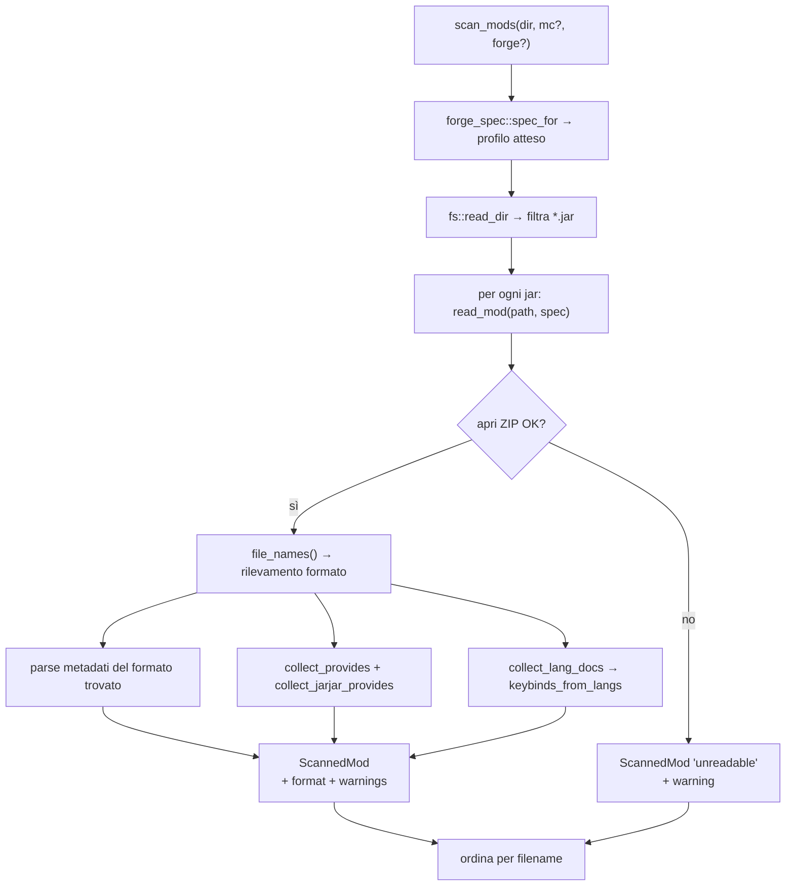
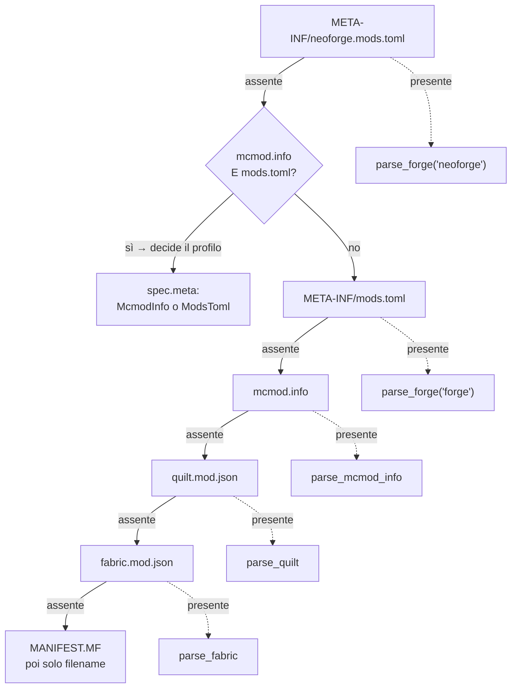
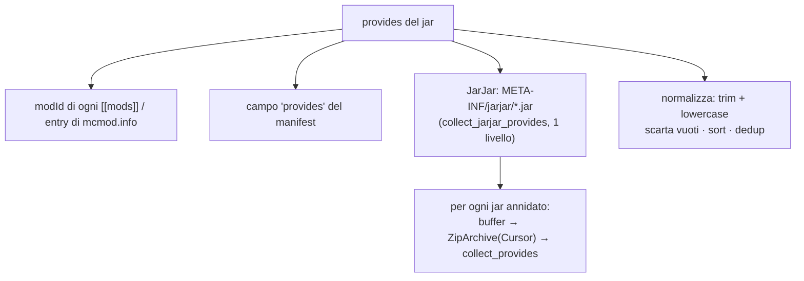
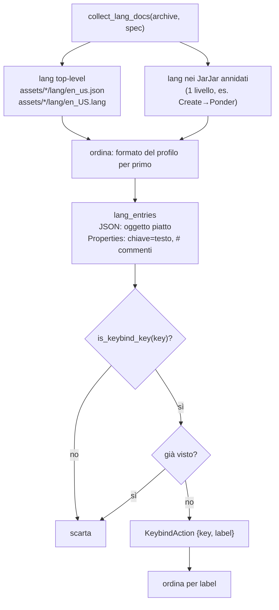

# 06 — Scansione mod, datapack e keybind

Il cuore "letto dal disco" dell'app. Il comando Rust [`scan_mods`](../../../src-tauri/src/mods.rs) apre
ogni `.jar` una sola volta come archivio ZIP ed estrae **in un unico passaggio**: metadati,
elenco `provides`, keybind e diagnostica (`format` + `warnings`). È la fonte dati per List Mods e
per Keybinds/Import.

## Profili di formato per versione di Minecraft

I mod Forge hanno cambiato formato nel tempo, sia per i metadati sia per i file di lingua. La
tabella dei profili vive in [`forge_spec.rs`](../../../src-tauri/src/forge_spec.rs):

| Profilo | Versioni MC | Metadati | Dipendenze | Lang |
|---------|-------------|----------|------------|------|
| `forge-legacy` | ≤ 1.12.2 | `mcmod.info` (JSON) | `requiredMods` / `dependencies` (stringhe) | `assets/<modid>/lang/en_US.lang` (properties) |
| `forge-fml` | 1.13 – 1.20.4 | `META-INF/mods.toml` | `mandatory = true` / `false` | `assets/<modid>/lang/en_us.json` |
| `forge-fml-modern` | ≥ 1.20.5 | `META-INF/mods.toml` (NeoForge: `neoforge.mods.toml`) | `type = "required"…` + `provides` | `en_us.json` |
| `detect-only` | — (nessun hint) | preferisce `mods.toml` | — | preferisce JSON |

> Il **rilevamento primario resta il contenuto del jar**: la cartella `mods` può contenere jar
> compilati per versioni diverse da quella del progetto. Il profilo serve a (1) fare da tie-break sui
> jar che contengono *entrambi* i formati di metadati, (2) ordinare la lettura dei lang, (3) produrre
> i `warnings` quando il formato trovato non corrisponde alla versione dichiarata nel progetto.

### Da dove arriva l'hint di versione

[`forge-spec.ts`](../../../src/lib/forge-spec.ts) costruisce l'hint `{ mc, forge }`:

- `mc` = `project.modloader.mcversion` (di norma basta questa per scegliere il profilo);
- `forge` = versione del loader **Forge**, usata dal backend solo se `mc` non è interpretabile
  (es. snapshot `24w14a`). Per NeoForge **non** viene passata: usa una numerazione diversa
  (20.4, 21.1…) che falserebbe il confronto con la numerazione Forge (14 / 47 / 50+).
- Se il progetto è su Forge senza versione di loader scelta, la si deduce dall'**ultima build** per
  quella versione MC leggendo il manifest già cachato in SQLite (host già in whitelist, TTL 24h,
  fallback offline: se non c'è rete si procede col solo `mc`).

`spec_for(mc, forge)` è una funzione pura, coperta da unit test.

## Scansione unificata di un jar

### Rilevamento del formato (cascata)

| Formato (`ScannedMod.format`) | File | Parser | Note |
|---|---|---|---|
| `neoforge:mods.toml` | `META-INF/neoforge.mods.toml` | `parse_forge(…, "neoforge")` | stesso schema TOML di Forge |
| `forge:mods.toml` | `META-INF/mods.toml` | `parse_forge(…, "forge")` | legge anche `MANIFEST.MF` |
| `forge:mcmod.info` | `mcmod.info` | `parse_mcmod_info` | Forge ≤ 1.12.2 |
| `quilt:quilt.mod.json` | `quilt.mod.json` | `parse_quilt` | dati sotto `quilt_loader` |
| `fabric:fabric.mod.json` | `fabric.mod.json` | `parse_fabric` | |
| `unknown:manifest` | `META-INF/MANIFEST.MF` | `unknown_mod` | nome/versione da `Implementation-*` |
| `unknown` / `unreadable` | — | `unknown_mod` / `read_mod` | solo filename / jar non apribile |

### Parsing dei metadati — dettagli per formato

**Forge/NeoForge ≥ 1.13** (`parse_forge`):
- legge il primo `[[mods]]` (`modId`, `displayName` → fallback `modId` → fallback filename,
  `version`, `description`); se il jar dichiara più mod lo segnala nei `warnings`;
- `version` vuota o con placeholder (`${file.jarVersion}`) → `Implementation-Version` dal
  `MANIFEST.MF`; se resta irrisolta, warning;
- `authors`: da stringa `"a, b"` o array (`authors_from_toml`);
- **dipendenze** (`forge_dependencies`): da `[[dependencies.<modId>]]` con lookup
  **case-insensitive** su **tutti** i modId dichiarati nel jar; accetta sia `[[dependencies.x]]`
  (array) sia `[dependencies.x]` (tabella singola); se nessuna chiave combacia ma la tabella non è
  vuota le entry vengono usate comunque, con warning. Obbligatoria se `type == "required"` o
  `mandatory` (default `true`); `optional`/`incompatible`/`discouraged` non lo sono;
- se il TOML **non è parsabile**, invece di perdere tutto si passa a una lettura permissiva riga per
  riga (`lenient_toml_value` su `modId`/`displayName`/`version`) + warning.

**Forge ≤ 1.12.2** (`parse_mcmod_info`): `mcmod.info` è un array in radice oppure
`{ modListVersion, modList: [...] }`. Campi: `modid`, `name`, `version` (placeholder `${version}` →
`MANIFEST.MF`), `description`, `authorList` (o `authors`). Dipendenze:

| Campo | Obbligatorietà di default | Formato voce |
|---|---|---|
| `requiredMods` | sì | `jei`, `jei@[4.15,)` |
| `dependencies` | no (solo ordine di caricamento) | `after:jei`, `required-after:jei@[4.15,)` |

`parse_legacy_dep` riconosce i prefissi di ordinamento FML (`required-after:`, `after:`, `before:`):
il prefisso con `required` rende la dipendenza obbligatoria; il resto viene diviso su `@` in nome +
`versionRange`.

**Fabric** (`parse_fabric`): `id`, `name`, `version`, `description`; `authors` da array di stringhe
o `{name}`; `dependencies` da `depends` (tutte `mandatory: true`).

**Quilt** (`parse_quilt`): tutto sotto `quilt_loader` (`id`, `version`, `metadata.name/description`,
`contributors`); `depends` come stringhe (`version:"*"`, mandatory) o oggetti `{id, versions, optional}`
(`mandatory = !optional`).

## `provides` e JarJar

`provides` = **tutti** i modId che un jar mette a disposizione. Serve a evitare falsi
"dipendenza mancante": su Forge molte dipendenze sono bundlate dentro il jar.

`collect_provides` applica la stessa cascata di rilevamento (incluso `mcmod.info`) e raccoglie i
modId; sui TOML rotti recupera almeno il `modId` in modo permissivo. `collect_jarjar_provides` apre
ogni jar dentro `META-INF/jarjar/` (leggendolo in un buffer e ri-aprendolo con `Cursor`) e richiama
`collect_provides` — **un solo livello** di profondità.

> ⚠️ I progetti salvati **prima** dell'introduzione di `provides` vanno ri-scansionati (refresh)
> per beneficiare di JarJar; il fallback della verifica usa il solo `modId`.

## Riconoscimento keybind

Nella stessa apertura del jar, `collect_lang_docs` raccoglie i file di lingua inglese in **entrambi
i formati** e `keybinds_from_langs` ne estrae le keybind.

Il riconoscimento del path è **case-insensitive** (`en_US.lang` legacy vs `en_us.json`); l'ordine
mette per primo il formato atteso dal profilo, così sui jar con entrambi vince quello coerente con
la versione MC. Se il jar non ha **nessun** file di lingua inglese, la scansione lo segnala nei
`warnings` (è il caso in cui le keybind non sono rilevabili).

### `is_keybind_key` — euristica

Una chiave è considerata keybind se:
1. **non** contiene `.categories.` né inizia con `key.categories.` (esclude i titoli di categoria);
2. **e** ha almeno un segmento marcatore tra: `key`, `keys`, `keybind`, `keybinds`, `keyinfo`,
   `keymapping`.

Questo copre i prefissi eterogenei dei mod: `key.jei.x`, `cos.key.x`, `create.keyinfo.x`,
`iris.keybind.x`, `keybind.simplyjetpacks.x`, `mod.chiselsandbits.keys.x`.

> **Limite noto**: i mod che nominano le KeyMapping **senza** alcun marcatore (es. `config.jsg.*`,
> `placebo.toggleTrails`) non sono distinguibili dalle altre traduzioni → non coperti dallo scan
> generico. Per quelli si usa la risoluzione mirata (sotto).

## Risoluzione mirata delle keybind

`resolve_keybind_labels(dir, keys, mc?, forge?)` riceve le chiavi di traduzione **esatte** (es. gli
`actionKey` di un `keybindprofiles.json` importato) e cerca per **match esatto** nei lang di ogni jar
la `label` e il `modId` proprietario — in entrambi i formati di lang, quindi funziona anche sui mod
legacy. Nessuna euristica → risolve anche le keybind con nomi non standard senza falsi positivi. Il
primo jar che definisce una chiave vince; le chiavi non trovate sono omesse.

È usato dall'import ([09 — Keybind I/O](./09-keybind-io.md)) come primo passo, più affidabile dello
scan generico.

## Diagnostica (`format` + `warnings`)

Ogni `ScannedMod` porta il formato rilevato e l'elenco dei problemi (in inglese, come i warning
degli exporter). List Mods li mostra nella colonna **Format**: badge col nome del file di metadati e,
se ci sono avvisi, un'icona con tooltip; una card di riepilogo conta le mod **con avvisi**. Casi
tipici:

| Warning | Significato |
|---|---|
| `Metadata format … expected …` | jar di una versione MC diversa da quella del progetto |
| `… is not valid TOML …` | `mods.toml` malformato: metadati letti in modo permissivo |
| `Dependencies are declared under a different mod id …` | chiave `[[dependencies.x]]` non allineata al `modId` |
| `Dependencies declared with … while … is expected` | stile `mandatory =` / `type =` non allineato alla versione MC |
| `No English language file … found` | keybind non rilevabili da questo jar |
| `Version placeholder could not be resolved` | `${…}` non risolvibile senza `Implementation-Version` |
| `No known mod metadata … was found` | nessun formato riconosciuto (dati dal MANIFEST o solo filename) |

I campi **non** finiscono in `project.json`: List Mods li legge dalla cache di scansione (peek al
mount), così il file di progetto resta leggero.

## Datapack

`scan_datapacks(dir)` legge una cartella e, per ogni `.zip` o cartella con `pack.mcmeta`, estrae un
`ScannedDatapack`:

- `read_datapack`: se directory legge `pack.mcmeta` dal disco; se `.zip` lo legge dall'archivio;
  scarta gli elementi senza `pack.mcmeta`.
- `parse_pack_mcmeta`: estrae `pack_format` e `description` **appiattita** dal text component di
  Minecraft (`text_component_to_string` gestisce string/array/oggetti con `text`+`extra`).

## Lato frontend — cache delle scansioni

Le scansioni sono cachate in SQLite (nessun TTL, invalidate solo dal refresh manuale):

| Helper | File | Chiave cache | Comando |
|--------|------|--------------|---------|
| `getModsScanCached` / `peekModsScanCache` | [`mods-scan.ts`](../../../src/lib/mods-scan.ts) | `mods:v3:<mc>:<forge>:<workpath>` | `scan_mods` |
| `getKeybindActionsCached` / `peekKeybindActionsCache` | [`keybind-cache.ts`](../../../src/lib/keybind-cache.ts) | (deriva da `mods:v3`) | — |
| `resolveKeybindLabels` | [`keybind-cache.ts`](../../../src/lib/keybind-cache.ts) | (nessuna) | `resolve_keybind_labels` |
| `getDatapacksScanCached` / `peekDatapacksScanCache` | [`datapacks-scan.ts`](../../../src/lib/datapacks-scan.ts) | `datapacks:v1:<dir>` | `scan_datapacks` |

`getModsScanCached` è l'**unica** fonte dati: List Mods ne deriva i metadati (senza copiare i
`keybinds` in `project.json`), Keybinds/Import ne derivano le azioni per mod (`toModKeybinds` filtra
le mod con almeno una keybind). L'**hint di versione fa parte della chiave**: cambiare versione di
Minecraft cambia il formato atteso, quindi la scansione viene rifatta. Il prefisso `v3` invalida le
cache scritte prima del supporto ai formati legacy e ai campi `format`/`warnings`.

## Test

`cargo test --lib` copre la parte pura e anche un caso end-to-end: il test
`scansione_end_to_end_legacy_e_moderno` costruisce due `.jar` reali (uno con `mcmod.info` +
`en_US.lang`, uno con `mods.toml` + `en_us.json`) in una cartella temporanea e verifica metadati,
dipendenze, keybind, `format`, `warnings` e `resolve_keybind_labels`.
