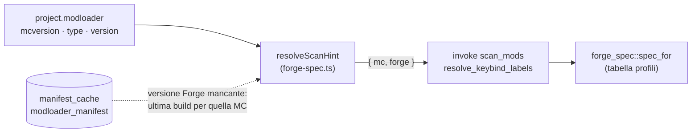
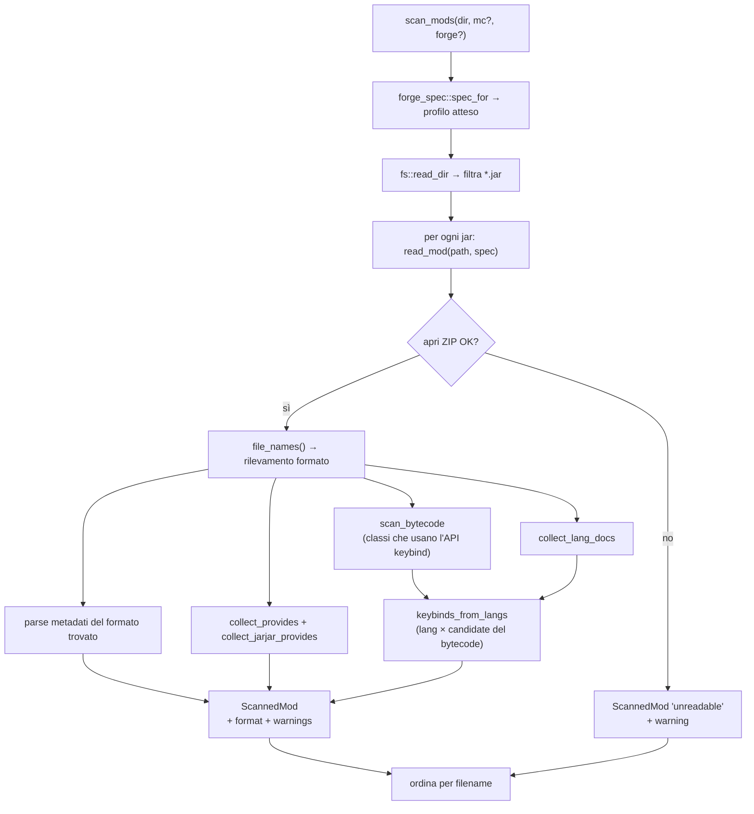
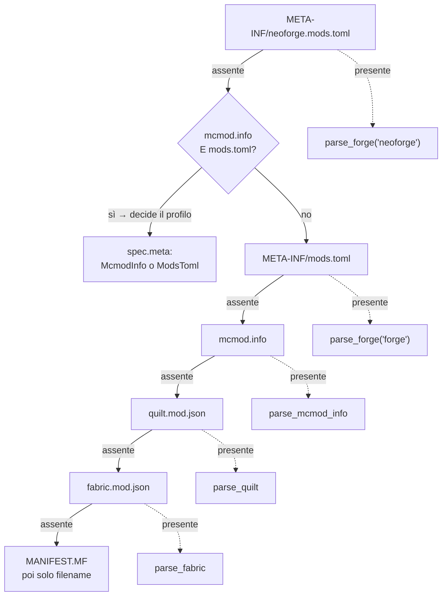
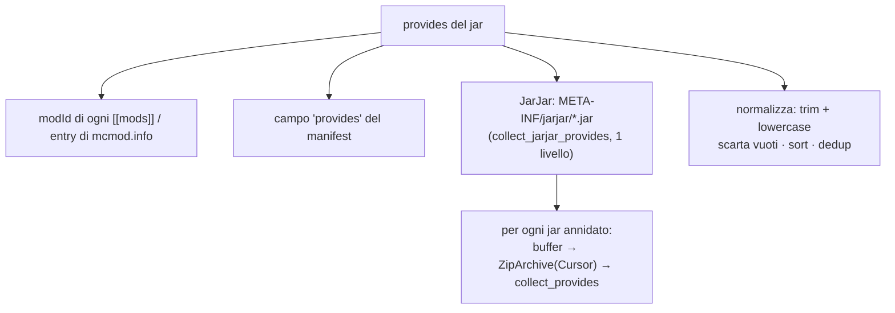
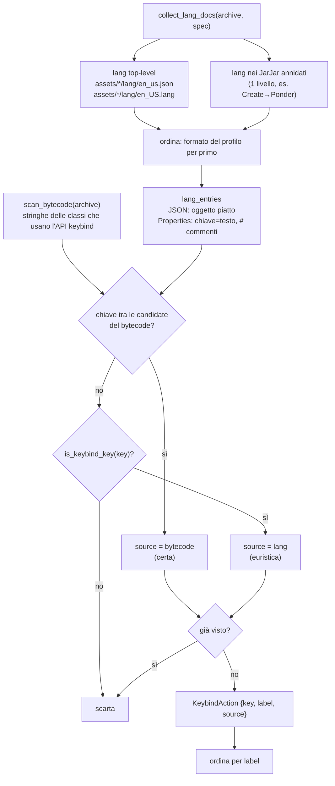
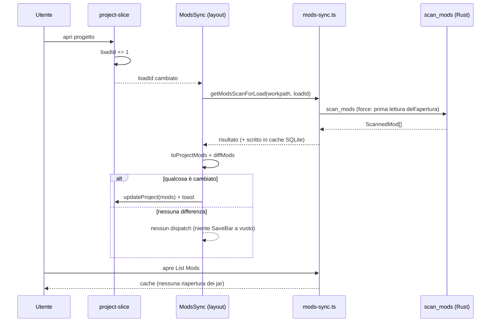

# 06 — Scansione mod, datapack e keybind

Il cuore "letto dal disco" dell'app. Il comando Rust [`scan_mods`](../../../src-tauri/src/mods.rs) apre
ogni `.jar` una sola volta come archivio ZIP ed estrae **in un unico passaggio**: metadati,
elenco `provides`, keybind e diagnostica (`format` + `warnings`). È la fonte dati per List Mods e
per Keybinds/Import.

## Profili di formato per versione di Minecraft

I mod Forge hanno cambiato formato nel tempo, sia per i metadati sia per i file di lingua. La
tabella dei profili vive in [`forge_spec.rs`](../../../src-tauri/src/forge_spec.rs):

| Profilo | Versioni MC | Metadati | Dipendenze | Lang |
|---------|-------------|----------|------------|------|
| `forge-legacy` | ≤ 1.12.2 | `mcmod.info` (JSON) | `requiredMods` / `dependencies` (stringhe) | `assets/<modid>/lang/en_US.lang` (properties) |
| `forge-fml` | 1.13 – 1.20.4 | `META-INF/mods.toml` | `mandatory = true` / `false` | `assets/<modid>/lang/en_us.json` |
| `forge-fml-modern` | ≥ 1.20.5 | `META-INF/mods.toml` (NeoForge: `neoforge.mods.toml`) | `type = "required"…` + `provides` | `en_us.json` |
| `detect-only` | — (nessun hint) | preferisce `mods.toml` | — | preferisce JSON |

> Il **rilevamento primario resta il contenuto del jar**: la cartella `mods` può contenere jar
> compilati per versioni diverse da quella del progetto. Il profilo serve a (1) fare da tie-break sui
> jar che contengono *entrambi* i formati di metadati, (2) ordinare la lettura dei lang, (3) produrre
> i `warnings` quando il formato trovato non corrisponde alla versione dichiarata nel progetto.

### Da dove arriva l'hint di versione

[`forge-spec.ts`](../../../src/lib/forge-spec.ts) costruisce l'hint `{ mc, forge }`:

- `mc` = `project.modloader.mcversion` (di norma basta questa per scegliere il profilo);
- `forge` = versione del loader **Forge**, usata dal backend solo se `mc` non è interpretabile
  (es. snapshot `24w14a`). Per NeoForge **non** viene passata: usa una numerazione diversa
  (20.4, 21.1…) che falserebbe il confronto con la numerazione Forge (14 / 47 / 50+).
- Se il progetto è su Forge senza versione di loader scelta, la si deduce dall'**ultima build** per
  quella versione MC leggendo il manifest già cachato in SQLite (host già in whitelist, TTL 24h,
  fallback offline: se non c'è rete si procede col solo `mc`).

`spec_for(mc, forge)` è una funzione pura, coperta da unit test.

## Scansione unificata di un jar

### Rilevamento del formato (cascata)

| Formato (`ScannedMod.format`) | File | Parser | Note |
|---|---|---|---|
| `neoforge:mods.toml` | `META-INF/neoforge.mods.toml` | `parse_forge(…, "neoforge")` | stesso schema TOML di Forge |
| `forge:mods.toml` | `META-INF/mods.toml` | `parse_forge(…, "forge")` | legge anche `MANIFEST.MF` |
| `forge:mcmod.info` | `mcmod.info` | `parse_mcmod_info` | Forge ≤ 1.12.2 |
| `quilt:quilt.mod.json` | `quilt.mod.json` | `parse_quilt` | dati sotto `quilt_loader` |
| `fabric:fabric.mod.json` | `fabric.mod.json` | `parse_fabric` | |
| `unknown:manifest` | `META-INF/MANIFEST.MF` | `unknown_mod` | nome/versione da `Implementation-*` |
| `unknown` / `unreadable` | — | `unknown_mod` / `read_mod` | solo filename / jar non apribile |

### Parsing dei metadati — dettagli per formato

**Forge/NeoForge ≥ 1.13** (`parse_forge`):
- legge il primo `[[mods]]` (`modId`, `displayName` → fallback `modId` → fallback filename,
  `version`, `description`); se il jar dichiara più mod lo segnala nei `warnings`;
- `version` vuota o con placeholder (`${file.jarVersion}`) → `Implementation-Version` dal
  `MANIFEST.MF`; se resta irrisolta, warning;
- `authors`: da stringa `"a, b"` o array (`authors_from_toml`);
- **dipendenze** (`forge_dependencies`): da `[[dependencies.<modId>]]` con lookup
  **case-insensitive** su **tutti** i modId dichiarati nel jar; accetta sia `[[dependencies.x]]`
  (array) sia `[dependencies.x]` (tabella singola); se nessuna chiave combacia ma la tabella non è
  vuota le entry vengono usate comunque, con warning. Obbligatoria se `type == "required"` o
  `mandatory` (default `true`); `optional`/`incompatible`/`discouraged` non lo sono;
- se il TOML **non è parsabile**, invece di perdere tutto si passa a una lettura permissiva riga per
  riga (`lenient_toml_value` su `modId`/`displayName`/`version`) + warning.

**Forge ≤ 1.12.2** (`parse_mcmod_info`): `mcmod.info` è un array in radice oppure
`{ modListVersion, modList: [...] }`. Campi: `modid`, `name`, `version` (placeholder `${version}` →
`MANIFEST.MF`), `description`, `authorList` (o `authors`). Dipendenze:

| Campo | Obbligatorietà di default | Formato voce |
|---|---|---|
| `requiredMods` | sì | `jei`, `jei@[4.15,)` |
| `dependencies` | no (solo ordine di caricamento) | `after:jei`, `required-after:jei@[4.15,)` |

`parse_legacy_dep` riconosce i prefissi di ordinamento FML (`required-after:`, `after:`, `before:`):
il prefisso con `required` rende la dipendenza obbligatoria; il resto viene diviso su `@` in nome +
`versionRange`.

**Fabric** (`parse_fabric`): `id`, `name`, `version`, `description`; `authors` da array di stringhe
o `{name}`; `dependencies` da `depends` (tutte `mandatory: true`).

**Quilt** (`parse_quilt`): tutto sotto `quilt_loader` (`id`, `version`, `metadata.name/description`,
`contributors`); `depends` come stringhe (`version:"*"`, mandatory) o oggetti `{id, versions, optional}`
(`mandatory = !optional`).

## `provides` e JarJar

`provides` = **tutti** i modId che un jar mette a disposizione. Serve a evitare falsi
"dipendenza mancante": su Forge molte dipendenze sono bundlate dentro il jar.

`collect_provides` applica la stessa cascata di rilevamento (incluso `mcmod.info`) e raccoglie i
modId; sui TOML rotti recupera almeno il `modId` in modo permissivo. `collect_jarjar_provides` apre
ogni jar dentro `META-INF/jarjar/` (leggendolo in un buffer e ri-aprendolo con `Cursor`) e richiama
`collect_provides` — **un solo livello** di profondità.

> ⚠️ I progetti salvati **prima** dell'introduzione di `provides` vanno ri-scansionati (refresh)
> per beneficiare di JarJar; il fallback della verifica usa il solo `modId`.

## Riconoscimento keybind

Due fonti, incrociate nella stessa apertura del jar:

1. **il bytecode** ([`keybind_scan.rs`](../../../src-tauri/src/keybind_scan.rs)) — come Forge dichiara
   *davvero* una keybind: keybind CERTE;
2. **i file di lingua** (`collect_lang_docs` + `is_keybind_key`) — euristica sul nome della chiave:
   keybind PROBABILI.

Ogni `KeybindAction` porta quindi un campo `source` (`"bytecode"` | `"lang"`).

Il riconoscimento del path dei lang è **case-insensitive** (`en_US.lang` legacy vs `en_us.json`);
l'ordine mette per primo il formato atteso dal profilo, così sui jar con entrambi vince quello
coerente con la versione MC. I contenuti sono decodificati come UTF-8 e, se i byte non sono validi,
come **ISO-8859-1** (comune nei `.lang`/`mcmod.info` legacy): altrimenti un solo byte fuori posto
farebbe scartare l'intero file e perdere tutte le keybind di quel mod. Il BOM UTF-8 viene rimosso
(faceva fallire il parse JSON).

### Dal bytecode: `scan_bytecode`

Su Forge/NeoForge una keybind è un oggetto `KeyBinding`/`KeyMapping` costruito nel codice, e la sua
chiave di traduzione è una **stringa costante** nel class file. Quindi:

1. per ogni `.class` del jar (e dei JarJar annidati) si legge **solo header + constant pool**
   ([`class_scan.rs`](../../../src-tauri/src/class_scan.rs)): la decompressione si ferma lì;
2. se la classe referenzia una delle classi SDK (`forge_spec::KEYBIND_MARKERS`), le sue stringhe
   costanti diventano **candidate**;
3. una candidata che è anche una chiave dei lang è una keybind certa — anche se il nome non ha
   nessun marcatore.

Funziona perché la reobfuscation SRG dei mod Forge rinomina **solo metodi e campi**: i nomi delle
classi Minecraft restano leggibili nei jar pubblicati. Su **Fabric/Quilt** le classi MC sono in
*intermediary* (`class_304`), quindi lo scan del bytecode non si applica e resta la sola euristica.

### API keybind per versione (tabella SDK)

In [`forge_spec.rs`](../../../src-tauri/src/forge_spec.rs), accanto ai profili di formato:

| Versioni MC | Classe keybind | Registrazione |
|---|---|---|
| ≤ 1.7.10 | `net.minecraft.client.settings.KeyBinding` | `cpw.mods.fml.client.registry.ClientRegistry` |
| 1.8 – 1.16.5 | `net.minecraft.client.settings.KeyBinding` | `net.minecraftforge.fml.client.registry.ClientRegistry` |
| 1.17 – 1.19.2 | `net.minecraft.client.KeyMapping` | `ClientRegistry` (in `FMLClientSetupEvent`) |
| ≥ 1.19.3 | `net.minecraft.client.KeyMapping` | `RegisterKeyMappingsEvent` (NeoForge: package `net.neoforged.neoforge.client.event`) |
| ≥ 1.21.9 / NeoForge 21.9 | `KeyMapping.Category` | `RegisterKeyMappingsEvent#registerCategory` |

Le classi vengono cercate **tutte**, non solo quelle del profilo: la cartella `mods` può contenere
jar di altre versioni. L'API attesa (`keybind_api_for`) serve solo alla diagnostica: se l'era della
classe rilevata (`KeyBinding` ≤1.16 vs `KeyMapping` ≥1.17) non è quella della versione MC del
progetto, arriva un warning — segnale tipico di un jar per la versione sbagliata.

### `is_keybind_key` — euristica (fallback)

Una chiave è considerata keybind se:
1. **non** è il titolo di una categoria (`is_category_key`): segmento `categories`, oppure `category`
   preceduto da `key` — quest'ultimo copre il formato `key.category.<namespace>.<path>` introdotto
   con `KeyMapping.Category` in **1.21.9**;
2. **e** ha almeno un segmento marcatore tra: `key`, `keys`, `keybind`, `keybinds`, `keyinfo`,
   `keymapping`.

Questo copre i prefissi eterogenei dei mod: `key.jei.x`, `cos.key.x`, `create.keyinfo.x`,
`iris.keybind.x`, `keybind.simplyjetpacks.x`, `mod.chiselsandbits.keys.x`.

> **Limite residuo**: le keybind la cui chiave è **costruita a runtime** (concatenazione
> `"key." + MODID + ".x"`) o dichiarata in una classe che non referenzia l'SDK non compaiono tra le
> candidate del bytecode; se il nome non ha marcatori restano fuori dallo scan generico. Per quelle
> c'è la risoluzione mirata (sotto). Viceversa, una chiave con marcatore che **non** è una keybind
> (es. `gui.mod.press.key`) resta nell'elenco ma marcata `source = "lang"`: la pagina Keybinds mostra
> prima le certe.

> ⚠️ Costo: lo scan del bytecode aggiunge decompressione (≈17 ms per 1000 classi in release). Per
> questo `scan_mods` legge i jar su **più thread** (`std::thread::scope`, fino a 8) e l'esito resta
> cachato in SQLite senza TTL; l'ordine finale è sempre alfabetico, quindi non dipende dallo
> scheduling.

## Risoluzione mirata delle keybind

`resolve_keybind_labels(dir, keys, mc?, forge?)` riceve le chiavi di traduzione **esatte** (es. gli
`actionKey` di un `keybindprofiles.json` importato) e cerca per **match esatto** nei lang di ogni jar
la `label` e il `modId` proprietario — in entrambi i formati di lang, quindi funziona anche sui mod
legacy. Nessuna euristica → risolve anche le keybind con nomi non standard senza falsi positivi. Il
primo jar che definisce una chiave vince; le chiavi non trovate sono omesse.

È usato dall'import ([09 — Keybind I/O](./09-keybind-io.md)) come primo passo, più affidabile dello
scan generico.

## Diagnostica (`format` + `warnings`)

Ogni `ScannedMod` porta il formato rilevato e l'elenco dei problemi (in inglese, come i warning
degli exporter). List Mods li mostra nella colonna **Format**: badge col nome del file di metadati e,
se ci sono avvisi, un'icona con tooltip; una card di riepilogo conta le mod **con avvisi**. Casi
tipici:

| Warning | Significato |
|---|---|
| `Metadata format … expected …` | jar di una versione MC diversa da quella del progetto |
| `Declares Minecraft … but the project targets …` | il vincolo di versione della mod non copre la versione MC del progetto |
| `… is not valid TOML …` | `mods.toml` malformato: metadati letti in modo permissivo |
| `Dependencies are declared under a different mod id …` | chiave `[[dependencies.x]]` non allineata al `modId` |
| `Dependencies declared with … while … is expected` | stile `mandatory =` / `type =` non allineato alla versione MC |
| `No English language file … found` | il jar dichiara keybind ma non ha lang inglesi → non rilevabili (per le mod senza keybind non viene emesso) |
| `Keybinds use KeyBinding … expects KeyMapping …` | l'era della classe keybind nel bytecode non è quella della versione MC del progetto |
| `Bytecode scan stopped after … classes` | jar oltre il limite di classi ispezionate: qualche keybind può mancare |
| `Version placeholder could not be resolved` | `${…}` non risolvibile senza `Implementation-Version` |
| `No known mod metadata … was found` | nessun formato riconosciuto (dati dal MANIFEST o solo filename) |

I campi **non** finiscono in `project.json`: List Mods li legge dalla cache di scansione (peek al
mount), così il file di progetto resta leggero.

## Compatibilità con la versione di Minecraft

Nella stessa scansione si verifica se la mod dichiara di funzionare con la versione MC del progetto.
Il vincolo esiste in **tre dialetti**, secondo il loader, e la logica sta tutta in
[`mc_compat.rs`](../../../src-tauri/src/mc_compat.rs) (modulo **puro**, nessuna I/O):

| Loader | Dove | Sintassi | Esempi |
|---|---|---|---|
| Forge / NeoForge | dipendenza verso `minecraft` (`versionRange`) | range **Maven** | `[1.20.1,1.21)`, `[1.20,)`, `(,1.19]`, `[1.12.2]`, gruppi in OR `[1.16,1.17),[1.18,1.19)` |
| Fabric / Quilt | `depends.minecraft` / `depends[].versions` | espressione **semver-like** | `>=1.20.1 <1.21`, `~1.20.1`, `^1.20.1`, `1.20.x`, `*`, OR con `\|\|` |
| Forge legacy | campo `mcversion` di `mcmod.info` | versione secca (a volte range) | `1.12.2` |

`compare_versions` confronta per **componenti**: i numeri come numeri (`1.10 > 1.9`, che un confronto
alfabetico sbaglierebbe), i componenti mancanti valgono 0 (`1.20` == `1.20.0`) e una coda testuale
abbassa la versione (`1.20.1-pre1` < `1.20.1`). Una versione **secca copre la sua generazione**
(`1.20` dichiarato vale su `1.20.1`), ma non il contrario (`1.20.1` non vale su `1.20`).

`ScannedMod` espone due campi:

- **`mcVersion`** — il vincolo dichiarato, mostrato così com'è nella colonna **MC** di List Mods;
- **`mcCompatible: Option<bool>`** — l'esito. `Some(false)` aggiunge anche un warning
  (`Declares Minecraft … but the project targets …`).

> ⚠️ **`None` significa "non lo so", mai "incompatibile"**: vincolo assente, sintassi non riconosciuta
> o progetto senza versione MC danno `None` e nessun avviso. Un falso "mod incompatibile" farebbe
> cercare all'utente un problema che non esiste, quindi in caso di dubbio il modulo tace.

I due campi **non** finiscono in `project.json`: come `format`/`warnings` vivono nella cache di
scansione. La chiave di cache è passata a **`mods:v5:…`** perché le entry più vecchie non le hanno
(vedi "Lato frontend").

## Sincronizzazione con il disco

Le liste derivate dal disco (mod e datapack) **non devono restare congelate** a quando il progetto è
stato salvato: se una mod viene rimossa, aggiunta o aggiornata fuori dall'app, il project deve
adeguarsi. La regola:

- **a ogni apertura di progetto** (create/open → `loadId` incrementato nello slice project) la prima
  lettura rilegge i file dal disco, anche se `project.mods` è già popolato;
- **dentro la stessa apertura** le letture successive usano la cache SQLite, così navigare tra le
  pagine non riapre tutti i jar;
- il **refresh manuale** forza sempre la rilettura.

| Elemento | Ruolo |
|---|---|
| `loadId` ([project-slice.ts](../../../src/redux/project-slice.ts)) | Contatore delle aperture, non persistito: il segnale "rileggi dal disco" |
| `getModsScanForLoad` / `getDatapacksScanForLoad` ([mods-sync.ts](../../../src/lib/mods-sync.ts)) | Rilettura alla prima richiesta dell'apertura, poi cache; **dedup** delle richieste concorrenti (una sola scansione condivisa) |
| `refreshModsScan` / `refreshDatapacksScan` | Refresh manuale: forza sempre |
| `toProjectMods` / `toProjectDatapacks` | Scansione → liste del project, preservando `active` per `filename`; le voci non più presenti sul disco spariscono |
| `diffMods` / `diffDatapacks` | Conteggio aggiunte/rimozioni/aggiornamenti (`active` escluso: è dell'utente) |
| `<ModsSync />` ([mods-sync.tsx](../../../src/components/mods-sync.tsx)) | Headless nel layout: sincronizza a ogni apertura **qualunque pagina sia aperta**, aggiorna anche `keybindActions`, mostra il toast del diff |

> **`updateProject` solo se il diff non è vuoto**: aprire un progetto o una pagina non deve far
> comparire la SaveBar quando sul disco non è cambiato niente.

> ⚠️ **Gotcha React**: le guardie "già sincronizzato" vanno controllate **e impostate dopo l'`await`**.
> Messe prima, in dev (React StrictMode invoca gli effect due volte) la prima invocazione viene
> annullata e la seconda salta il lavoro: risultato, nessuna sincronizzazione.

## Datapack

`scan_datapacks(dir)` legge una cartella e, per ogni `.zip` o cartella con `pack.mcmeta`, estrae un
`ScannedDatapack`:

- `read_datapack`: se directory legge `pack.mcmeta` dal disco; se `.zip` lo legge dall'archivio;
  scarta gli elementi senza `pack.mcmeta`.
- `parse_pack_mcmeta`: estrae `pack_format` e `description` **appiattita** dal text component di
  Minecraft (`text_component_to_string` gestisce string/array/oggetti con `text`+`extra`).

## Lato frontend — cache delle scansioni

Le scansioni sono cachate in SQLite (nessun TTL, invalidate solo dal refresh manuale):

| Helper | File | Chiave cache | Comando |
|--------|------|--------------|---------|
| `getModsScanCached` / `peekModsScanCache` | [`mods-scan.ts`](../../../src/lib/mods-scan.ts) | `mods:v5:<mc>:<forge>:<workpath>` | `scan_mods` |
| `getKeybindActionsCached` / `peekKeybindActionsCache` | [`keybind-cache.ts`](../../../src/lib/keybind-cache.ts) | (deriva da `mods:v5`) | — |
| `resolveKeybindLabels` | [`keybind-cache.ts`](../../../src/lib/keybind-cache.ts) | (nessuna) | `resolve_keybind_labels` |
| `getDatapacksScanCached` / `peekDatapacksScanCache` | [`datapacks-scan.ts`](../../../src/lib/datapacks-scan.ts) | `datapacks:v1:<dir>` | `scan_datapacks` |

`getModsScanCached` è l'**unica** fonte dati: List Mods ne deriva i metadati (senza copiare i
`keybinds` in `project.json`), Keybinds/Import ne derivano le azioni per mod (`toModKeybinds` filtra
le mod con almeno una keybind). L'**hint di versione fa parte della chiave**: cambiare versione di
Minecraft cambia il formato atteso, quindi la scansione viene rifatta. Il prefisso `v3` invalida le
cache scritte prima del supporto ai formati legacy e ai campi `format`/`warnings`.

## Test

`cargo test --lib` copre la parte pura e anche un caso end-to-end: il test
`scansione_end_to_end_legacy_e_moderno` costruisce due `.jar` reali (uno con `mcmod.info` +
`en_US.lang`, uno con `mods.toml` + `en_us.json`) in una cartella temporanea e verifica metadati,
dipendenze, keybind, `format`, `warnings` e `resolve_keybind_labels`.

La compatibilità di versione ha i suoi test: `mc_compat::tests` copre i tre dialetti (range Maven,
espressioni Fabric, versioni secche), il confronto numerico (`1.10 > 1.9`), le pre-release e — caso
più importante — che una sintassi sconosciuta dia `None` e **non** `Some(false)`.
`verifica_compatibilita_versione_mc` fa lo stesso end-to-end su jar reali (Forge compatibile, Forge di
un'altra versione, Fabric, e un jar che non dichiara nulla).
