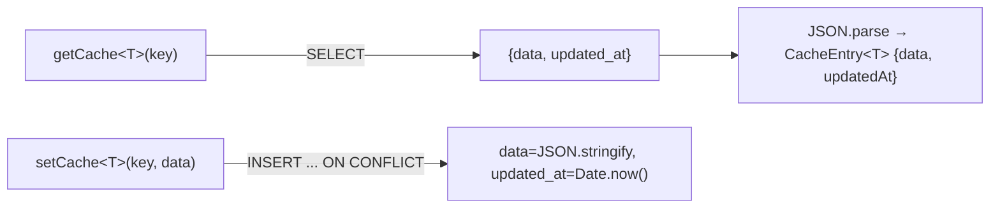
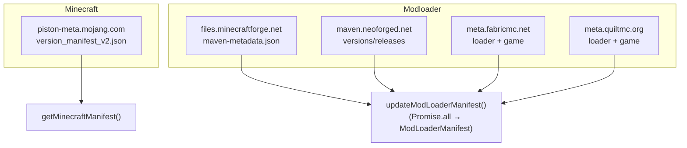
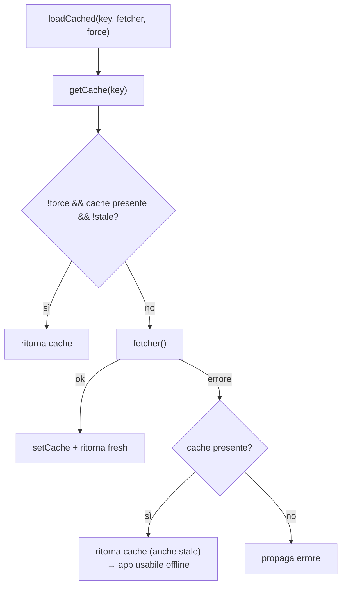
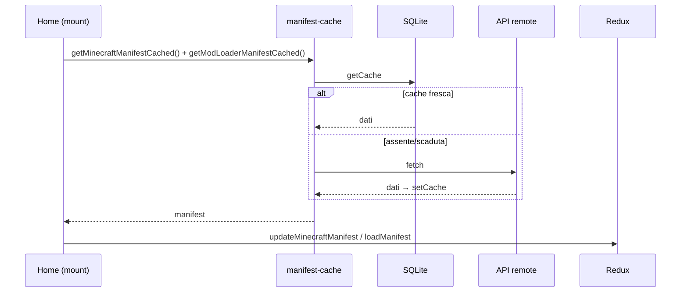

# 07 — Cache SQLite e manifest remoti

Per non interrogare le API a ogni avvio, l'app cacha i manifest (e le scansioni) in un DB SQLite
locale. La rete si usa **solo** per i metadati delle versioni: mai per scaricare mod.

## Cache key-value (SQLite)

[`cache-db.ts`](../../../src/lib/cache-db.ts) espone un accesso generico alla tabella `manifest_cache`
(schema in [05 — Backend Rust](./05-backend-rust.md)):

- Singleton della connessione (`Database.load("sqlite:forgemodpack.db")`) → le migration girano
  una sola volta.
- `getCache<T>(key)`: ritorna `{ data, updatedAt }` o `null`.
- `setCache<T>(key, data)`: upsert con timestamp corrente.

### Chiavi usate

| Chiave | Contenuto | TTL |
|--------|-----------|-----|
| `minecraft_manifest` | Manifest versioni MC | 24h |
| `modloader_manifest` | Manifest Forge/NeoForge/Fabric/Quilt | 24h |
| `mods:v3:<mc>:<forge>:<workpath>` | Scansione mod (metadati + keybind + diagnostica) | nessuno (refresh manuale) |
| `datapacks:v1:<dir>` | Scansione datapack | nessuno (refresh manuale) |

## Manifest remoti

[`get-manifest.ts`](../../../src/lib/get-manifest.ts) usa `@tauri-apps/plugin-http` per scaricare i dati.
Gli host sono **whitelistati** in [`capabilities/default.json`](../../../src-tauri/capabilities/default.json).

`updateModLoaderManifest()` esegue in parallelo le sei fetch (Forge, NeoForge, Fabric loader+game,
Quilt loader+game) e le ricompone in un unico `ModLoaderManifest`.

## Strategia di cache (TTL + fallback offline)

[`manifest-cache.ts`](../../../src/lib/manifest-cache.ts) orchestra TTL, fetch e fallback:

- **TTL** = 24h (`TTL_MS`); `isStale(updatedAt)` = `Date.now() - updatedAt > TTL_MS`.
- API pubbliche:
  - `getMinecraftManifestCached(force = false)`
  - `getModLoaderManifestCached(force = false)`
- `force = true` (refresh manuale dalla Home) bypassa la cache e riscarica.
- Se la fetch fallisce (offline) ma esiste una cache, la usa **anche se scaduta**.

## Bootstrap in Home

Un ref (`bootstrapped`) evita il doppio fetch causato da React StrictMode.

## Cache delle scansioni

Le scansioni mod/datapack usano lo stesso store SQLite ma **senza TTL** (la cartella cambia
raramente; si invalida solo col refresh manuale). Dettaglio in
[06 — Scansione](./06-scansione.md). Il versioning nella chiave (`v2`, `v1`) permette di invalidare
in blocco le cache vecchie quando cambia la forma dei dati.
