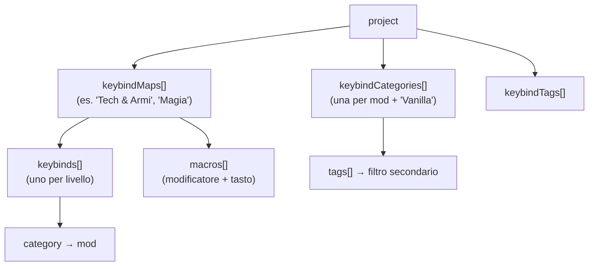
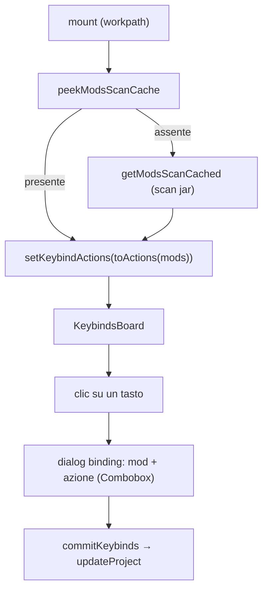
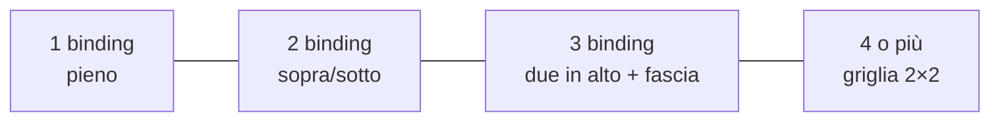

# 08 — Keybinds

La sezione più ricca dell'app: una **rappresentazione grafica della tastiera** (layout ISO/IT +
numpad + mouse) su cui assegnare azioni delle mod, organizzata in **mappe/profili** multipli con
due assi di classificazione (Mod e Tag).

## Concetti

- **Mappa** (`keybindMap`): un profilo con il proprio set di `keybinds` e `macros`. Il progetto ne
  ha più di una; selettore in cima con add/remove.
- **Categoria** (`keybindCategory`): asse primario = una **mod** (`name` = nome mod), con `color` e
  `tags[]`. La categoria non-mod di default è **"Vanilla"**.
- **Tag** (`keybindTag`): asse secondario di filtro, associato alle mod.
- Il binding memorizza solo `category` (la mod); i tag derivano dalla mod.

## Layout della tastiera

[`keyboard-layout.ts`](../../../src/lib/keyboard-layout.ts) è **data-driven** (unità rem). Ogni tasto ha un
`id` **stabile**: è la chiave a cui vengono legati i keybind, quindi non va cambiato una volta in uso.

- `KeyDef { id, label, w?, tall? }` e `Spacer { spacer }` (con type guard `isSpacer`).
- `MAIN_ROWS`: 6 righe (function, numeri, qwerty, home, shift, bottom) con cluster navigazione e
  frecce; `NUMPAD_ROWS`/`NUMPAD_SIDE` per il tastierino; `MOUSE_KEYS` per i pulsanti mouse.
- Gli id dei tasti IT includono le accentate (`igrave`, `egrave`, `agrave`, `ograve`, `ugrave`).
- **Scala**: in [`keybinds/page.tsx`](../../../src/app/keybinds/page.tsx) `KEY_SCALE` (1.35) è
  l'**unico** punto da cui derivano le misure della griglia — `UNIT_REM` (2.5 → 3.375rem, cioè 54px per
  un tasto 1u), `GAP_REM`, `KEY_GAP_STYLE` (anche i gap del markup: erano `gap-1` per coincidenza) e
  `scaledPx()` per l'angolo piegato. Scalare solo una parte sfalserebbe `keyWidth()`, che somma unità
  **e** gap: i tasti larghi non starebbero più allineati alla griglia. I **corpi del testo** restano
  fissi (`text-[9px]`/`text-[7.5px]`/`text-[10px]`): il tasto più grande serve a dare spazio all'azione
  (più caratteri per riga, due righe intere), non a scriverla più grande.
  I tre blocchi (tastiera, numpad, mouse) vanno **a capo** (`flex-wrap`) perché a questa scala non
  stanno in fila su schermi normali, e l'`overflow-x-auto` resta per la tastiera sola.

## Template di una nuova mappa

[`keybind-template.ts`](../../../src/lib/keybind-template.ts) — separato dal layout — definisce da cosa
nasce una mappa nuova:

- **`defaultKeybinds()`**: i keybind **vanilla** di Minecraft con i tasti di default (movimento,
  inventario, UI, multiplayer, hotbar 1-9 → `digit1..9`), tutti con `actionKey` valido → esportabili.
  Include anche funzioni **hardcoded** senza `actionKey` (`esc`→Menu, `f1`→Toggle HUD, `f3`→Debug) come
  riferimento (occupano tasti fissi, non esportabili).
- **`defaultCategories()`**: la sola categoria non-mod **"Vanilla"** (colore `#6b7280`).
- **`defaultTags()`**: elenco predefinito di tag tematici (Movement, Inventory, Technology, Magic…,
  nomi in inglese canonico perché sono dati persistiti). Vengono messi nel progetto **alla creazione**
  ([`new-project.ts`](../../../src/lib/new-project.ts)), non alla prima mappa: servono a etichettare le
  mod con **Add Mod**, che si può usare prima di creare qualsiasi mappa.
- **`vanillaActions()`**: elenco completo dei keybind vanilla (`{actionKey, label}`), usato come
  fallback nel dialog quando la categoria non è una mod scansionata.

Alla creazione di una mappa, il template viene fuso nelle categorie/tag del progetto **senza
duplicati**. Per i tag quella fusione è ormai una rete di sicurezza per i progetti creati prima che
`emptyProject` li includesse (`keybindTags` vuoto); le categorie invece nascono davvero lì, perché
"Vanilla" ha senso solo insieme a una mappa.

## Flusso della pagina

- **Bootstrap**: al mount legge la cache unificata; se assente esegue la scansione (così la pagina è
  usabile anche senza aver prima aperto List Mods). `scanKeybinds(force)` per il refresh manuale.
- **`actionsForCategory(name)`**: se la categoria è non-mod (Vanilla) → `vanillaActions()`; altrimenti
  risolve la mod e ritorna le keybind scansionate, o `null` (→ input libero) se la mod non ne ha.
- **`commit(next)`** = `dispatch(updateProject(next))`; `commitKeybinds`/`commitMacros` aggiornano
  solo la mappa attiva.

## Layer (livelli) di una mappa

Un tasto può servire più azioni, ma disegnarle tutte insieme rende la tastiera un mosaico di colori.
I **layer** sono lucidi sovrapposti DENTRO la stessa mappa: si guarda un livello per volta e ogni
tasto mostra un solo binding, a colore pieno.

| Dato | Dove | Significato |
|---|---|---|
| `keybind.layer?` | [`models.ts`](../../../src/model/models.ts) | livello del binding, `>= 1` senza massimo; **assente = 1** (progetti salvati prima dei layer) |
| `keybindMap.layerCount?` | idem | quanti livelli ha la mappa; esplicito, così un livello appena creato e ancora vuoto non scompare |

- **`layerOf(binding)`** normalizza il livello (fuori range → 1); **`layerCountOf(map)`** non scende
  mai sotto il massimo livello effettivamente usato dai binding (un import o una modifica a mano
  potrebbero superare `layerCount`).
- **`effectiveLayer`** ricade su 1 se il livello selezionato non esiste nella mappa corrente:
  cambiando mappa la tastiera resterebbe vuota senza spiegazione.
- **Appiattimento**: `flattened = effectiveLayer === "all" || filtersActive`. Con un filtro attivo
  (mod, tag o ricerca) il sottoinsieme è già piccolo — lì si vuole "la mappa di quella mod", non il
  livello 2 — e la vista isolata mostra comunque un colore solo per tasto, quindi non c'è nulla da
  separare. Il `KeyCap` torna a dividersi in riquadri (`colorRects`) solo su **"Tutti i livelli"**
  senza filtri.
- **Tooltip del tasto**: `KeyCap` usa il `Tooltip` di shadcn/Radix, **non** l'attributo `title` nativo
  (che arrivava tardi, col font di sistema e le righe separate da `\n`): dentro il tasto l'azione è
  troncata a due righe di 9px, quindi è lì che serve leggerla per intero. Ogni binding nel tooltip ha
  il **pallino del colore della sua mod**, così spiega anche i riquadri del tasto. Un tasto vuoto e
  senza binding nascosti non ha tooltip: ripeterebbe l'etichetta già scritta sopra (e sarebbero ~100
  tooltip inutili). `delayDuration={250}` invece dello 0 del provider globale: passando il mouse sulla
  tastiera i tooltip istantanei sarebbero un lampeggio continuo.
- **Segno dei binding nascosti**: sul tasto compare un **angolo piegato** in alto a destra (come la
  punta di un foglio sotto) col tooltip di ciò che la vista non mostra: gli **altri livelli**
  (`alsoOnLayers`) nella vista per livello, le **altre mod** (`alsoUsedBy`) nella vista isolata.
  Senza quel segno un tasto già occupato sembrerebbe libero; con un puntino per livello il tasto
  risultava sporco.
- **`spreadOnLayers()`** distribuisce i binding che condividono un tasto su livelli separati: è la
  migrazione per i progetti nati prima dei layer. Il bottone compare solo se esiste davvero un tasto
  con più binding sullo stesso livello.
- Si rimuove solo l'**ultimo livello, se vuoto**: cancellare un livello pieno butterebbe via dei
  binding senza mostrare cosa si perde.

### Editor del tasto

Il dialog è una **lista piatta** di binding dentro una `ScrollArea` (i binding non hanno un massimo:
senza area scrollabile il dialog crescerebbe oltre lo schermo). Ogni riga ha azione, mod e una **Select
del livello**; l'ultima voce della Select, `NEW_LAYER_VALUE`, apre un livello in più e ci sposta il
binding, così non serve un bottone dedicato.

- `sortedDrafts` ordina le righe per livello: la lista è piatta, quindi senza ordine le righe
  salterebbero avanti e indietro cambiando la Select.
- `setDraftLayer(id, value)` non fa **nessuno scambio automatico**: con una Select, vedere muoversi
  un'altra riga sarebbe inspiegabile. Due binding sullo stesso livello sono ammessi, e `sharedLayers`
  li segnala sotto la lista (è la ragione per cui un tasto tornerebbe a mostrarsi diviso in riquadri).
- I `draftBinding` mantengono un **`id` stabile**: l'indice nell'array non lo è (cambia quando si
  rimuove una riga) e serve come chiave React e per gli aggiornamenti puntuali.
- Un livello creato qui (`draftLayers`) viene scritto nella mappa al salvataggio (`layerCount`) anche
  se resta vuoto.

Il dialog gestisce i draft (`addDraftBinding`, `updateDraftBinding`, `removeDraftBinding`,
`setDraftLayer`, `draftToKeybinds`) e salva con `saveBinding` (solo mappa attiva) o
`saveBindingToAll` (tutte le mappe, con conferma).

## Multi-binding per tasto

Un tasto può avere **quanti binding serve** (uno per livello, livelli illimitati). Nella vista
appiattita senza filtri ("Tutti i livelli") il `KeyCap` divide lo sfondo in riquadri, un colore per mod:

> Oltre i 4 riquadri `colorRects` non aggiunge suddivisioni: la vista appiattita di un tasto molto
> carico resta illeggibile per costruzione, ed è proprio il caso in cui conviene guardare un livello
> per volta.

## Import e layer

L'importer keyset ([`keybind-import/keyset.ts`](../../../src/lib/keybind-import/keyset.ts)) assegna i
livelli mentre ricostruisce le mappe: il primo binding di un tasto va sul livello 1, il secondo sul 2
e così via, e `ImportedMap.layerCount` riporta quanti servono. Senza questo, un import riporterebbe la
mappa allo stato "arlecchino" che i layer servono a evitare. Siccome i livelli non hanno un tetto,
**nessun binding viene più scartato** perché il tasto è pieno: il motivo `overflow` è stato rimosso da
`ImportIssueReason`.

> L'**export** non cambia: i layer sono un'organizzazione della vista, mentre `options.txt`/keyset
> ricevono tutti i binding della mappa come prima (in gioco più azioni sullo stesso tasto restano un
> conflitto, come lo erano già).

## Selezione azioni

Il dialog non usa testo libero ma un **Combobox** con le azioni reali della mod selezionata
(dalla scansione unificata), ricercabile per label. Il binding memorizza sia `action` (label) sia
`actionKey` (translation key, opzionale → retrocompatibile). L'`actionKey` è ciò che serve
all'export.

## Filtri

Due barre di filtro combinate (`matchesFilters`): **Mods** (categoria) + **Tags** + ricerca testuale.

Le barre offrono **solo ciò che è usato nella mappa attiva** (`usedInMap` → `filterCategories` /
`filterTags`, che guardano binding **e** macro): le categorie sono di progetto, quindi la lista completa
conteneva mod senza un solo tasto in quella mappa — filtrarci dava una tastiera vuota e su un modpack
grosso il chip utile era sepolto. Il valore **selezionato** resta comunque in lista anche se non è più in
uso (succede cambiando mappa): un filtro attivo ma invisibile non si potrebbe più togliere.

I chip della barra filtri stanno in un `ChipStrip`: **massimo due righe** (`grid-flow-col` +
`grid-rows-2`, quindi la striscia cresce in larghezza e non in altezza) con **scroll orizzontale** nativo
— sta subito sopra la tastiera, e a capo libero la spingeva fuori dallo schermo. Etichetta della striscia
e chip "Tutte" stanno fuori dall'area che scorre, così il reset del filtro è sempre a portata.

Le card **Mods** e **Tags** in cima **non** usano il `ChipStrip`: i loro chip vanno a capo liberamente e
elencano **tutte** le categorie/tag del progetto, perché sono la lista di gestione (colore, tag
associati) e vanno raggiunte anche prima di usarle in una mappa.

Con almeno un filtro attivo (`filtersActive`) la tastiera passa alla **vista isolata**: ogni tasto
mostra **solo i binding che corrispondono**, a colore pieno, e i tasti senza corrispondenze restano
vuoti come su una mappa nuova. Prima i binding delle altre mod restavano sul tasto, solo attenuati:
filtrando per una mod la tastiera restava un arlecchino di colori, che è l'opposto di quello che serve
(guardare "il livello dedicato" a quella mod). I binding esclusi non sono persi di vista: li segnala
l'angolo piegato (`alsoUsedBy`). Stessa regola per le **macro**, che sono chip colorati nella stessa
vista: quelle fuori filtro sono nascoste, non attenuate (`visibleMacros`, con l'indice originale
preservato per l'editor).

## Gestione mod, tag, mappe

| Azione | Effetto principale |
|--------|--------------------|
| **Add/Edit Mod** | Combobox sulle mod → `name` = nome mod, colore, tag associati. Rinomina propaga a tutti i binding di tutte le mappe. Dopo add nuova, avvia `scanKeybinds(true)` se non in cache |
| **Remove Mod** | Rimuove la categoria e i suoi binding |
| **Add/Edit Tag** | Nome (+ rinomina aggiorna i tag delle categorie) |
| **Add/Edit Map** | Nuova mappa pre-popolata con `defaultKeybinds()`; aggiunge categorie/tag mancanti |
| **Remove Map** | Rimuove la mappa |
| **Macro** | `openAddMacro`/`saveMacro`/`removeMacro`: modificatore + tasto base + azione |

Persistenza: tutto via `updateProject` → `unsaved` → SaveBar. Il dialog di **Export** e **Import**
sono montati qui (vedi [09 — Keybind I/O](./09-keybind-io.md)); il report di import è mostrato in una
Card con tabella (Map / Action / Key / Problem).

## Macro

Le macro (`macro`) sono combinazioni **modificatore + tasto** (es. Ctrl+A) legate a un'azione.
Vivono nella `keybindMap` separate dai keybind normali. Un solo modificatore per combinazione
(`ctrl` | `shift` | `alt`), lo standard supportato dai mod tipo Keyset.

> ⚠️ Le macro **non** sono rappresentabili nel formato vanilla `options.txt`: in export vengono
> saltate e segnalate (vedi [09](./09-keybind-io.md)).
