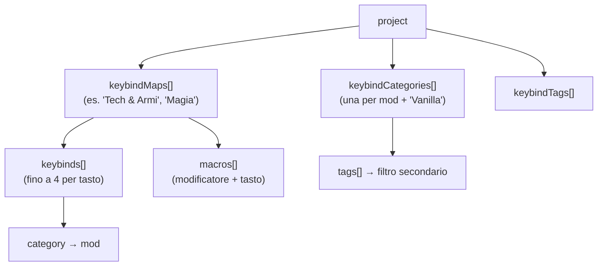
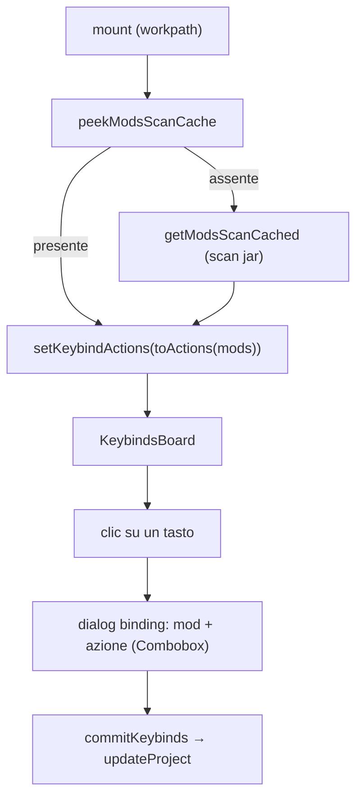
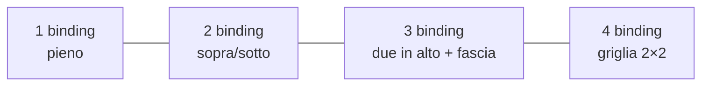

# 08 — Keybinds

La sezione più ricca dell'app: una **rappresentazione grafica della tastiera** (layout ISO/IT +
numpad + mouse) su cui assegnare azioni delle mod, organizzata in **mappe/profili** multipli con
due assi di classificazione (Mod e Tag).

## Concetti

- **Mappa** (`keybindMap`): un profilo con il proprio set di `keybinds` e `macros`. Il progetto ne
  ha più di una; selettore in cima con add/remove.
- **Categoria** (`keybindCategory`): asse primario = una **mod** (`name` = nome mod), con `color` e
  `tags[]`. La categoria non-mod di default è **"Vanilla"**.
- **Tag** (`keybindTag`): asse secondario di filtro, associato alle mod.
- Il binding memorizza solo `category` (la mod); i tag derivano dalla mod.

## Layout della tastiera

[`keyboard-layout.ts`](../../../src/lib/keyboard-layout.ts) è **data-driven** (unità rem). Ogni tasto ha un
`id` **stabile**: è la chiave a cui vengono legati i keybind, quindi non va cambiato una volta in uso.

- `KeyDef { id, label, w?, tall? }` e `Spacer { spacer }` (con type guard `isSpacer`).
- `MAIN_ROWS`: 6 righe (function, numeri, qwerty, home, shift, bottom) con cluster navigazione e
  frecce; `NUMPAD_ROWS`/`NUMPAD_SIDE` per il tastierino; `MOUSE_KEYS` per i pulsanti mouse.
- Gli id dei tasti IT includono le accentate (`igrave`, `egrave`, `agrave`, `ograve`, `ugrave`).

## Template di una nuova mappa

[`keybind-template.ts`](../../../src/lib/keybind-template.ts) — separato dal layout — definisce da cosa
nasce una mappa nuova:

- **`defaultKeybinds()`**: i keybind **vanilla** di Minecraft con i tasti di default (movimento,
  inventario, UI, multiplayer, hotbar 1-9 → `digit1..9`), tutti con `actionKey` valido → esportabili.
  Include anche funzioni **hardcoded** senza `actionKey` (`esc`→Menu, `f1`→Toggle HUD, `f3`→Debug) come
  riferimento (occupano tasti fissi, non esportabili).
- **`defaultCategories()`**: la sola categoria non-mod **"Vanilla"** (colore `#6b7280`).
- **`defaultTags()`**: elenco predefinito di tag tematici (Movimento, Inventario, Tecnologia, Magia…).
- **`vanillaActions()`**: elenco completo dei keybind vanilla (`{actionKey, label}`), usato come
  fallback nel dialog quando la categoria non è una mod scansionata.

Alla creazione di una mappa, il template viene fuso nelle categorie/tag del progetto **senza
duplicati**.

## Flusso della pagina

- **Bootstrap**: al mount legge la cache unificata; se assente esegue la scansione (così la pagina è
  usabile anche senza aver prima aperto List Mods). `scanKeybinds(force)` per il refresh manuale.
- **`actionsForCategory(name)`**: se la categoria è non-mod (Vanilla) → `vanillaActions()`; altrimenti
  risolve la mod e ritorna le keybind scansionate, o `null` (→ input libero) se la mod non ne ha.
- **`commit(next)`** = `dispatch(updateProject(next))`; `commitKeybinds`/`commitMacros` aggiornano
  solo la mappa attiva.

## Multi-binding per tasto

Un tasto può avere fino a **4** binding (`MAX_BINDINGS = 4`). Il `KeyCap` divide lo sfondo in
riquadri, un colore per mod:

Il dialog del tasto gestisce i draft (`addDraftBinding`, `updateDraftBinding`, `removeDraftBinding`,
`draftToKeybinds`) e salva con `saveBinding` (solo mappa attiva) o `saveBindingToAll` (tutte le mappe).

## Selezione azioni

Il dialog non usa testo libero ma un **Combobox** con le azioni reali della mod selezionata
(dalla scansione unificata), ricercabile per label. Il binding memorizza sia `action` (label) sia
`actionKey` (translation key, opzionale → retrocompatibile). L'`actionKey` è ciò che serve
all'export.

## Filtri

Due barre di filtro combinate (`matchesFilters`): **Mods** (categoria) + **Tags** + ricerca testuale.
I tasti fuori dai filtri vengono "dimmati" (attenuati), non nascosti.

## Gestione mod, tag, mappe

| Azione | Effetto principale |
|--------|--------------------|
| **Add/Edit Mod** | Combobox sulle mod → `name` = nome mod, colore, tag associati. Rinomina propaga a tutti i binding di tutte le mappe. Dopo add nuova, avvia `scanKeybinds(true)` se non in cache |
| **Remove Mod** | Rimuove la categoria e i suoi binding |
| **Add/Edit Tag** | Nome (+ rinomina aggiorna i tag delle categorie) |
| **Add/Edit Map** | Nuova mappa pre-popolata con `defaultKeybinds()`; aggiunge categorie/tag mancanti |
| **Remove Map** | Rimuove la mappa |
| **Macro** | `openAddMacro`/`saveMacro`/`removeMacro`: modificatore + tasto base + azione |

Persistenza: tutto via `updateProject` → `unsaved` → SaveBar. Il dialog di **Export** e **Import**
sono montati qui (vedi [09 — Keybind I/O](./09-keybind-io.md)); il report di import è mostrato in una
Card con tabella (Map / Action / Key / Problem).

## Macro

Le macro (`macro`) sono combinazioni **modificatore + tasto** (es. Ctrl+A) legate a un'azione.
Vivono nella `keybindMap` separate dai keybind normali. Un solo modificatore per combinazione
(`ctrl` | `shift` | `alt`), lo standard supportato dai mod tipo Keyset.

> ⚠️ Le macro **non** sono rappresentabili nel formato vanilla `options.txt`: in export vengono
> saltate e segnalate (vedi [09](./09-keybind-io.md)).
