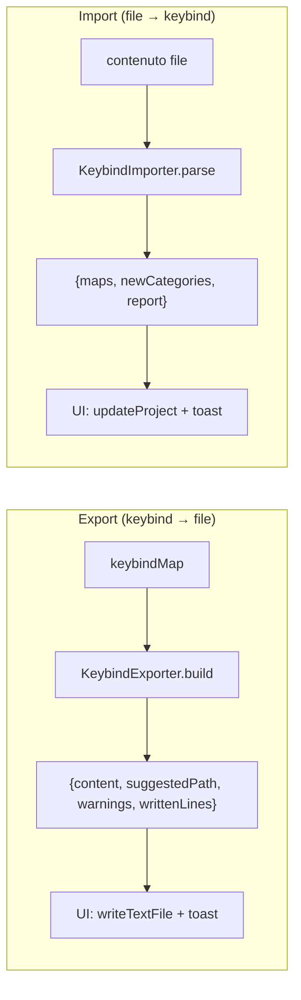
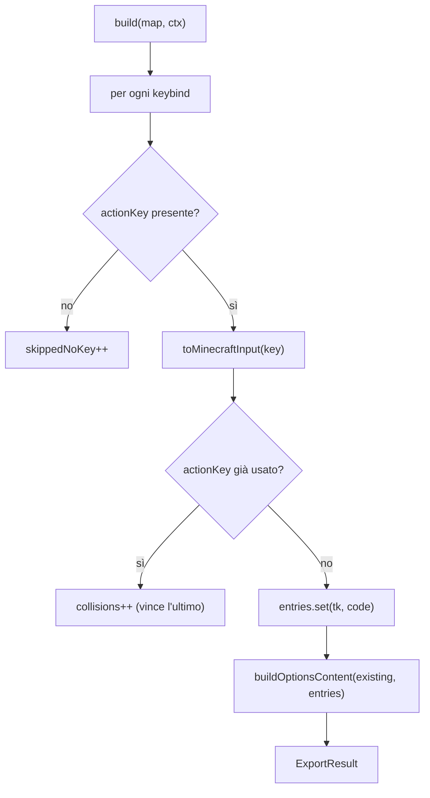
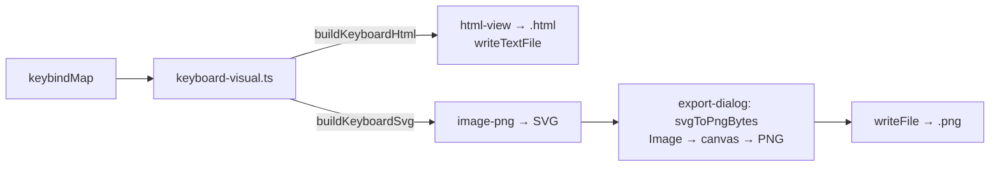
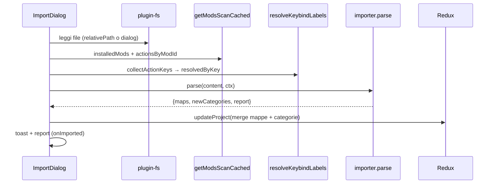

# 09 — Import / Export keybind

Due astrazioni simmetriche e **pure** (nessun I/O su disco): la lettura/scrittura del file e i toast
restano nella UI, così permessi e gestione errori sono centralizzati.

## Export

[`keybind-export/`](../../../src/lib/keybind-export). Il registro `EXPORTERS` ordina gli exporter come
mostrati in UI; `getExporter(id)` li recupera.

### Interfaccia `KeybindExporter`

| Campo | Significato |
|-------|-------------|
| `id` | `"options-txt"` \| `"keyset"` |
| `label` | Etichetta nel dialog |
| `defaultFileName` | Es. `options.txt` |
| `available` | `false` = disabilitato in UI (formato non pronto) |
| `build(map, ctx)` | Esporta una singola mappa → `ExportResult` |
| `buildAll?(maps, ctx)` | Opzionale: esporta tutte le mappe in un file (formati multi-profilo) |

`ExportResult`: `{ content, suggestedPath, warnings[], writtenLines }`. `ExportContext`:
`{ project, workpath, readExisting(absPath) }` (`readExisting` iniettata dalla UI per gli exporter
che fanno merge).

### `options-txt` (attivo)

[`options-txt.ts`](../../../src/lib/keybind-export/options-txt.ts) esporta il file `options.txt` di
Minecraft vanilla.

Warning generati: keybind senza translation key saltate, tasti non mappabili (`unknown`), azioni con
più tasti (tenuto l'ultimo), macro non supportate.

### Merge conservativo

[`merge-options.ts`](../../../src/lib/keybind-export/merge-options.ts) — `buildOptionsContent(existing,
entries)` — è il cuore anti-perdita-dati: `options.txt` contiene molte righe non-keybind
(grafica/audio) da **non** toccare.

| Riga | Comportamento |
|------|---------------|
| non `key_*` | preservata invariata |
| `key_*` presente nel progetto | sovrascritta col nuovo input code |
| `key_*` non nel progetto | lasciata invariata (bind di mod non gestite) |
| `key_*` nuova | appesa in coda |

Preserva anche il line ending esistente (CRLF/LF) e la presenza/assenza di newline finale. Se il file
non esiste, emette solo le righe keybind (LF).

### Traduzione tasto → input code Minecraft

[`mc-keycodes.ts`](../../../src/lib/mc-keycodes.ts):

- **`toMinecraftInput(keyId)`**: id del layout → input code MC (`"w"` → `key.keyboard.w`,
  `"shiftleft"` → `key.keyboard.left.shift`, `"mouse1"` → `key.mouse.left`, `"num5"` →
  `key.keyboard.keypad.5`). Fallback `UNMAPPED` (`key.keyboard.unknown`) per i tasti IT accentati e
  simboli non-US, che non hanno un input code vanilla stabile.
- **`fromMinecraftInput(code)`**: inversa (usata dall'import); `null` se non riconosciuto. Per code
  con più id (es. `enter1`/`enter2` → `key.keyboard.enter`) vince il primo inserito in `SPECIAL`.

### Visualizzazione tastiera: HTML interattivo e immagine PNG

Oltre ai formati di config, si può esportare la **rappresentazione grafica** della mappa dei tasti.
Il rendering è in [`keyboard-visual.ts`](../../../src/lib/keybind-export/keyboard-visual.ts), un modulo
**puro** (nessun DOM) che replica l'aspetto della tastiera della pagina Keybinds (blocchi Tastiera +
Tastierino + Mouse, riquadri colorati per binding, un colore per mod):

- **`buildKeyboardSvg(map, categories, labels?, opts?)`** → `{ svg, width, height, boundCount }`:
  costruisce l'SVG (geometria in px: `UNIT=40`, `GAP=4`; `colorRectsPx` per i multi-binding 1/2/3/4).
  Con `opts.legend = true` disegna sotto la tastiera una **legenda** (pastiglia colore → nome mod) per
  le mod usate nella mappa — usata dall'export PNG. Ogni tasto espone `data-key` e `data-b` (lista
  binding in JSON) per l'interazione al click.
- **`buildKeyboardHtml(map, categories, labels?)`** → documento HTML autonomo: SVG inline + tooltip
  nativi (`<title>`) + legenda **cliccabile** (mod e tag) che attenua i tasti non corrispondenti +
  **finestra modale**: il clic su un tasto apre un riquadro con le **azioni e la mod** di quel tasto.
  Tutto con CSS/JS incorporati (funziona offline, sola visualizzazione).

Due exporter usano il modulo:

| Exporter | File | `image` | Output |
|----------|------|---------|--------|
| `html-view` | [`html-view.ts`](../../../src/lib/keybind-export/html-view.ts) | — | `<mappa>.html` (testo) |
| `image-png` | [`image-png.ts`](../../../src/lib/keybind-export/image-png.ts) | `true` | `<mappa>.png` (binario) |

Il flag **`image`** sul `KeybindExporter` segnala che `content` non è testo da scrivere ma il markup
**SVG** da rasterizzare. La rasterizzazione avviene lato UI in
[`export-dialog.tsx`](../../../src/components/keybinds/export-dialog.tsx) (`svgToPngBytes`): l'SVG è
caricato in un `Image`, disegnato su un `canvas` (scala 2× per la nitidezza) e scritto come byte PNG
via `writeFile` (richiede `fs:allow-write-file` nelle capabilities). Gli altri exporter usano
`writeTextFile`.

### `keyset` (placeholder)

[`keyset.ts`](../../../src/lib/keybind-export/keyset.ts) è predisposto ma `available: false` (formato ancora
da definire).

## Import

[`keybind-import/`](../../../src/lib/keybind-import). Registro `IMPORTERS` + `getImporter(id)`. Simmetrico
agli exporter: gli importer ricevono il contenuto già letto e ritornano le mappe ricostruite + le
categorie da garantire.

### Interfaccia `KeybindImporter`

`{ id, label, defaultFileName, available, relativePath[], parse(content, ctx) }`. `relativePath` è il
path relativo alla workpath (es. `["config", "keybindprofiles.json"]`).

`ImportContext`:

| Campo | Ruolo |
|-------|-------|
| `project` | Progetto corrente |
| `installedMods` | Mod **installate** (`modId` + `name`); un binding di mod non installata (e non vanilla) viene **scartato** |
| `actionsByModId` | Azioni scansionate dai jar → ricollega `actionKey` a mod + label |
| `resolvedByKey?` | Risoluzione mirata `actionKey → {modId, label}` (via `resolve_keybind_labels`): il link più affidabile, copre anche i nomi non standard |

`ImportResult`: `{ maps: ImportedMap[], newCategories: keybindCategory[], report: ImportReport }`.

### Flusso di import (UI `import-dialog.tsx`)

Il merge fa upsert delle mappe per nome (`byName`) e aggiunge le categorie mancanti.

### Report e problemi

`ImportReport { maps, bindings, issues[] }`. Ogni `ImportIssue { map, actionKey, keyCode, reason }`.
I binding "unbound" (senza tasto) sono ignorati in silenzio, non entrano nel report.

| `ImportIssueReason` | Significato |
|---------------------|-------------|
| `not-installed` | La mod del binding non è tra quelle installate → scartato |
| `unmapped` | Il tasto non è mappabile sul layout |
| `overflow` | Oltre il limite di 4 binding per tasto |

I binding con modificatori (SHIFT/CTRL/ALT) vengono ricostruiti come **macro**.
