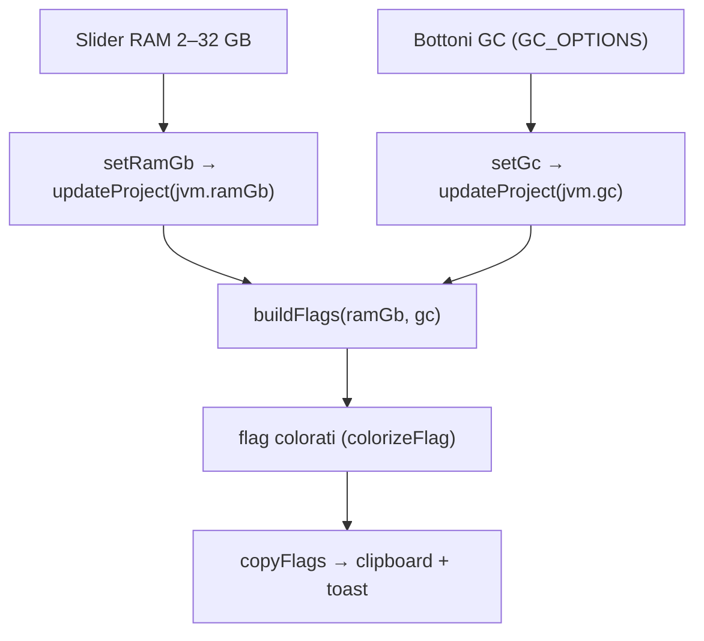

# 10 — JVM

La pagina `/jvm` configura l'allocazione RAM e il garbage collector del modpack, e genera i flag JVM
corrispondenti (copiabili). Le impostazioni vivono in `project.jvm` (`{ ramGb, gc }`).

## Modello

- `jvmSettings = { ramGb: number, gc: gcType }`
- `gcType = "g1" | "zgc" | "shen"`
- Default `defaultJvmSettings()` → `{ ramGb: 4, gc: "g1" }` (anche per i progetti salvati prima
  dell'introduzione del campo `jvm`).

## Pagina

Nessun comando Tauri: solo `buildFlags`/`GC_OPTIONS` da [`jvm.ts`](../../../src/lib/jvm.ts) e `setByPath`.

## Generazione flag ([`jvm.ts`](../../../src/lib/jvm.ts))

`buildFlags(ram, gc)` parte sempre da `-Xms{ram}G -Xmx{ram}G` (heap fisso), poi aggiunge i flag del GC.

| GC | `GC_OPTIONS` label | Set di flag |
|----|--------------------|-------------|
| `g1` | G1GC (Aikar) | Preset **Aikar** (standard de-facto server modded); alcuni valori scalano se `ram ≥ 12` |
| `zgc` | ZGC | `-XX:+UseZGC -XX:+ZGenerational` + AlwaysPreTouch, DisableExplicitGC, PerfDisableSharedMem, ConcGCThreads=2 |
| `shen` | Shenandoah | `-XX:+UseShenandoahGC -XX:ShenandoahGCMode=iu` + AlwaysPreTouch, DisableExplicitGC, UseNUMA |

### Scaling del preset G1 (Aikar)

Alcuni parametri variano in base alla RAM (soglia 12 GB):

| Flag | `ram < 12` | `ram ≥ 12` |
|------|-----------|-----------|
| `G1NewSizePercent` | 30 | 40 |
| `G1MaxNewSizePercent` | 40 | 50 |
| `G1HeapRegionSize` | 8M | 16M |
| `G1ReservePercent` | 20 | 15 |
| `InitiatingHeapOccupancyPercent` | 15 | 20 |

Gli altri flag G1 (ParallelRefProcEnabled, MaxGCPauseMillis=200, DisableExplicitGC, AlwaysPreTouch,
SurvivorRatio=32, MaxTenuringThreshold=1, ecc.) sono fissi, più i marcatori `-Dusing.aikars.flags`
e `-Daikars.new.flags=true`.
