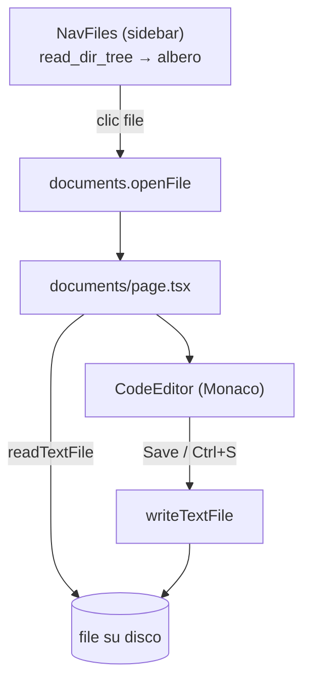
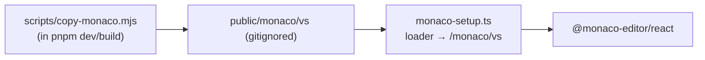
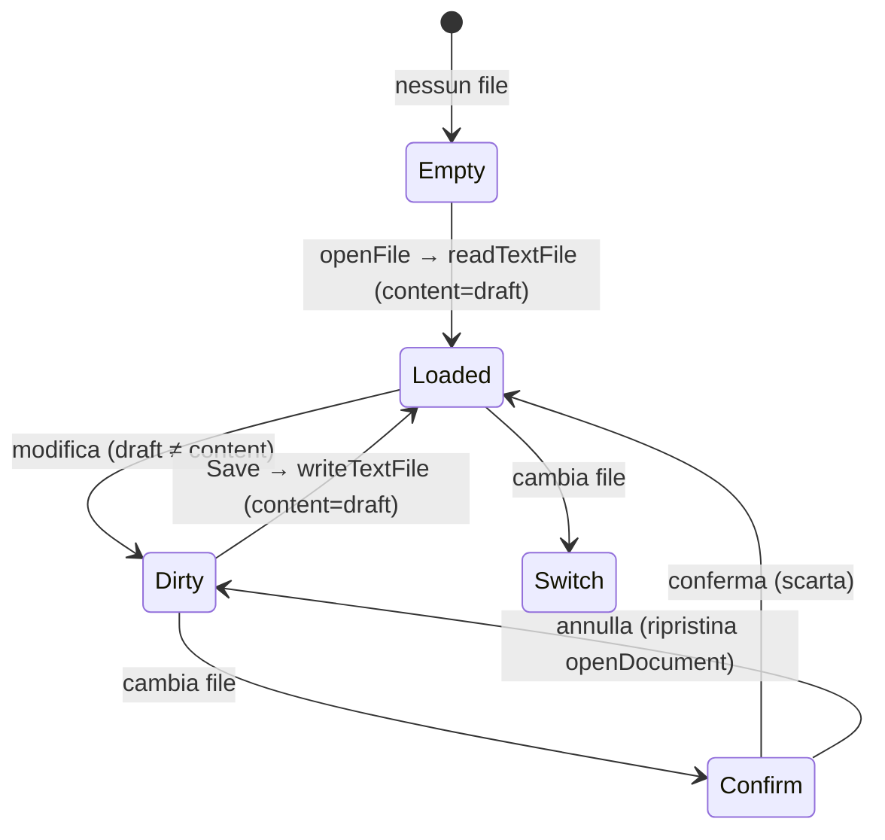
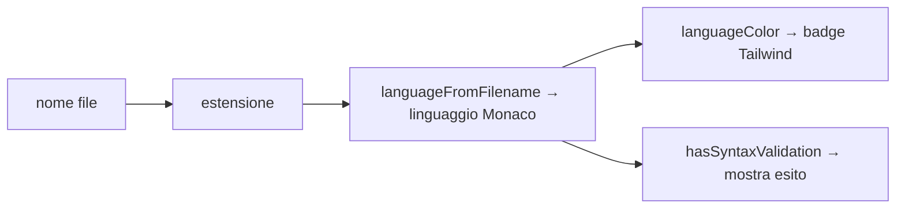

# 11 — Documents: editor di codice

La sezione Documents è un editor **Monaco** per i file di configurazione del modpack
(`config/`, `kubejs/`). Ha un ciclo di salvataggio **indipendente** dal `project.json`: i file di
config non vivono nel progetto.

## Architettura

- L'**albero dei file** vive nella sidebar ([`nav-files.tsx`](../../../src/components/nav-files.tsx) →
  [`file-tree.tsx`](../../../src/components/documents/file-tree.tsx)), disaccoppiato dall'editor via Redux
  (`documents-slice`).
- La **pagina** rende solo l'editor del file aperto. Le cartelle assenti sono saltate.

## Monaco offline

L'app gira offline, quindi Monaco **non** va caricato dalla CDN:

- [`copy-monaco.mjs`](../../../scripts/copy-monaco.mjs) copia `node_modules/monaco-editor/min/vs` in
  `public/monaco/vs`; è incatenato in `pnpm dev` e `pnpm build`.
- [`monaco-setup.ts`](../../../src/lib/monaco-setup.ts) punta il loader agli asset locali
  (`setupMonacoLoader()`, chiamato una volta).

## Flusso di editing

- Stato editor: `content` (su disco), `draft` (in editor), `dirty = content !== null && draft !== content`.
- Cambiando file con modifiche non salvate, chiede conferma; se annullato ripristina la selezione
  precedente (`openDocument`).
- `handleSave()`: `writeTextFile(openFile.path, draft)` → aggiorna `content` + toast.
- `usePageSaveShortcut(handleSave, dirty)`: Ctrl/Cmd+S anche fuori dal focus dell'editor.

## `CodeEditor` ([`code-editor.tsx`](../../../src/components/documents/code-editor.tsx))

Wrapper di `@monaco-editor/react` (`key={filename}`, `theme="vs-dark"`). Espone i tipi
`CursorInfo { line, column, lineCount }` e `Diagnostics { errors, warnings }`.

- **Diff gutter**: `refreshDiff()` usa `diffLines(original, value)` ([`line-diff.ts`](../../../src/lib/line-diff.ts))
  per conteggi +/~/- e decorazioni (`dirty-line-added/modified/deleted`).
- **Diagnostica**: da `getModelMarkers`/`onDidChangeMarkers` → `onDiagnostics`.
- **Cursore**: da `onDidChangeCursorPosition`/`onDidChangeModelContent` → `onCursorChange`.
- Ctrl/Cmd+S registrato anche dentro l'editor (`saveRef`).

## Linguaggio dal file ([`file-language.ts`](../../../src/lib/file-language.ts))

- `languageFromFilename(filename)`: mappa estensione → linguaggio Monaco (default `plaintext`).
  Es. `.toml`/`.cfg`/`.properties` → `ini`; `.json`/`.json5`/`.mcmeta` → `json`; `.js`/`.zs` →
  `javascript`; `.snbt`/`.nbt` → `plaintext`.
- `languageColor(language)`: classe Tailwind per il badge del tipo file.
- `hasSyntaxValidation(language)`: `true` solo per i linguaggi con validazione Monaco nativa
  (`json`, `javascript`, `typescript`, `css`, `html`) → per quelli la status bar mostra
  "valido / errori".

## Albero file ([`file-tree.tsx`](../../../src/components/documents/file-tree.tsx))

Rispecchia la struct `FileNode` di `read_dir_tree`. Operazioni sui file (via `plugin-fs`, con
`useConfirm` per l'eliminazione):

| Operazione | Implementazione |
|------------|-----------------|
| Nuovo file | `join` + `exists` + `writeTextFile("")` → `onFileCreated` + select |
| Rinomina | `prompt` → `join(parent, newName)` + `exists` + `rename` → `onFileRenamed` |
| Elimina | `confirm` → `remove` → `onFileDeleted` |

Gli aggiornamenti dell'albero sono ottimistici e immutabili (`insertFileNode`, `replaceFileNode`,
`removeFileNodeByPath` in `nav-files.tsx`).
