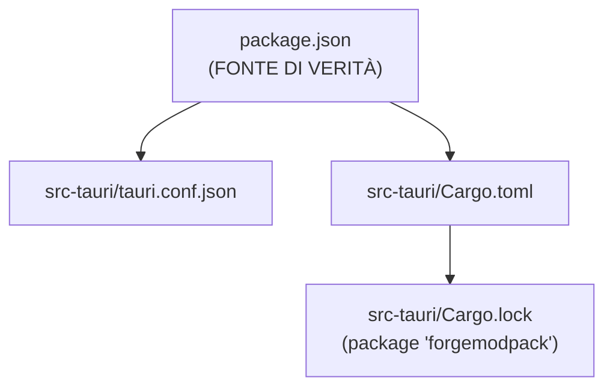
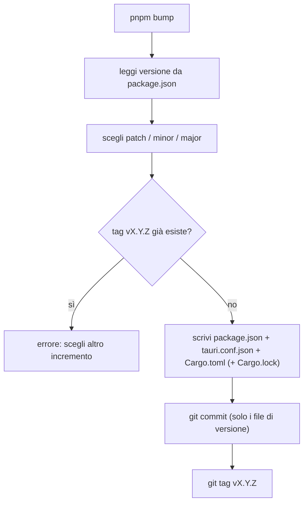
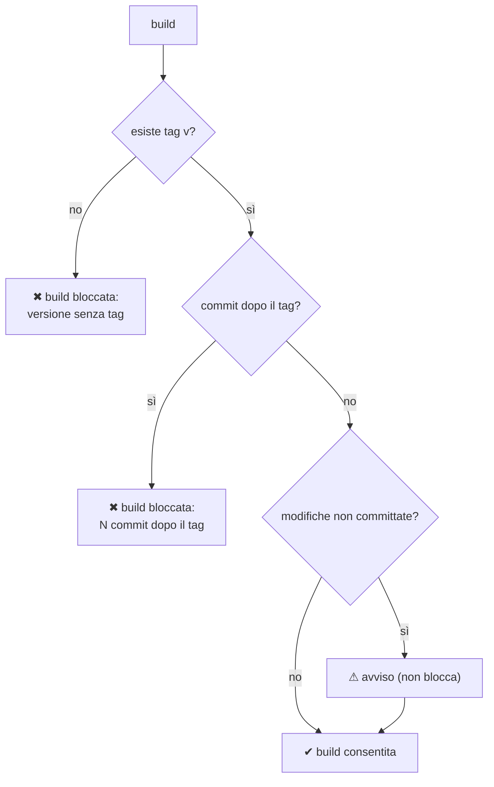
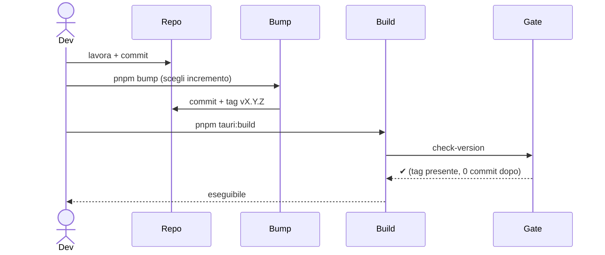

# 12 — Versioning e gate di build

La versione dell'app vive in **tre file** da tenere allineati; una build è **bloccata** finché la
versione corrente non è stata "generata di fresco" con `pnpm bump`.

## I tre file (+ lock)

## `pnpm bump` ([`bump-version.mjs`](../../../scripts/bump-version.mjs))

Bump interattivo che sincronizza tutti i file e crea commit + tag.

- `package.json` è la fonte di verità; deve essere semver `X.Y.Z`.
- Aggiorna: `package.json` e `tauri.conf.json` (JSON, indent 2), `Cargo.toml` (solo la prima riga
  `version = "..."`), `Cargo.lock` (versione del package `forgemodpack`, se il lock esiste).
- Crea commit (limitato ai file di versione) e tag `vX.Y.Z`. Fallisce se il tag esiste già.

## Gate di build ([`check-version.mjs`](../../../scripts/check-version.mjs))

Incatenato nel `beforeBuildCommand` di `tauri.conf.json` → vale sia per `pnpm tauri:build` sia per
`tauri build`.

Regole di blocco:
1. deve esistere il tag git `v<versione>` (creato da `pnpm bump`);
2. non ci devono essere commit **dopo** quel tag (altrimenti hai fatto lavoro nuovo senza bumpare →
   versione "stantia").

Le modifiche non committate producono solo un **avviso** (non bloccano).

## Flusso tipico di release

> In pratica: fai bump **subito prima** di ogni build. Qualsiasi commit successivo al tag richiede un
> nuovo bump prima di poter ribuildare.
